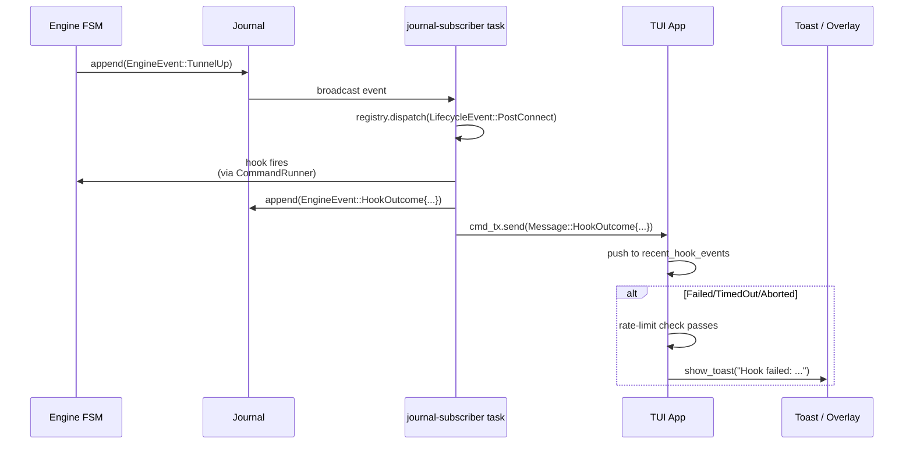

# feat: TUI hook surface

## Problem Frame

Plan 015 phase A landed lifecycle hooks as a journal-subscribed
subsystem: hooks fire on FSM transitions, outcomes are captured as
`HookOutcome`, failures are stderr-printed. The TUI is invisible to
this entire flow.

Concretely:

- When a `ShellHook` returns `HookOutcome::Failed/TimedOut/Aborted`,
  the existing journal-subscriber task in `crates/vortix/src/main.rs`
  calls `eprintln!` — which the TUI captures into the alt-screen
  buffer, never displayed. **A user running the TUI with broken
  hooks has zero in-product signal.**
- A user iterating on hook config has no way to see what just fired
  short of dropping to `tail -f` on the session JSONL outside the
  TUI.
- Malformed `[[hooks]]` entries in `settings.toml` get a stderr
  warning at startup (captured + invisible). First-time hook
  configurers can't sanity-check their entry without triggering a
  real VPN event.

This plan closes the visibility gap for hooks specifically. It does
**not** migrate the TUI off `VpnEngine` to `EngineHandle` — that
architectural shift is the natural companion to Phase D's daemon
engine wiring and lands in v0.3.x. The fix here uses the existing
`App.engine.cmd_tx` bridge pattern: the journal-subscriber task in
`main.rs` pushes hook outcomes into the channel; the TUI's existing
message-handler routes them into the toast system and a new
recent-events buffer.

## Summary

Three tiers, one commit-per-unit:

- **Tier 1 — Failure toasts.** When `Failed`/`TimedOut`/`Aborted`,
  the TUI shows a toast naming the hook + outcome. Rate-limited: one
  toast per hook name per 30 s.
- **Tier 2 — Hooks overlay.** New `H` keybind + action-menu entry
  ("Hooks (N active)") opens an overlay listing every registered
  hook + the last fire outcome + a short scrollback of recent fires
  with captured stdout/stderr snippets.
- **Tier 3 — Config-validation startup toast.** When
  `build_registry_from_config` rejects an entry (unknown event kind,
  empty command), the TUI shows a startup toast naming the rejection.

Supporting infrastructure:

- New `EngineEvent::HookOutcome { hook_name, event_kind, outcome, ... }`
  variant in `vortix-core::engine::event` so any consumer (TUI today,
  remote daemon clients tomorrow) reads outcomes from the journal.
- Existing main-thread journal-subscriber emits the new event and
  bridges it into the TUI's `cmd_tx` channel.

## Scope Boundaries

**In scope:**
- Tier 1 + Tier 2 + Tier 3 as defined above
- `EngineEvent::HookOutcome` event variant + journal emission from
  the existing subscriber
- `App.recent_hook_events: VecDeque<HookOutcomeRecord>` (last 50)
- New overlay file + action-menu integration + `H` keybind
- Doc updates: README "Features" mentions in-TUI hook feedback;
  MIGRATION + FAQ note where users can see hook outcomes;
  smoke script asserts the overlay opens without panic

**Deferred to follow-up work:**
- TUI architectural shift from `App.engine: VpnEngine` to
  `App.engine_handle: EngineHandle` (v0.3.x, alongside daemon engine
  wiring)
- TUI-direct journal subscription (Pattern B → Pattern A bridge is
  fine for v0.3.0; full subscribe is the v0.3.x architectural shift)
- "Skip hooks this session" toggle (feature creep; no user demand)
- Success toasts (deliberate non-goal — see brainstorm: silence on
  success preserves signal-to-noise for failure toasts)
- Hook output streaming (stdout/stderr capture per-fire is in scope;
  live tailing is not)
- Audit overlay, daemon footer indicator, secret-store integration
  in auth overlay — each is its own brainstorm
- Webhook / Rust-plugin hook types — plan 009's deferred scope

**Outside this product's identity:**
- The TUI becomes a hook *editor* (creates/modifies `[[hooks]]`
  entries). Hooks are user-edited config; the TUI inspects, never
  writes.
- The TUI gates hook execution ("don't fire hook X this time").
  Hooks are observers; gating turns them into control flow.

## Requirements

| ID | Requirement | Source |
|----|-------------|--------|
| R1 | When a hook returns `Failed`/`TimedOut`/`Aborted`, the TUI shows a toast within ~1 second of the outcome being captured | Brainstorm: Sarah's failure-visibility gap |
| R2 | Hook-failure toasts are rate-limited to at most one toast per hook name per 30 s | Brainstorm: flappy-connection toast spam |
| R3 | `Success` outcomes produce no TUI signal | Brainstorm: silence-on-success preserves failure-signal value |
| R4 | The action menu shows a `Hooks (N active)` entry whose `N` matches the count of registered hooks at startup; `H` keybind opens the same overlay | Brainstorm: Raj's inspection need + discoverability through existing patterns |
| R5 | The Hooks overlay lists every registered hook with its event kind, command summary, and the most-recent fire timestamp + outcome | Brainstorm: Raj's iteration use case |
| R6 | The Hooks overlay shows a session-scoped recent-fires list with captured stdout/stderr (truncated to a sensible length per entry) | Brainstorm: post-mortem debugging without leaving the TUI |
| R7 | When `build_registry_from_config` rejects an entry at startup, the TUI shows a toast naming the rejected event kind + reason | Brainstorm: Phase 2 onboarding gap |
| R8 | `EngineEvent::HookOutcome` is emitted to the journal for every hook fire (Success, Failed, TimedOut, Aborted) | Architectural — required for the overlay to render data from a session re-loaded later, and for daemon-mode clients to observe outcomes |
| R9 | No regression in existing TUI behavior — connect/disconnect/status path, toast system for connection failures, action menu items, overlay key handling | Continuity guarantee |

## Key Technical Decisions

### D1. Bridge via `cmd_tx`, not direct journal subscription in the TUI

The TUI today is poll-driven (Pattern A: `VpnEngine.cmd_rx` →
`app.process_external`). Plan 015 phase A introduced a parallel event
flow (Pattern B: journal broadcast → subscriber task → side effects).
The TUI doesn't subscribe to Pattern B.

Two options to feed hook outcomes into the TUI:
1. **Subscribe to the journal broadcast inside the TUI** (Pattern B
   direct) — cleanest architectural fit but the change ripples into
   how App state is mutated, what runs on the tokio runtime vs the
   TUI main thread, and how derived state (ConnectionInfo) is
   computed.
2. **Bridge from the existing main.rs journal-subscriber** into
   `app.engine.cmd_tx` — uses the existing message-passing pattern,
   no runtime / threading changes, scoped to hook outcomes only.

**Decision: option 2.** Bounded change, matches existing patterns,
fits the v0.3.0 "ship Pattern-B-visible-from-Pattern-A" framing. The
architectural shift to Pattern B-direct lands with daemon engine
wiring in v0.3.x — same PR that completes plan 005 U6.

### D2. `HookOutcome` event in the journal regardless of outcome (not just failure)

We could emit only `HookFailed` events and skip success. But:

- The overlay shows "Hooks (N active)" with "last outcome" per hook
  — needs success events to populate the timestamp.
- Daemon mode (future) will have multiple frontends observing the
  same daemon — they need a consistent event stream, not partial
  coverage.
- Disk overhead is negligible (one JSON line per FSM transition; FSM
  transitions are not high-frequency).

**Decision: emit `HookOutcome` for every fire, regardless of
outcome.** Storage cost is trivial; consumer simplicity is the win.

### D3. Rate-limit at the App layer, not the journal-subscriber

The journal records every fire (D2). The toast layer applies the
30s-per-hook-name rate limit. Rationale:

- The journal stays the truth source; downstream consumers can have
  different filtering policies.
- A future "audit log" view would want every fire, not just the
  toast-eligible ones.

### D4. Rate-limit window: 30 seconds per hook name

Long enough to absorb a flappy-reconnect storm (5 retries in 10s →
1 toast, not 5). Short enough that a second failure 35 seconds later
is treated as a new event the user should notice. Configurable later
if user demand surfaces.

### D5. Keybind: shift-`H` for overlay, with action-menu entry as discoverable fallback

Lowercase `h` is reserved for vim-style left navigation in profile
lists (verified by code scan: no current shift-`H` binding).

- Power users: `H` jumps straight to the overlay
- Discovery users: action menu (`x`) → "Hooks (N active)" → overlay

Both routes open the same overlay.

### D6. Stdout/stderr capture: bounded, not unlimited

`ShellHook::fire` already captures the subprocess output via
`run_to_output`. The TUI doesn't need full output for every fire —
the overlay surfaces the last ~1KB stdout + ~1KB stderr per recent
fire. Full output stays in the journal record; users wanting more
use shell tools.

### D7. `App.recent_hook_events: VecDeque<HookOutcomeRecord>` capped at 50

Session-scoped (cleared at App new()); 50 entries covers the worst
realistic case (10 hooks × 5 fires per session). Older entries
silently drop; the journal still holds full history.

---

## High-Level Technical Design

The data flow this plan establishes:

This illustrates the intended approach and is directional guidance
for review, not implementation specification. The implementing agent
should treat it as context, not code to reproduce.

The bridge from the journal-subscriber task into the TUI's `cmd_tx`
keeps Pattern A (TUI poll-loop) intact. Hook outcomes flow into App
state alongside the existing connection events; no new threading or
runtime changes.

---

## Implementation Units

### U1. `EngineEvent::HookOutcome` variant + supporting types

- **Goal:** Add a new `EngineEvent` variant carrying the hook fire
  outcome. Round-trips through serde. No TUI consumer yet.
- **Requirements:** R8
- **Dependencies:** none
- **Files:**
  - `crates/vortix-core/src/engine/event.rs` (modify — add variant
    + reciprocal types)
  - `crates/vortix-core/src/engine/hooks.rs` (touch — re-export the
    serializable form of `HookOutcome` for the event payload)
- **Approach:**
  - New variant: `EngineEvent::HookOutcome { hook_name: String, event_kind: String, outcome: HookOutcomeRecord, ... }`
    where `HookOutcomeRecord` is a serializable form carrying the
    outcome label (Success/Failed/TimedOut/Aborted), exit code (when
    known), and truncated stdout/stderr (cap ~1 KiB each).
  - `HookOutcomeRecord` lives in `event.rs` (or a sibling module) so
    consumers don't drag in hook execution types. Convertible
    `From<&HookOutcome>` for `HookOutcomeRecord` where the runtime
    enum collapses into the serializable shape.
  - `#[serde(tag = "kind")]` follows the existing snake_case
    convention used in `EngineEvent`.
  - `EventEnvelope::SCHEMA_VERSION` stays at 1; the variant is
    additive on `#[non_exhaustive] EngineEvent`.
- **Test scenarios:**
  - JSON round-trip for each outcome kind (Success/Failed/
    TimedOut/Aborted)
  - Stdout/stderr longer than the cap is truncated, not dropped;
    truncation is byte-aware (no panics on multi-byte boundaries)
  - Empty stdout/stderr serialize as empty strings, not omitted
  - Missing exit code (TimedOut) serializes as `null`, not omitted
- **Verification:** `cargo test -p vortix-core engine::event::hook_outcome` passes.

### U2. Emit `HookOutcome` from the journal-subscriber + bridge to `cmd_tx`

- **Goal:** The existing journal-subscriber task in `main.rs` now
  (a) appends a `HookOutcome` event for every fire and (b) pushes a
  message into the TUI's `cmd_tx` channel so the App sees it. Adds a
  new `Message::HookOutcome` variant.
- **Requirements:** R8, R9 (no regression)
- **Dependencies:** U1
- **Files:**
  - `crates/vortix/src/main.rs` (modify — extend the subscriber task)
  - `crates/vortix/src/message.rs` (modify — new variant)
  - `crates/vortix/src/app/update.rs` (modify —
    `handle_message(Message::HookOutcome)` routes into the buffer)
  - `crates/vortix/src/app/mod.rs` (modify — `recent_hook_events`
    field on App)
- **Approach:**
  - The subscriber task today receives `Vec<(String, HookOutcome)>`
    from `registry.dispatch(le)`. For each entry, append
    `EngineEvent::HookOutcome { ... }` to the journal AND send a
    `Message::HookOutcome { hook_name, event_kind, outcome }` into
    the TUI's `cmd_tx`.
  - `Message::HookOutcome` carries the `HookOutcomeRecord` shape
    (already serializable from U1) so the App's state update is
    typed.
  - `App.recent_hook_events: VecDeque<HookOutcomeRecord>` capped at
    50 (D7). `handle_message(Message::HookOutcome { record })`
    pushes; if at capacity, oldest entry drops silently.
  - No toast emission yet (that's U3); this unit only wires the data
    pipeline.
- **Patterns to follow:** existing `Message` variants in
  `message.rs`; existing `handle_message` arms in `update.rs`; the
  existing journal-subscriber spawn pattern.
- **Test scenarios:**
  - Integration test in `crates/vortix/tests/`: synthesize a
    journal subscriber receive event, verify `Message::HookOutcome`
    lands in `cmd_tx`
  - `App::handle_message(Message::HookOutcome)` with 51 successive
    entries — buffer length is 50, oldest drops
  - JSON-deserialize a journal record produced by the subscriber +
    feed it through `App.handle_message`; outcome lands in
    `recent_hook_events`
  - Smoke: existing connection-failure-toast test still passes (no
    regression on the existing `cmd_tx` path)
- **Verification:** `cargo test --workspace` clean; new tests assert
  the data flow end-to-end without touching the rendering layer.

### U3. Tier 1 — Failure toasts with rate limiting

- **Goal:** When `App.handle_message(Message::HookOutcome)` sees a
  Failed/TimedOut/Aborted outcome, emit a toast through the existing
  `show_toast` system. Rate-limited per hook name.
- **Requirements:** R1, R2, R3
- **Dependencies:** U2
- **Files:**
  - `crates/vortix/src/app/update.rs` (modify — toast emission +
    rate-limit lookup)
  - `crates/vortix/src/app/mod.rs` (modify — new field
    `hook_toast_last_fired: HashMap<String, Instant>`)
  - `crates/vortix/src/app/helpers.rs` (touch — possibly a small
    helper for the rate-limit check if it has reuse value)
- **Approach:**
  - Filter at the toast layer (D3): every outcome lands in the
    buffer; only Failed/TimedOut/Aborted go through the toast check.
  - Rate-limit: on a failure outcome for hook X, check
    `hook_toast_last_fired.get(X)`. If `None` or
    `Instant::now() - last > 30s`, emit toast + update map.
    Otherwise drop the toast silently (the journal still has the
    record; the user can see it in the overlay).
  - Toast message format:
    `"⚠ Hook '{hook_name}' on {event_kind}: {short_outcome}"`
    where short_outcome is "exit {code}" / "timed out" / "aborted".
    Followed (on a second line) by truncated stderr if non-empty.
  - Toast type: `ToastType::Error` (existing variant; verify what
    exists in the codebase, fall back to `Warning` if Error isn't a
    variant).
- **Patterns to follow:** existing `show_toast` callers (e.g.,
  connection-timeout toast).
- **Test scenarios:**
  - Single Failed outcome → one toast emitted
  - Five Failed outcomes for the same hook in 5s → one toast (rate
    limit holds)
  - Five Failed outcomes for different hooks in 5s → five toasts
    (per-hook rate limit, not global)
  - Failed outcome 31s after a previous Failed for the same hook →
    new toast (window expired)
  - Success outcome → no toast (R3 enforcement)
  - TimedOut outcome → toast (verifies the "TimedOut" branch hits
    the toast layer)
  - Aborted outcome → toast
- **Verification:** `cargo test -p vortix tests::hook_toast` covers
  all scenarios; manual smoke configures a hook pointing at a
  non-existent binary, connects a profile, verifies the toast
  appears.

### U4. Tier 2 — Hooks overlay + action-menu entry + `H` keybind

- **Goal:** New overlay listing registered hooks + their last
  outcome + recent fires with captured output. Reachable via the
  action menu (`x` → "Hooks (N active)") OR direct `H` keybind.
- **Requirements:** R4, R5, R6
- **Dependencies:** U2 (needs `recent_hook_events`)
- **Files:**
  - `crates/vortix/src/ui/overlays/hooks.rs` (new — overlay render)
  - `crates/vortix/src/ui/overlays/mod.rs` (modify — export)
  - `crates/vortix/src/ui/dashboard/mod.rs` (modify —
    `render_overlays` arm for the new overlay)
  - `crates/vortix/src/app/mod.rs` (modify — `show_hooks_overlay: bool`,
    `registered_hooks: Vec<HookSummary>` — populated at startup from
    Settings)
  - `crates/vortix/src/app/input.rs` (modify — `H` keybind handler)
  - `crates/vortix/src/ui/overlays/action_menu.rs` (modify — new
    entry that toggles `show_hooks_overlay`)
- **Approach:**
  - `HookSummary { name, event_kind, command_preview, last_outcome: Option<HookOutcomeRecord> }`
    — `last_outcome` derived from `App.recent_hook_events` by
    iterating in reverse and matching by `(name, event_kind)`.
  - Overlay layout:
    - Top section: "Registered hooks (N)"
      - One line per hook: `{event_kind}  {command_preview}  {status_icon}  {timestamp}`
      - Status icon: ✅ for last-Success, ❌ for last-Failed/TimedOut/
        Aborted, ⏳ for "never fired this session"
    - Middle section: "Recent fires (M)" — last 10 entries from
      `recent_hook_events`, newest first
    - Bottom section: short instructions ("press q or Esc to close")
  - Stdout/stderr from each recent fire renders truncated to ~3
    lines per stream; full content is in the journal (referenced via
    `vortix journal path`).
  - Empty state: when no hooks are configured, overlay shows "No
    hooks configured. Add [[hooks]] entries to ~/.config/vortix/
    settings.toml" with a brief example.
  - Keybinds within the overlay: `q` / `Esc` close, `↑` / `↓` scroll
    the recent-fires list, `g` / `G` jump to top / bottom (existing
    overlay conventions).
- **Patterns to follow:** existing `ui/overlays/help.rs` for the
  centered modal pattern + scroll handling;
  `ui/overlays/action_menu.rs` for the menu-entry registration.
- **Test scenarios:**
  - Overlay opens via `H` keybind from the dashboard
  - Overlay opens via action menu "Hooks (N active)" entry
  - Overlay closes on `q` / `Esc`
  - Overlay with no hooks configured shows the empty-state message
  - Overlay with 3 hooks, 0 fires shows them with ⏳ status
  - Overlay with 3 hooks, mixed outcomes shows correct status icons
    matching the most-recent fire per hook
  - Recent-fires list scrolls when entries exceed visible area
  - Recent fire with 5 KiB stderr → renders truncated, doesn't
    overflow / wrap unreasonably
- **Verification:** `cargo test -p vortix tests::hooks_overlay`
  passes a rendering snapshot or buffer-write test that asserts the
  overlay's text content for a fixture state.

### U5. Tier 3 — Config-validation startup toast

- **Goal:** When `build_registry_from_config` rejects a `HookConfig`
  entry (unknown event kind, empty command), the TUI shows a startup
  toast naming the rejected entry.
- **Requirements:** R7
- **Dependencies:** U2 (uses the same toast plumbing)
- **Files:**
  - `crates/vortix/src/hooks/mod.rs` (modify —
    `build_registry_from_config` returns
    `(HookRegistry, Vec<HookConfigError>)` instead of swallowing
    errors via `eprintln!`)
  - `crates/vortix/src/main.rs` (modify — after building registry,
    push a `Message::HookConfigErrors` into `cmd_tx` if errors are
    non-empty)
  - `crates/vortix/src/message.rs` (modify — new variant)
  - `crates/vortix/src/app/update.rs` (modify — handler emits one
    toast summarizing the count + naming the first rejected entry)
- **Approach:**
  - Toast text: `"⚠ {N} hook config error(s): {first_event} — {first_reason}. See logs."`
    The toast is one-shot per startup (not per error — avoid spam if
    settings.toml is badly broken).
  - Implementation note: the errors are present at startup time, but
    `cmd_tx` exists on the App which doesn't exist until later in
    main.rs. Hold the errors in a local `Vec` in main; once App is
    constructed and given access to its `cmd_tx`, send the message.
  - Existing `eprintln!("Warning: skipping hook for event ...")` is
    kept (CLI-only users still see something on stderr; TUI users
    get the toast).
- **Patterns to follow:** existing toast emission patterns from U3.
- **Test scenarios:**
  - Settings with one unknown-event-kind entry → toast emitted once
    at startup
  - Settings with three malformed entries → one toast emitted naming
    the count + first entry
  - Settings with all valid entries → no toast emitted
  - Settings with zero `[[hooks]]` blocks → no toast emitted (empty
    is valid)
- **Verification:** integration test asserts toast appears in the
  app on a settings fixture with broken entries; absent for valid
  fixtures.

### U6. Docs + smoke + plan/roadmap status reflection

- **Goal:** Doc sweep so the new TUI surface is discoverable from
  every artifact a user might land on.
- **Requirements:** none directly (covers verification artifact
  surface)
- **Dependencies:** U3, U4, U5
- **Files:**
  - `README.md` (modify — "Features" mentions hook failure toasts +
    Hooks overlay)
  - `docs/MIGRATION.md` (modify — under "What needs manual opt-in →
    Lifecycle hooks", mention "the TUI surfaces hook failures as
    toasts and offers a Hooks overlay (`H`)")
  - `docs/v0.3.0-FAQ.md` (modify — new Q&A: "I configured a hook;
    how do I see if it's working?")
  - `docs/v0.3.0-RELEASE-NOTES.md` (modify — Highlights bullet
    referencing in-TUI hook visibility)
  - `docs/architecture-migration-v1.md` (modify — phase-A status
    entry adds the TUI surface)
  - `scripts/smoke-v0.3.0.sh` (modify — add a check that
    `vortix --help` doesn't show "engine" or "journal" subcommand
    regressions and the binary boots without panic; no TUI-specific
    smoke since TUI requires a terminal)
- **Test scenarios:** Test expectation: none — documentation only.
- **Verification:** manual review of the rendered Markdown via
  `gh pr view 201 --web` after push; smoke script passes its
  existing 12 PASS, 0 FAIL, 1 SKIP gate.

---

## System-Wide Impact

| Surface | Impact | Mitigation |
|---|---|---|
| `EngineEvent` consumers | New `HookOutcome` variant on a `#[non_exhaustive]` enum — pattern-match sites need a default arm (most already have one for forward compat) | Compile errors will flag any non-exhaustive match; fix in place |
| Journal file size | One `HookOutcome` event per hook fire (Success and otherwise) | Negligible — hook fires happen at FSM transitions, not in a hot loop. 30-day retention caps total growth |
| TUI message-handling latency | New `Message::HookOutcome` variant + handler with rate-limit map lookup | Microseconds per message; nowhere near a frame-budget concern |
| `App` struct size | Two new fields (`recent_hook_events`, `hook_toast_last_fired`, `registered_hooks`, `show_hooks_overlay`) | Bounded — VecDeque<50> + small HashMap + small Vec + bool |
| Action menu | One new entry ("Hooks (N active)") | Existing entry-add pattern; no UX disruption to other entries |
| Keybind namespace | `H` (shift-h) is now bound | Verified free by code scan; document in README's keybinds table |
| Existing toast usage | No change to call sites; new caller type | Verified existing connection-failure toast keeps working in U3's test scenarios |

---

## Risk Analysis & Mitigation

| Risk | Likelihood | Impact | Mitigation |
|---|---|---|---|
| Toast spam during flappy reconnect | Medium | Medium (annoyance) | Rate-limit per hook name, 30 s window (D4) |
| Long stdout/stderr from hooks blows up the overlay layout | Medium | Low (UI ugly, not broken) | Cap per-fire output to ~3 visible lines per stream in the overlay; full output in journal (D6) |
| `HookOutcomeRecord` truncation drops important context | Low | Low (debugging harder, but journal has full record) | 1 KiB cap per stream is comfortable for typical hook output; users with bigger needs tail the journal |
| Action menu becomes cluttered as future overlays add entries | Low | Low (cosmetic) | Out of scope here; action-menu redesign is its own conversation |
| `recent_hook_events` capacity of 50 drops important entries during long sessions | Low | Low | Journal retains everything; overlay's "Recent fires" panel shows a session-scoped tail, not the full history |
| `H` keybind collides with future user-installed mods | Very low | Very low | Document in keybind table; users override via config (out of scope here) |
| Bridging via `cmd_tx` adds asymmetry between Pattern A and Pattern B | Certain (acknowledged) | Low for v0.3.0 | Documented in D1; the architectural shift is the v0.3.x companion to daemon engine wiring, not this plan's scope |

---

## Verification Strategy

| Layer | Coverage | When |
|---|---|---|
| Unit tests | `EngineEvent::HookOutcome` round-trip; rate-limit logic; overlay rendering against fixture state; startup-toast emission paths | After each unit |
| Integration tests | End-to-end: synthesize `HookOutcome` journal event → message lands in App → toast/buffer state updated | U2 + U3 + U5 |
| Manual smoke | Configure a hook pointing at a non-existent binary; connect a profile; verify toast appears. Open Hooks overlay; verify it lists the hook with a ❌ status. Configure a malformed entry; restart vortix; verify startup toast names the rejection. | Pre-commit on each tier |
| Workspace gates | `cargo build --workspace --all-targets`, `cargo test --workspace`, `cargo clippy --workspace --all-targets -- -D warnings`, `cargo fmt --all --check`, three xtask lints, `scripts/smoke-v0.3.0.sh dev` | After each commit |

---

## Implementation Unit Ordering

U1 → U2 → U3 → U4 → U5 → U6.

- U1 first because the event variant is the data carrier every other
  unit relies on.
- U2 second because the data pipeline must work end-to-end before
  any UI consumer can light up.
- U3 third because Tier 1 (failure toasts) is the highest-impact
  user-facing change and the smallest unit body.
- U4 fourth because the Hooks overlay is the largest unit; it builds
  on the data already flowing from U2.
- U5 fifth because the config-validation toast is small + independent
  of U3/U4.
- U6 last so docs reflect the final shipped behavior.

Each unit produces one commit. The smoke script asserts after U6
that all gates still pass.

---

## Out of Scope (cross-reference)

This plan does NOT deliver:

- Migration of `App.engine: VpnEngine` to `App.engine_handle: EngineHandle`
  (deferred to v0.3.x with daemon engine wiring per plan 015 phase D
  + plan 005 U6)
- TUI subscription to the journal broadcast directly (the cmd_tx
  bridge is sufficient for v0.3.0; full subscribe is v0.3.x scope)
- Audit overlay or daemon footer indicator (each its own brainstorm)
- Secret-store integration with the existing `auth` overlay
- What's New overlay (#164, v0.4.x)
- Webhook / Rust-plugin / non-shell hook types (plan 009's deferred
  scope)
- Hook editing from within the TUI (philosophical non-goal — hooks
  are user-edited config; the TUI inspects, never writes)
