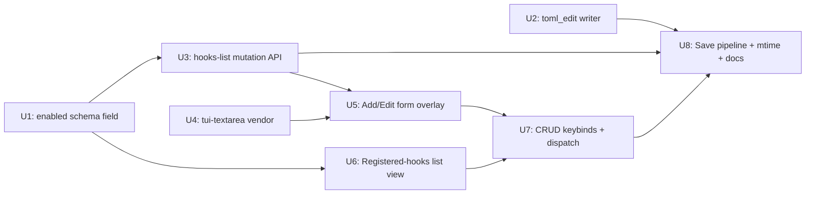

# feat: TUI hook management

> Origin: [TUI hook management requirements](../brainstorms/2026-05-24-tui-hook-management-requirements.md).
> Status: active, target PR #201, target v0.3.0.

---

## Problem Frame

vortix v0.3.0 ships the lifecycle-hooks subsystem (plan 015 phase A) and the
TUI **observability** surface (plan 016): toasts on failure, an overlay
showing recent fires, a startup toast for malformed `[[hooks]]` entries.
What it does **not** ship is the ability to *change* hook configuration
from inside the TUI. To add, edit, toggle, or delete a hook today the
maintainer must locate `~/.config/vortix/config.toml`, open it in
`$EDITOR`, hand-edit the `[[hooks]]` section (TOML structure, quoting,
multi-line strings, env sub-tables), save, exit, and restart vortix.

That violates the TUI's reason to exist. This plan closes the loop:
**full CRUD over `[[hooks]]` from inside the running TUI, with a
restart-apply discipline (no hot-reload), an `enabled` toggle field,
multi-line command editing, comment-preserving `settings.toml` writes,
and mtime-based external-edit conflict detection.** Bundled into PR #201
alongside plans 015 and 016.

---

## Summary

The existing `Shift-H` Lifecycle Hooks overlay grows from a read-only
"what just fired" view into a **manage** view. New behavior:

- **List view** of registered hooks (active + disabled, sorted by file
  order) with one-glance status, command preview, and event label.
- **Detail view** drilling into one hook (full config + recent fires).
- **Add / Edit form** with a multi-line command textarea, event picker,
  timeout input, env-var pair editor, and `enabled` checkbox.
- **Toggle** (`t`) flips `enabled` from the list without opening the
  form.
- **Delete** (`d` or Del) with a confirm dialog.
- **Save pipeline**: validate → mtime conflict check → comment-preserving
  TOML write → atomic rename → "Saved. Restart vortix to apply." toast.

No registry hot-reload — the in-process registry stays bound to whatever
loaded at startup; changes take effect on next vortix start. This is the
maintainer's explicit choice (origin D1).

---

## Requirements Trace

Each requirement below cites its origin Acceptance Example (AE) from the
brainstorm. Coverage is verified at the unit-level test scenarios.

| R | Origin | Description |
|---|---|---|
| R1 | AE1 | Add a hook end-to-end from inside the TUI; resulting `[[hooks]]` entry is valid; non-hook regions of `settings.toml` unchanged. |
| R2 | AE2 | Comments and unrelated sections in `settings.toml` survive any TUI write byte-for-byte. |
| R3 | AE3 | Command field supports multi-line input; newlines survive round-trip through save/reload. |
| R4 | AE4 | Validation rejects empty command, empty name, invalid event kind, malformed timeout before any write. |
| R5 | AE5 | External-edit detection: mtime mismatch on save prompts the user to overwrite; default is reject. |
| R6 | AE6 | Toggle keystroke flips `enabled` and writes through; toast confirms restart-apply. |
| R7 | AE7 | Delete confirmation dialog before any write; non-target hook entries unaffected. |
| R8 | AE8 | Disabled hooks render visually distinct in the list (dim + `[off]` prefix). |
| R9 | AE9 | "Saved. Restart vortix to apply." toast on every successful write; running registry untouched. |
| R10 | AE10 | `scripts/smoke-v0.3.0.sh` passes 12/12 after this work lands. |
| R11 | SC2 | Comment-preservation invariant verified by checksum on the non-`[[hooks]]` slice. |
| R12 | SC3 | ≥95% of misconfigurations caught at form save, not next startup. |

---

## Key Technical Decisions

| # | Decision | Rationale |
|---|---|---|
| KD1 | Write path uses `toml_edit` for parse/edit/serialize — never `serde::Serialize` round-trip. | The default `toml` crate flattens comments, blanks, and key ordering; that would destroy hand-curated `settings.toml`. `toml_edit` is the Rust-ecosystem standard for comment-preserving TOML edits (used by Cargo). |
| KD2 | Vendor [`tui-textarea`](https://crates.io/crates/tui-textarea) for the multi-line command field. | OQ1 resolved. ratatui 0.30 ships single-line `Input` only; building a multi-line editor from scratch is real work with no upside over the mature crate. tui-textarea is MIT, ratatui-compatible, well-maintained. |
| KD3 | Command field stores as `Vec<String>` argv (existing schema). UI presents a single multi-line textarea by default, wrapping as `["sh", "-c", "<text>"]` on save. An "Edit as argv" toggle reveals a literal argv list editor for power users. | The schema is argv; the user expects "edit shell." `sh -c` wrapping is the cleanest bridge. Toggle preserves literal argv form for users who need it. Uses `shlex` for argv↔string conversion in display only — never silently rewrites a user's literal argv on load. |
| KD4 | `enabled: bool` is an `Option<bool>` on the wire, defaulting to `Some(true)` via `#[serde(default)]` + a helper. Registry build skips entries where `enabled == Some(false)`. | Backward-compatible with existing settings files that don't have the field. Wire `Option` keeps absent-vs-present distinct for round-trip purposes; runtime collapses both to "active". |
| KD5 | Atomic file write: write to `settings.toml.tmp` in the same directory, fsync, then `rename` over `settings.toml`. | POSIX-atomic rename. Prevents half-written settings.toml if the process dies mid-write. Standard pattern; no new dependency. |
| KD6 | Mtime-based conflict detection. Form captures `settings.toml` mtime when it opens; save compares mtime; mismatch triggers an overwrite y/N toast prompt. | Cheap, simple, sufficient for the single-writer-with-rare-collision model. No merge UI. |
| KD7 | Env-var editor is a repeating key+value row list. `a` adds a row, `d` deletes the focused row. | OQ4 resolved. More structured than a raw text field, simpler than a TOML inline-table editor. Each row is two single-line inputs. |
| KD8 | Save pipeline is **synchronous** within the TUI event loop. No background save task. | Save is a single TOML write — milliseconds, no network, no contention. Async adds complexity without payoff. |
| KD9 | **No registry hot-reload.** Toast on save says "Saved. Restart vortix to apply." The running journal-subscriber's registry is not touched. | Origin D1 locked. Eliminates the registry-swap race window and ArcSwap dependency. Trade-off documented in the AE9 toast wording. |
| KD10 | `Settings` save path is **hooks-slice-only**, not a general-purpose `Settings::save()`. The writer reads the entire `settings.toml` into a `toml_edit::Document`, mutates only the `[[hooks]]` array, writes back. | Scoping discipline: this PR does not commit us to "settings can be edited from the TUI." Only hooks can. Generalization is a future decision. |

---

## High-Level Technical Design

### Save pipeline (directional — not implementation specification)

```mermaid
flowchart TD
    A[User: Save in form] --> B{Validate fields}
    B -->|invalid| B1[Inline error in form, no write]
    B -->|valid| C[Stat settings.toml mtime]
    C --> D{mtime changed since form open?}
    D -->|yes| E[Toast: 'settings.toml changed externally — overwrite? y/N']
    E -->|N| B1
    E -->|y| F[Continue]
    D -->|no| F
    F --> G[Mutate Vec&lt;HookConfig&gt; in memory: upsert/remove/toggle]
    G --> H[Read settings.toml as toml_edit::Document]
    H --> I[Replace [[hooks]] array preserving everything else]
    I --> J[Write to settings.toml.tmp + fsync]
    J --> K[Rename .tmp over settings.toml]
    K --> L[Toast: 'Saved. Restart vortix to apply.']
    L --> M[Refresh registered-hooks list view in-memory]
    M -.->|registry stays bound to old config| N[(running registry unchanged)]
```

> Illustrates the intended save flow. The implementing agent should treat
> it as directional context, not code to reproduce.

### Implementation unit dependency graph



U1, U2, U4 are independent and can land in any order. U3 needs U1 (so
`enabled` is part of the mutation API). U5 needs U3 + U4. U6 needs U1.
U7 needs U5 + U6. U8 ties everything together.

---

## Implementation Units

### U1. Schema: `enabled: bool` field + registry-skip semantics

**Goal:** Add the `enabled` field to `HookConfig`, default `true`,
backward-compatible with existing settings files. Registry build skips
entries where `enabled == false`.

**Requirements:** R6, R9 (foundation for toggle + restart-apply).

**Dependencies:** none.

**Files:**
- modify: `crates/vortix-config/src/hooks_config.rs`
- modify: `crates/vortix/src/hooks/mod.rs` (`build_registry_from_config_collecting`)
- modify: `crates/vortix-config/src/hooks_config.rs` (tests inline)

**Approach:**
- Add `pub enabled: Option<bool>` with `#[serde(default)]`. A separate
  `pub fn is_enabled(&self) -> bool { self.enabled.unwrap_or(true) }`
  collapses the Option to the runtime boolean. The `Option` is
  load-bearing for round-trip: a settings file that originally lacked
  the field should not gain one until the user touches the entry.
- In `build_registry_from_config_collecting`, skip the `ShellHook::from_config`
  call entirely when `cfg.is_enabled()` is false. The entry stays in
  `Vec<HookConfig>` (so the TUI can render it as `[off]` and toggle it
  back on), but no registration happens.

**Patterns to follow:** existing `HookConfig` field defaulting via
`default_timeout_secs` at `crates/vortix-config/src/hooks_config.rs`.

**Test scenarios:**
- *Covers AE6 (toggle behaviour at schema level).* TOML without an
  `enabled` key parses to `enabled: None`; `is_enabled()` returns `true`.
- TOML with `enabled = true` parses to `Some(true)`; `is_enabled()` returns `true`.
- TOML with `enabled = false` parses to `Some(false)`; `is_enabled()` returns `false`.
- A `Vec<HookConfig>` with three entries (enabled, disabled, missing-field)
  goes through `build_registry_from_config_collecting` and produces a
  registry of size 2 (the disabled one is skipped). Errors vec stays empty.
- Round-trip: serialize a `HookConfig { enabled: None, ... }` via `toml`
  → the output does NOT contain an `enabled =` line.
- Round-trip: serialize a `HookConfig { enabled: Some(false), ... }` →
  output contains exactly `enabled = false`.

**Verification:** new schema tests pass; existing hook registry tests
still pass; clippy clean.

---

### U2. Comment-preserving TOML writer (`toml_edit` + atomic write)

**Goal:** A focused module that reads `settings.toml`, replaces the
`[[hooks]]` array slice with a `Vec<HookConfig>` produced by the TUI,
and writes the result back atomically — preserving every byte outside
the hooks region.

**Requirements:** R1, R2, R11.

**Dependencies:** none.

**Files:**
- modify: `crates/vortix-config/Cargo.toml` (add `toml_edit` dep)
- create: `crates/vortix-config/src/hooks_writer.rs`
- modify: `crates/vortix-config/src/lib.rs` (re-export)
- create: `crates/vortix-config/tests/hooks_writer_roundtrip.rs` (snapshot fixtures)
- create: `crates/vortix-config/tests/fixtures/settings_with_comments.toml`
- create: `crates/vortix-config/tests/fixtures/settings_no_hooks.toml`
- create: `crates/vortix-config/tests/fixtures/settings_multi_sections.toml`

**Approach:**
- Public API (sketch — directional, not implementation):
  - `pub fn write_hooks(path: &Path, hooks: &[HookConfig]) -> Result<(), HooksWriteError>`
  - `pub fn write_hooks_with_mtime_check(path: &Path, expected_mtime: SystemTime, hooks: &[HookConfig]) -> Result<(), HooksWriteError>`
  - `HooksWriteError` variants: `Io`, `Parse`, `MtimeChanged { current: SystemTime }`.
- Internal flow:
  1. Read file as bytes; if file doesn't exist, treat as empty Document.
  2. Parse with `toml_edit::DocumentMut::from_str`.
  3. Remove the existing `hooks` array-of-tables (if present).
  4. For each `HookConfig` in input, build an `ArrayOfTables` entry with
     event, command (array), `timeout_secs` only if not default, env
     (inline table or sub-section depending on size), and `enabled` only
     if `Some(_)`.
  5. Re-insert at the same position the old array occupied (or end of
     document for fresh files).
  6. Write `Document` to bytes; write to `<path>.tmp`; `File::sync_all`;
     `fs::rename` over the target.

**Patterns to follow:** no existing precedent in `vortix-config` for
writing; this unit establishes the pattern. The atomic-write pattern is
standard (used elsewhere in the workspace by the profile-store sidecar).

**Test scenarios (snapshot + assertion):**
- *Covers AE1, AE2.* `settings_with_comments.toml` fixture has a header
  comment, an inline comment on a non-hook key, and two existing `[[hooks]]`
  blocks. Writing a third hook appends; the header and inline comments
  survive byte-identical. The two original hook entries keep their text.
- *Covers AE2, R11.* `settings_multi_sections.toml` has `[journal]`,
  `[engine]`, and `[[hooks]]` interleaved with comments. Writing any
  hook change leaves every byte outside the hooks array unchanged
  (checksum invariant — assert via `sha256` over the non-hook slice).
- *Covers AE1 (empty start).* `settings_no_hooks.toml` has no `[[hooks]]`
  section. Writing one hook adds the section at end of document; no
  other content changes.
- Writing zero hooks against a file that had two `[[hooks]]` blocks
  removes both, leaving no stray blank lines or `[hooks]` table headers.
- Round-trip: write_hooks(read_hooks(file)) is a no-op (byte-identical)
  when the input file is already canonically formatted by the writer.
- `write_hooks_with_mtime_check` returns `MtimeChanged` when the file's
  current mtime differs from the expected mtime; the file is NOT
  overwritten in that case.
- Atomic write under failure: simulate a write failure during the
  `.tmp` step (mock filesystem or write to a read-only directory); the
  original `settings.toml` remains untouched.
- `env` with one key serializes as inline table `env = { K = "v" }`;
  `env` with three+ keys serializes as a `[hooks.env]` sub-section (or
  whichever format the writer picks — pin via snapshot).
- `enabled = None` does not appear in output; `enabled = Some(false)`
  appears as `enabled = false`.

**Verification:** all snapshot fixtures match expected outputs; the
non-hook checksum invariant holds across every test write.

---

### U3. Hooks-list mutation API

**Goal:** Provide a small, focused API on `Vec<HookConfig>` (or a thin
wrapper) for the four CRUD operations the TUI invokes: append, replace-
at-index, remove-at-index, toggle-at-index.

**Requirements:** R1, R6, R7.

**Dependencies:** U1.

**Files:**
- modify: `crates/vortix-config/src/hooks_config.rs` (add inherent
  methods on a new `HooksList` newtype OR free functions on `Vec<HookConfig>`)
- modify tests inline.

**Approach:** decide between newtype `HooksList(Vec<HookConfig>)` and
free functions during implementation. The newtype is cleaner if the
mutation operations need shared invariants (e.g., duplicate-name
detection); free functions are simpler if not. Default: newtype, since
deduplication-by-name will likely earn its slot.

API sketch (directional):
- `HooksList::add(&mut self, cfg: HookConfig)` — appends.
- `HooksList::replace(&mut self, idx: usize, cfg: HookConfig)` — replaces
  at index; returns the old entry. Out-of-bounds returns `None`.
- `HooksList::remove(&mut self, idx: usize) -> Option<HookConfig>`.
- `HooksList::toggle(&mut self, idx: usize) -> bool` — flips `enabled`,
  returns the new value. Out-of-bounds returns `false` and is a no-op.

**Patterns to follow:** none new — straightforward Vec wrapper.

**Test scenarios:**
- `add` appends; length grows by 1.
- `replace(0, new)` swaps element 0; returns the old element.
- `replace(99, new)` on a 3-element list returns `None`; list unchanged.
- `remove(1)` on a 3-element list shrinks to 2; element at index 1 is gone.
- `remove(99)` returns `None`; list unchanged.
- `toggle` on an entry with `enabled: None` produces `Some(false)` and
  returns `false`.
- `toggle` on `Some(true)` produces `Some(false)` and returns `false`.
- `toggle` on `Some(false)` produces `Some(true)` and returns `true`.
- `toggle(99)` is a no-op and returns `false`.

**Verification:** all mutation paths covered; no panics on bad indices.

---

### U4. Vendor `tui-textarea` and minimal wrapper

**Goal:** Add `tui-textarea` as a workspace dependency and wire a
minimal wrapper that the form (U5) can call without spreading
crate-specific types across the codebase.

**Requirements:** R3.

**Dependencies:** none.

**Files:**
- modify: `Cargo.toml` (workspace deps)
- modify: `crates/vortix/Cargo.toml`
- create: `crates/vortix/src/ui/widgets/mod.rs` (new module)
- create: `crates/vortix/src/ui/widgets/textarea.rs`
- modify: `crates/vortix/src/ui/mod.rs` (declare widgets)

**Approach:**
- Pin to the latest `tui-textarea` version compatible with ratatui 0.30
  (verify at impl time — likely 0.7.x or newer).
- Wrapper exposes:
  - `TextArea::new() / .with_text(s) / .lines() -> Vec<String> /
    .as_string() / .input(KeyEvent) / .render(frame, area)`.
- The wrapper exists so we can swap the implementation later without
  rewriting every form caller.

**Patterns to follow:** existing single-line input handling in
`crates/vortix/src/ui/overlays/rename.rs` (cursor management, Esc/Enter
semantics) — mirror conventions, don't copy code.

**Test scenarios:**
- Test expectation: light — wrapper compiles, a smoke test feeds two
  key events (a character and a newline) and asserts `lines()` returns
  two lines. The textarea crate itself is presumed tested; we test the
  wrapper boundary only.

**Verification:** `cargo build -p vortix` succeeds with new deps; the
wrapper smoke test passes.

---

### U5. Hook editor form (Add / Edit overlay)

**Goal:** A new modal overlay with all the fields needed to add or edit
a hook: event picker (single-select), name (single-line input — used as
the human-readable label in lists and journal), command (multi-line
textarea from U4 OR argv list mode), timeout (numeric input), env-var
pair list (repeating key/value rows), enabled (checkbox), Save/Cancel
buttons.

**Requirements:** R1, R3, R4, R5.

**Dependencies:** U3, U4.

**Files:**
- create: `crates/vortix/src/ui/overlays/hook_edit.rs`
- modify: `crates/vortix/src/ui/overlays/mod.rs`
- modify: `crates/vortix/src/state.rs` (new `InputMode::HookEdit { ... }`)
- modify: `crates/vortix/src/message.rs` (HookEditMessage variants)

**Approach:**
- Form state lives on `InputMode::HookEdit { form: HookEditState, ... }`.
- `HookEditState` carries: event_kind selection, name string, command
  representation (`CommandRepr::Shell(TextArea)` or `CommandRepr::Argv(Vec<single_line_input>)`),
  timeout_secs input, env rows `Vec<(Input, Input)>`, enabled bool,
  edit_target (`AddingNew` or `EditingExisting { index, original_mtime }`),
  dirty flag.
- Tab cycles focus across fields; Shift-Tab reverse-cycles. Enter on
  Save button triggers `Message::HookEditSave`. Esc with `dirty=true`
  prompts an unsaved-changes confirm; otherwise closes immediately.
- Command field default mode is `Shell` (multi-line textarea). A key
  binding (`Ctrl-A`) toggles between Shell and Argv modes. Switching
  modes round-trips via `shlex::split` / `shlex::join`; if the current
  text can't be tokenized (unclosed quotes), the toggle is refused with
  an inline error.
- Validation runs on Save attempt: name non-empty, command non-empty,
  event kind valid (picker prevents invalid), timeout parses as `u64`
  and > 0. First failure focuses that field and shows an inline
  message; no save attempt.

**Patterns to follow:**
- `crates/vortix/src/ui/overlays/auth.rs` for multi-field overlay with
  Tab focus management.
- `crates/vortix/src/ui/overlays/rename.rs` for single-input + cursor.
- `crates/vortix/src/ui/overlays/confirm_dialog.rs` for the unsaved-
  changes confirm reuse.

**Test scenarios:**
- *Covers AE4.* Empty name + Save → form stays open, validation error
  visible on the name field, no `Message::HookEditSave` fired.
- *Covers AE4.* Empty command + Save → form stays open, validation
  error visible on the command field.
- *Covers AE4.* Timeout = "abc" + Save → form stays open, validation
  error visible on the timeout field.
- *Covers AE3.* Multi-line text in command textarea → `lines()` returns
  the entered lines in order, including blanks.
- *Covers AE3.* Adding a new hook: type two newlines in command, fill
  other fields, Save fires `HookEditSave` with `CommandRepr::Shell`
  carrying the multi-line string.
- Edit mode: open form on an existing argv-shape hook (`["notify-send",
  "title"]`); UI presents `CommandRepr::Argv` mode with two single-line
  inputs by default (auto-detected, so literal argv form is preserved).
- Edit mode: open form on `["sh", "-c", "echo hi"]`; UI detects shell-
  wrapper, presents `CommandRepr::Shell` with "echo hi" as the textarea
  contents.
- Toggle Ctrl-A: Shell mode with text `"a b c"` switches to Argv mode
  with three single-line inputs `[a, b, c]`. Switching back rejoins.
- Toggle Ctrl-A: Shell mode with `unclosed "quote` → toggle is
  refused, inline error appears.
- Tab cycles event → name → command → timeout → env → enabled → Save
  → Cancel → event (wraps).
- Esc with no edits → form closes immediately without confirm.
- Esc with dirty=true → confirm dialog appears; "y" closes, "n" returns
  to form.
- Add env row (`a` while env focused): empty key+value row appears,
  focus on key.
- Delete env row (`d` while env row focused): row removed; focus moves
  to previous row.
- Env validation: a row with empty key + non-empty value blocks Save
  with an inline error.

**Verification:** form opens, accepts every documented input, validates
all paths described above, dispatches `HookEditSave` only on valid
input.

---

### U6. Registered-hooks list view in the Lifecycle Hooks overlay

**Goal:** Extend the existing `Shift-H` overlay so the top section
shows **registered hooks** (active and disabled) with status, event,
name, and command preview. The existing "recent fires" content remains
below.

**Requirements:** R8.

**Dependencies:** U1.

**Files:**
- modify: `crates/vortix/src/ui/overlays/hooks.rs`
- modify: `crates/vortix/src/app/mod.rs` (cache `registered_hooks: Vec<HookConfig>` on App for rendering — refresh from `Settings::load()` on overlay open and after save)

**Approach:**
- Add a `registered_hooks` field on App, populated:
  - At startup from `Settings::load()`.
  - On overlay open (re-read from disk to catch external edits since
    last open).
  - After successful save (U8).
- The overlay header gains a tabbed/sectioned layout: "Registered (N
  active, M disabled)" section above the existing "Recent fires"
  section. List rows:
  - **Active**: green-on-default style, no prefix.
  - **Disabled**: dimmed, `[off]` prefix.
  - Each row shows: `event_kind · name · command-preview (truncated)`.
- Selection state on the list (j/k navigation) — required for U7's
  `e`/`d`/`t` actions to know which entry they target.
- Empty state: "No hooks configured. Press `a` to add one."

**Patterns to follow:**
- Existing `crates/vortix/src/ui/overlays/hooks.rs` (the recent-fires
  rendering).
- `crates/vortix/src/ui/sidebar.rs` (or equivalent) for selectable list
  navigation with j/k.

**Test scenarios:**
- *Covers AE8.* Three hooks (active, disabled, active) → list renders
  three rows; row 1 has no `[off]`, row 2 has `[off]` and dimmed style,
  row 3 has no `[off]`.
- Empty `registered_hooks` → empty-state message renders; no list.
- Header shows correct counts: "Registered (2 active, 1 disabled)".
- Long command preview is truncated with `…`, not wrapped.
- j/k navigation moves selection; selection wraps at top/bottom (or
  clamps — pin via test).
- After save (U8 wire), the list reflects the new state in memory even
  though the registry didn't reload.

**Verification:** the overlay renders both sections correctly, j/k
selection works, status indicators match `is_enabled()`.

---

### U7. CRUD keybinds + message dispatch + delete confirm

**Goal:** Wire keystrokes in the registered-hooks list (`a` add, `e`
edit, `d` delete, `t` toggle) and `Enter` (inspect/edit) to dispatch
messages that open the form (U5) or the confirm dialog. Action menu
entries mirror the keybinds for discoverability.

**Requirements:** R6, R7.

**Dependencies:** U5, U6.

**Files:**
- modify: `crates/vortix/src/app/input.rs` (input dispatch when the
  hooks overlay is open and the registered-hooks section is focused)
- modify: `crates/vortix/src/message.rs` (new variants)
- modify: `crates/vortix/src/app/update.rs` (handlers)
- modify: `crates/vortix/src/ui/overlays/help.rs` (document new
  keybinds)

**Approach:**
- New messages:
  - `Message::HookAdd` — opens form in `AddingNew` mode.
  - `Message::HookEdit(usize)` — opens form in `EditingExisting`,
    pre-fills from `app.registered_hooks[idx]`, captures current
    `settings.toml` mtime.
  - `Message::HookDeleteRequest(usize)` — opens confirm dialog.
  - `Message::HookDeleteConfirm(usize)` — invokes the save pipeline
    with the hook removed.
  - `Message::HookToggle(usize)` — flips `enabled`, invokes the save
    pipeline (no form).
- Input dispatch: when the hooks overlay is open AND the registered
  section is focused:
  - `a` → `HookAdd`
  - `Enter` or `e` → `HookEdit(selected)`
  - `d` or `Del` → `HookDeleteRequest(selected)`
  - `t` → `HookToggle(selected)`
  - `j`/`k` → list navigation
- Delete confirm dialog reuses `confirm_dialog::render` with
  body "Delete hook 'NAME'? This cannot be undone."

**Patterns to follow:**
- `crates/vortix/src/app/input.rs` profile sidebar key dispatch (a/e/d
  semantics elsewhere).
- The existing delete-profile confirm flow at
  `crates/vortix/src/ui/overlays/confirm_dialog.rs`.

**Test scenarios:**
- `a` in registered-hooks focus → `Message::HookAdd` dispatched; form
  opens in AddingNew.
- `e` on a selected entry → `Message::HookEdit(idx)` dispatched; form
  opens pre-filled.
- `d` on a selected entry → confirm dialog appears; "y" dispatches
  `Message::HookDeleteConfirm`; "n" dismisses dialog without write.
- `t` on a selected entry → `Message::HookToggle(idx)`; toast appears;
  list reflects new state.
- `j`/`k` move selection; `Enter` on empty list is a no-op.
- Help overlay lists `a`, `e`, `d`, `t` under a new "Hooks overlay"
  section.

**Verification:** every keybind dispatches the correct message; the
help overlay documents them; delete requires confirm.

---

### U8. Save pipeline: validate → mtime → write → toast (+ docs sweep)

**Goal:** Tie the form (U5), mutation API (U3), and writer (U2)
together into the save pipeline. Mtime-check on save with overwrite
prompt. "Saved. Restart vortix to apply." toast on success. Update
documentation, help overlay, smoke script.

**Requirements:** R1, R4, R5, R6, R7, R9, R10, R12.

**Dependencies:** U2, U3, U7.

**Files:**
- modify: `crates/vortix/src/app/update.rs` (the pipeline handler)
- modify: `crates/vortix/src/message.rs` (overwrite-prompt message)
- modify: `crates/vortix/src/state.rs` (InputMode for the overwrite
  toast/prompt if it needs state)
- modify: `README.md` (highlight bullet)
- modify: `docs/v0.3.0-RELEASE-NOTES.md` (hook management line)
- modify: `docs/architecture-migration-v1.md` (phase A row addition)
- modify: `scripts/smoke-v0.3.0.sh` (optional: assert registered-hooks
  section renders in `vortix info` or skip; primary smoke remains
  unchanged)
- modify: `crates/vortix/src/ui/overlays/help.rs` (already touched in
  U7 — coordinate)

**Approach:**
- Pipeline handler for `Message::HookEditSave` (and `HookToggle`,
  `HookDeleteConfirm`):
  1. Build the new `Vec<HookConfig>` from `app.registered_hooks` +
     the mutation (upsert via U3 helpers).
  2. Validate fields (mostly already done in form; defense-in-depth
     here for toggle/delete that bypass the form).
  3. Call `hooks_writer::write_hooks_with_mtime_check(path, original_mtime, &new_hooks)`.
  4. On `MtimeChanged` → push `InputMode::HookOverwritePrompt { idx,
     pending_hooks }` that renders a toast-like confirm: "settings.toml
     changed externally — overwrite? y/N". `y` re-invokes
     `hooks_writer::write_hooks` (no mtime check, force-write); `n`
     cancels.
  5. On `Io`/`Parse` errors → ERROR toast with the message;
     `app.registered_hooks` unchanged.
  6. On success → `app.registered_hooks = new_hooks`; toast "Saved.
     Restart vortix to apply."; close form.
- Docs sweep:
  - README highlights bullet updated: "Lifecycle hooks managed from
    inside the TUI — add, edit, toggle, delete via `Shift-H`."
  - Release notes mention CRUD + restart-apply.
  - Help overlay: keybinds documented (coordinated with U7).
  - architecture-migration-v1.md gains row A.2 below the A.1 (plan
    016) row.

**Patterns to follow:**
- `crates/vortix/src/app/update.rs` for `handle_message` arm style.
- The existing `HookConfigErrors` handler (plan 016 U5) for toast-with-
  context patterns.

**Test scenarios:**
- *Covers AE1.* Add a new hook via the form pipeline (mocked writer):
  registered_hooks grows by 1; success toast appears with "Restart
  vortix to apply" wording.
- *Covers AE4, R12.* Save with empty command (defense-in-depth, since
  form already validates): writer is NOT called; error toast appears.
- *Covers AE5.* Mtime mismatch on save: writer returns `MtimeChanged`;
  overwrite prompt appears; `y` re-calls writer without check; `n`
  cancels without write.
- *Covers AE6.* Toggle existing hook via `Message::HookToggle`: writer
  called with the toggled `enabled` field; success toast appears.
- *Covers AE7.* Delete confirm path: `HookDeleteConfirm(idx)` removes
  the entry; writer called with one fewer hook; success toast appears.
- *Covers AE9.* The running registry (`hooks_for_task` in main.rs) is
  NOT touched by any save path — verify by reading
  `app.engine.cmd_sender()` is not used and no `HookConfigErrors` or
  reload signal is emitted.
- Writer Io error → original `app.registered_hooks` unchanged; error
  toast.
- Writer Parse error (existing settings.toml has malformed content
  somewhere else) → error toast with detail; no write.

**Verification:** the four save paths (add, edit, delete, toggle) all
flow through the writer correctly; failure modes surface as toasts;
docs land; smoke 12/12.

---

## Dependencies

| Crate | Version target | Purpose | Risk |
|---|---|---|---|
| `toml_edit` | latest 0.22+ | Comment-preserving TOML edit (KD1). | Low — Cargo uses this; mature. |
| `tui-textarea` | latest compatible with ratatui 0.30 | Multi-line text input widget (KD2). | Medium — ratatui 0.30 is newer; verify compat at impl time. |
| `shlex` | latest 1.x | Shell-string ↔ argv conversion for command field (KD3). | Low — tiny, mature. |

All three are MIT/Apache-licensed. No supply-chain or build-system
surprises expected.

---

## Scope Boundaries

### In scope (this plan, this PR)

- Schema: `enabled: Option<bool>` on `HookConfig`, registry-skip when false.
- CRUD operations on `Vec<HookConfig>` (add/replace/remove/toggle).
- Comment-preserving TOML write with atomic rename.
- Multi-line command textarea (`tui-textarea` vendored).
- Shell-string ↔ argv toggle in the form (Ctrl-A).
- Env-var key+value row editor.
- Add/Edit/Delete/Toggle keybinds in the Lifecycle Hooks overlay.
- Registered-hooks list view alongside recent-fires.
- Mtime-based external-edit conflict detection with overwrite prompt.
- "Saved. Restart vortix to apply." toast on every successful write.
- Help overlay, README, release notes, architecture-migration-v1 update.

### Deferred to Follow-Up Work

- **Registry hot-reload** (v0.3.x). ArcSwap-based atomic swap of the
  in-process registry so changes take effect without restart. The
  restart-apply toast wording stays accurate; this is purely a UX
  upgrade.
- **`vortix hooks` CLI subcommand**. The CLI counterpart for power
  users who want to script hook setup. Out of scope here; not a top-
  level CLI slot decision today.
- **Schema-driven preset gallery** (vNext). A library of pre-canned
  hook templates (Slack webhook, desktop notify, log to file). The
  brainstorm explicitly says the single-user model doesn't need
  presets; revisit if/when a non-shell-comfortable user persona
  materializes.

### Deferred for later (carried from origin)

- **Per-profile hook attachment.** A different schema and a separate
  brainstorm. The global `[[hooks]]` shape is what this plan manages.
- **Daemon-RPC hook management.** The daemon (plan 010 / 015 phase D)
  is skeleton-only in v0.3.0. When engine routing through the daemon
  ships, hook management may move to an RPC call instead of a direct
  file write — but that's not this work.

### Outside this product's identity (carried from origin)

- **Visual rule builder / IFTTT-style action chains.** vortix is a VPN
  manager; the hook mechanism stays a low-level shell-out, not a
  no-code automation framework.
- **Hook composition / pipelines.** One event fires N independent
  hooks. No chaining, no fan-in, no shared state.
- **GUI alternatives.** No native window, no web UI, no system tray.
  TUI only.

---

## System-Wide Impact

| Surface | Impact | Notes |
|---|---|---|
| `vortix-config` | New module (`hooks_writer`), new dependency (`toml_edit`), schema field on `HookConfig`. | Crate stays internal; no external API consumers. |
| `vortix` (binary/lib) | New overlay (`hook_edit`), new widget module, new messages, new App fields. | All additive; no existing behavior changes. |
| Settings file | TUI writes become possible. Mtime + atomic write protect against half-states. | Users who edit `settings.toml` externally are protected by mtime check; comments and unrelated sections are preserved. |
| Journal subscriber task | Unchanged. Continues to read the registry that was loaded at startup. | Restart-apply discipline is what keeps this isolated. |
| Daemon | Unchanged in v0.3.0; not part of this plan's surface. | Future daemon-RPC management is a v0.3.x decision. |
| CI / smoke | Smoke script likely unchanged (the overlay is interactive). Add a config-layer integration test for the writer + reader round-trip. | Workspace `cargo test` already runs in CI. |
| Docs | README, release notes, help overlay, architecture-migration-v1 all updated in U8. | One coordinated docs commit. |

---

## Testing Strategy

- **Unit tests live next to code** (`#[cfg(test)] mod tests`) for U1, U3.
- **Integration tests** for the writer (U2) live in
  `crates/vortix-config/tests/hooks_writer_roundtrip.rs` with fixture
  files in `crates/vortix-config/tests/fixtures/`. The comment-
  preservation invariant is asserted via a SHA-256 checksum over the
  non-`[[hooks]]` slice of the file before and after the write.
- **Form tests** (U5) live in `crates/vortix/src/ui/overlays/hook_edit.rs`
  (mod tests) and exercise `HookEditState` transitions directly (no
  ratatui frame rendering needed).
- **App-level tests** (U6, U7, U8) extend `crates/vortix/src/app/tests.rs`
  following the patterns established by plan 016 U2/U3 hook tests.
  Save pipeline tests use a mock writer to avoid touching the real
  filesystem during unit tests.
- **No new end-to-end harness.** The v0.3.0 smoke (`scripts/smoke-v0.3.0.sh`)
  remains the headless smoke and stays at 12/12.

---

## Risks and Mitigations

| Risk | Severity | Mitigation |
|---|---|---|
| **`toml_edit` round-trip edge cases.** Exotic TOML shapes (deeply nested tables, multi-line strings with embedded quotes) may not survive perfectly. | Medium | Snapshot fixture tests cover the shapes we ship. Mtime-overwrite path is the safety net for user-authored content the writer doesn't model. |
| **Form widget complexity.** Multi-line textarea + Tab order + Esc-with-dirty-state is real new UI surface for vortix. | Medium | `tui-textarea` carries the multi-line burden; rest is form state machine — straightforward. Tests exercise every transition. |
| **`tui-textarea` ratatui 0.30 compatibility.** | Low-medium | Verify pinned version at impl time; if no compatible version exists, fall back to building a minimal textarea (~200 LOC). |
| **Mtime check on filesystems without sub-second precision.** Two saves in the same second could miss a conflict. | Low | Vortix users are single-writer in practice; mtime granularity is good enough. If a real conflict slips through, the toml_edit writer still only mutates the `[[hooks]]` slice — non-hook regions survive. |
| **PR #201 scope creep.** PR #201 has absorbed 005/006/007/015/016 and now this. Bisect surface grows. | Medium | The maintainer explicitly chose "do it right, in this PR." Each unit lands as its own commit so revert granularity stays sharp. |
| **`shlex` round-trip lossiness in Shell ↔ Argv toggle.** A user's quoting style may not survive the toggle. | Low | The toggle is opt-in (Ctrl-A); the default Shell mode never invokes argv split unless the user asks. Users who hand-wrote literal argv see Argv mode by default on edit (auto-detect). |
| **`enabled` field on existing settings files.** | Low | `Option<bool>` + `#[serde(default)]` is backward-compatible; writer doesn't add the field unless the user explicitly toggled it. |

---

## Documentation Plan

- **README**: update the lifecycle-hooks bullet to mention CRUD-in-TUI.
- **`docs/v0.3.0-RELEASE-NOTES.md`**: append a paragraph to the hooks
  section describing add/edit/delete/toggle, the restart-apply
  discipline, and comment preservation.
- **`docs/architecture-migration-v1.md`**: add a row `A.2 — TUI hook
  management (plan 017)` below the existing A.1 row for plan 016.
- **Help overlay** (`crates/vortix/src/ui/overlays/help.rs`): add a
  new "Hooks overlay" section with `a`, `e`, `d`, `t`, `Ctrl-A`,
  `Enter`, `Esc` keybinds.
- **No new top-level docs** — this is an in-product UX addition, not a
  new subsystem; the existing hook docs continue to apply.

---

## Verification (plan-level)

The plan is complete when:

- All 8 implementation units ship as separate commits on
  `refactor/architectural-migration-v1`.
- `cargo test --workspace` passes (current count: 308 in `vortix` + 209
  elsewhere; this plan adds ~30 new tests).
- `cargo clippy --workspace --all-targets -- -D warnings` is clean.
- `scripts/smoke-v0.3.0.sh dev` passes 12/12.
- A manual end-to-end check (the maintainer's own scenario): from a
  cold TUI start, add a `post_connect` desktop-notify hook, save,
  restart vortix, connect to a profile, verify the notification fires.
  Logged in the U8 commit message as the acceptance signal.
- The non-hook checksum invariant (R11/SC2) is asserted in U2 tests.
- Origin AE1–AE10 are each linked to at least one passing test scenario
  (the per-unit Test scenarios sections show the `Covers AE<N>` links).

---

## Open Implementation-Time Unknowns

The following are deliberately deferred to execution:

- Exact `tui-textarea` API surface (which key codes it consumes, how to
  pass focus state) — resolved by reading the crate's docs at U4.
- Whether the form's env-row Tab navigation goes column-first
  (key1 → value1 → key2 → value2) or row-first (key1 → value1 then
  next-row). Pick whichever feels cleaner at impl time.
- Whether the writer outputs `env` as inline table (`env = { K = "v" }`)
  or sub-section (`[hooks.env] / K = "v"`) when there's only one env
  var. Pin the choice via snapshot test in U2.
- Whether selection wraps or clamps at the top/bottom of the
  registered-hooks list (U6). Pick whichever matches the profile list's
  existing behavior.
- Whether the overwrite prompt is a toast with key handling or a full
  confirm-dialog overlay. Toast-with-prompt is simpler; confirm-dialog
  is more discoverable. Decide at U8.
