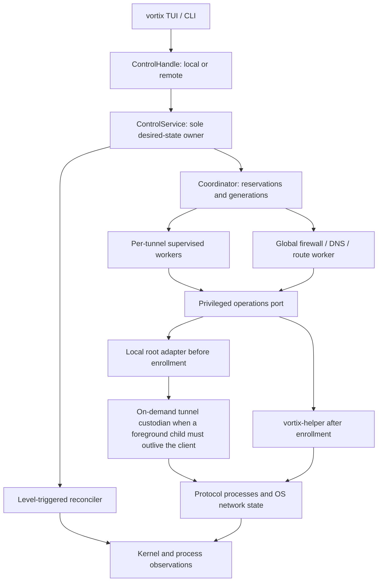
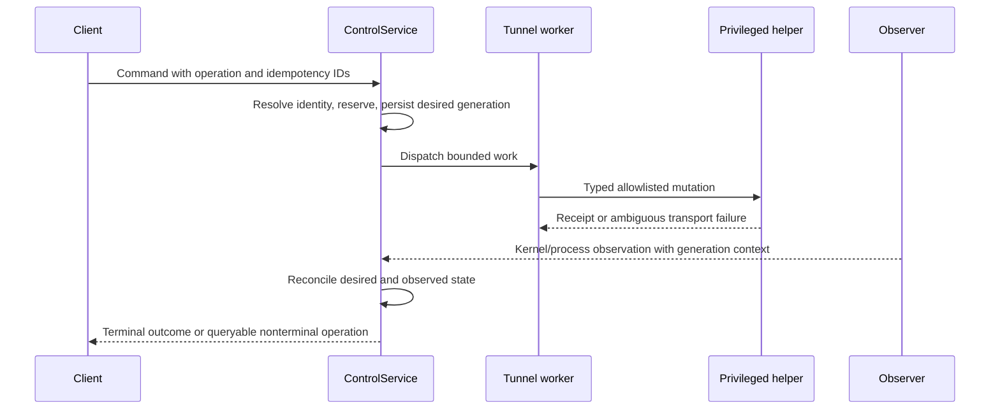
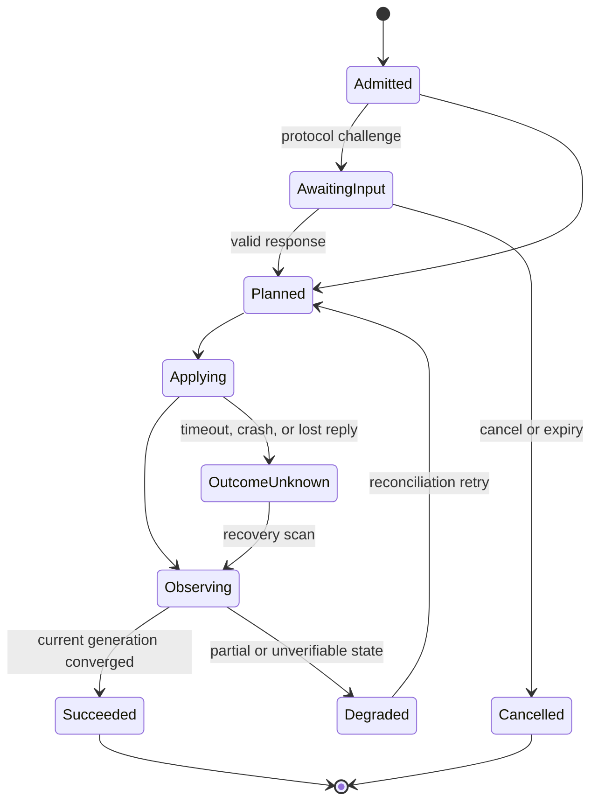
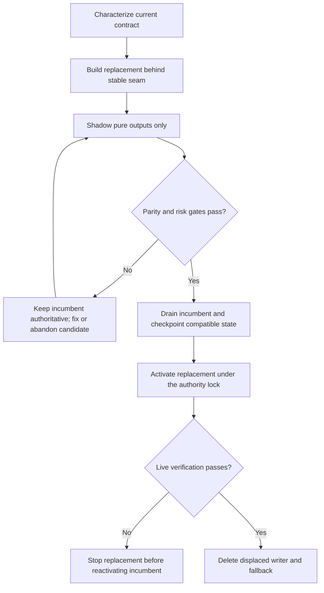
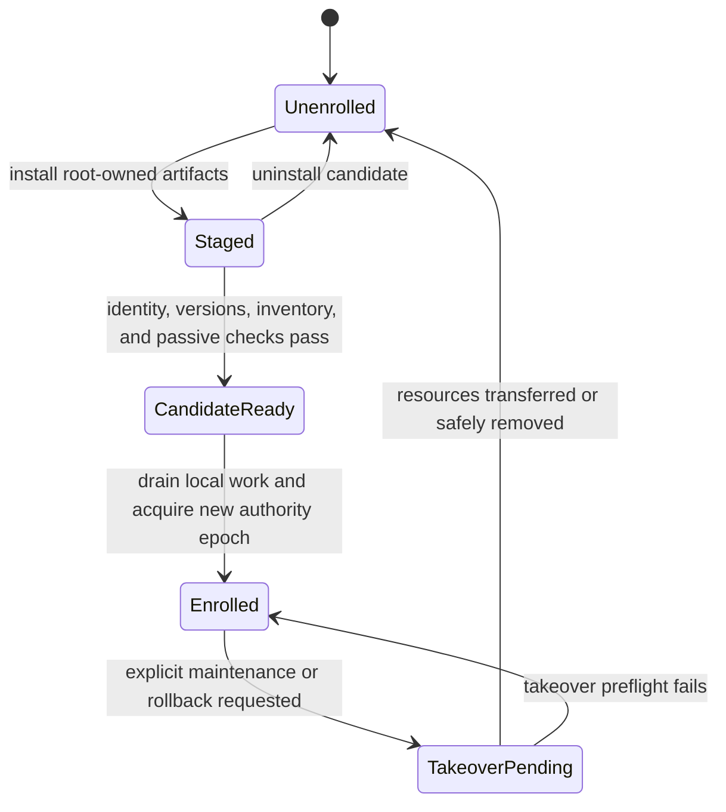
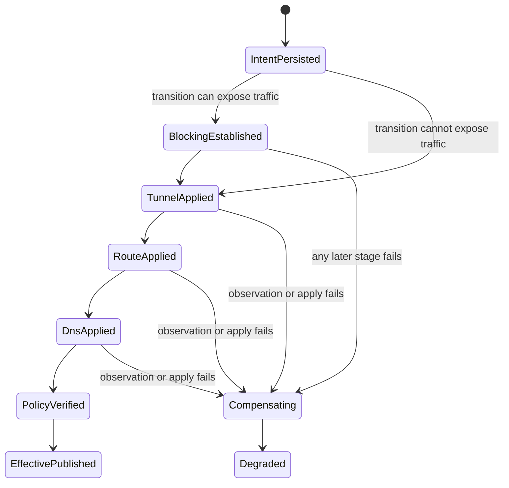
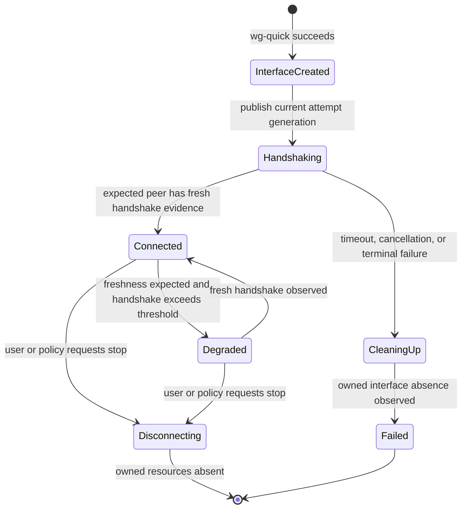
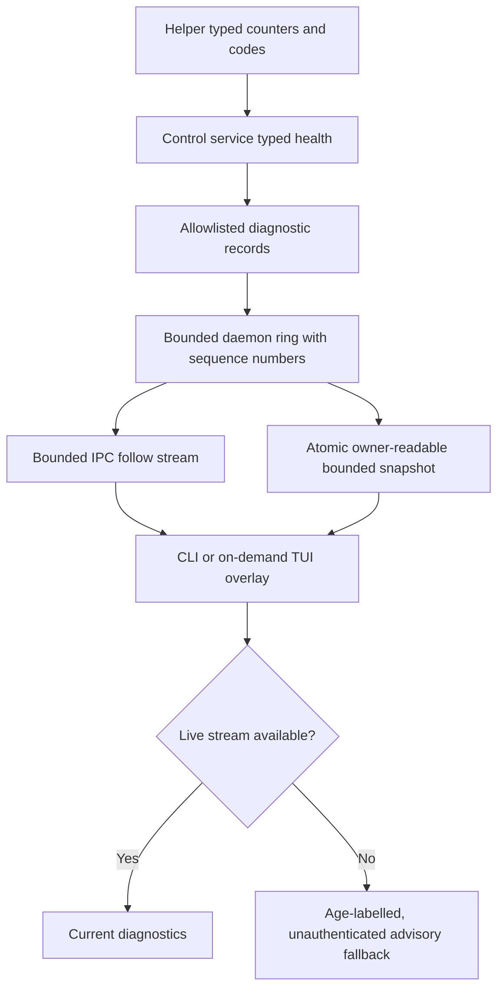

# Canonical Control Plane Migration - Plan

## Goal Capsule

| Field | Contract |
|---|---|
| Objective | Migrate Vortix from overlapping TUI, CLI, registry, and daemon mutation paths to one canonical control service with reconciled desired, observed, and effective state. |
| Product authority | Existing CLI grammar, JSON v2, profile formats, multi-tunnel behavior, kill-switch vocabulary, and no-daemon workflows remain authoritative unless a security correction is named in this plan. |
| Architecture authority | One control service owns desired state; one coordinator owns global network policy; one worker owns each managed tunnel; only the privileged helper performs privileged mutations after service enrollment. |
| Execution profile | Characterization-first, incremental cutovers, one writable authority at every step, and full CI parity before every push. |
| Stop conditions | Stop a cutover on output mismatch, ambiguous ownership, false protection reporting, unbounded work, an unverified rollback path, or missing real-platform evidence for the affected OS. |
| Tail ownership | The final unit removes obsolete bridges, updates release/install documentation, records remaining manual scenarios, and leaves no abandoned migration code. |

---

## Product Contract

### Summary

Vortix will preserve its current product behavior while replacing its internal control plane in independently shippable phases.
The migration first corrects firewall and DNS truthfulness, then makes one in-process service authoritative, hosts that service in the daemon, introduces a narrow privileged helper, and finally deletes every legacy writer and mirror.

### Problem Frame

Vortix currently has several overlapping control paths.
The TUI invokes protocol adapters and mirrors results into `TunnelRegistry`; the CLI runs blocking `VpnRuntime` lifecycle helpers; scanner reconciliation and kill-switch synchronization live partly in `App`; and the daemon hosts an optional single-tunnel handle with incomplete streaming and multi-tunnel semantics.
These paths duplicate state, allow silent fallback between authorities, and force placeholder engines and compatibility projections to keep UI state aligned with kernel state.

The target primitives already exist in partial form: typed commands and events, FSM state, protocol and platform ports, profile storage, peer-credential checks, an IPC frame contract, and registry snapshots.
The work is therefore a migration and consolidation, not a clean-room rewrite.

### Actors

- A1. A Standard-mode user expects manual root-assisted TUI and CLI operation with no always-on Vortix control service while idle.
- A2. A Background-mode user expects unprivileged CLI and TUI clients to share one long-lived state, remain live in sync, and receive continuous supervision.
- A3. A package maintainer needs one release version to install, upgrade, verify, roll back, and uninstall the client, daemon mode, helper, and service artifacts safely.
- A4. A contributor needs compiler-visible or automated boundary checks that prevent new direct writers, privileged calls, and unbounded control paths.

### Requirements

**Compatibility and identity**

- R1. Preserve the existing CLI grammar, aliases, semantic exit codes, human output meaning, JSON v2 envelope, and quiet/watch behavior throughout the migration.
- R2. Preserve safe WireGuard and OpenVPN profile behavior, sidecars, auth flows, imports, rename/delete rules, and rollback compatibility; raw WireGuard/OpenVPN executable directives are rejected as a named security correction with actionable migration to R37's owner-run lifecycle automation.
- R3. Preserve heterogeneous multi-tunnel behavior, existing CIDR/AllowedIPs split routing, kernel-derived primary selection, conflict detection, external-session visibility, and current no-primary semantics; per-application split tunneling remains deferred.
- R4. Use one opaque stable `ProfileId` internally while retaining profile display names at CLI, TUI, JSON, and configuration boundaries.
- R5. Keep no-daemon operation first-class by instantiating the same control service locally; do not maintain a separate lifecycle implementation.

**Authority and state**

- R6. Exactly one control service owns desired tunnel and kill-switch state in each operating mode.
- R7. Model desired intent, kernel observations, and effective user-visible conditions separately; never infer effective protection from persisted intent alone.
- R8. Serialize reservations and global firewall, DNS, and route policy while allowing bounded independent tunnel work.
- R9. Give every mutation an operation ID, idempotency key, deadline, durable status, and terminal result that requires observation.
- R10. Treat scanner and platform events as observations; they may refresh metadata but may not overwrite protocol-authoritative identity or silently promote an in-flight operation.
- R11. Admit daemon mutations only after startup reconciliation completes and authority enrollment is verified.
- R12. Never permit silent local mutation fallback when an enrolled daemon is unavailable, incompatible, starting, or upgrading.

**Security and privilege**

- R13. Correct Linux and macOS firewall ownership, atomicity, multi-tunnel, dual-stack, and truthful-state defects before control-plane cutover.
- R14. Reconcile DNS ownership and secondary-tunnel suppression through the global coordinator before client cutover.
- R15. Run clients and the control daemon unprivileged after enrollment; route privileged process, firewall, DNS, and route work through a narrow helper.
- R16. Give the helper only a canonical allowlisted model parsed unprivileged; reject arbitrary commands, hooks, plugins, includes, executables, arguments, paths, interfaces, addresses, CIDRs, file writes, and unknown protocol variants.
- R17. Authenticate client-to-daemon IPC with kernel peer credentials and bind daemon-to-helper authority to an OS-verified daemon instance plus a root-issued boot-scoped lease; peer UID alone is insufficient.
- R18. Report `Protected` only when fresh observations for the current desired generation, privileged-executor epoch (local authority or helper), and policy digest verify interface, route, DNS, and firewall gates; invalidate immediately on relevant drift events and within a five-second freshness ceiling otherwise.
- R19. Keep interactive credentials memory-only across client/control IPC and create protocol-required secret material by inherited descriptor or in a fixed helper-owned runtime directory when a named file is unavoidable.

**Reliability and recovery**

- R20. Persist a versioned atomic user-owned desired-state snapshot containing generations, boot scope, operation status, and requested resources; keep a separate minimal root-owned helper ledger as the only proof of privileged resource ownership.
- R21. Resume supervised intent after a same-boot daemon restart and reconnect after reboot only for profiles explicitly configured and eligible for boot connection.
- R22. Reconcile after startup, relevant platform events, child exits, helper reconnect, and bounded periodic polling.
- R23. Bound every in-memory queue and persistent collection with explicit overload, retention, compaction, disk-exhaustion, or loss behavior.
- R24. Give every protocol child an accountable lifecycle owner until exit and reap: the Background-mode helper or a minimal on-demand Standard-mode tunnel custodian; protocol processes may not self-daemonize, and owner death must trigger OS-enforced containment before restart.
- R25. Represent ambiguous external sessions as read-only observations until they can be mapped to a stable profile and protocol-correct ownership handle.
- R26. Preserve fail-closed behavior during kill-switch, daemon, helper, upgrade, rollback, and disk-exhaustion failures without falsely claiming success.

**Delivery and governance**

- R27. Keep `main` releasable after every implementation unit and delete a displaced writer in the same unit that promotes its replacement.
- R28. Compare normalized snapshots, events, errors, JSON, and outcomes during shadow validation, but never dual-run kernel side effects.
- R29. Give every authority cutover an enrollment preflight, drain/checkpoint step, monotonic authority epoch, single-owner activation, rollback procedure, and promotion evidence.
- R30. Extend architecture checks so client code cannot import protocol/platform/process mutation layers, production cannot call seed/mirror APIs, and privileged or unbounded operations cannot escape their owner.
- R31. Run the complete `docs/ci-parity.md` suite before every push and add real Linux and macOS verification at the unit where platform behavior changes.
- R32. Apply firewall, route, DNS, and tunnel changes through a persisted topology-generation state machine whose safety barriers cannot be coalesced away.
- R33. Present two user-facing modes: **Standard mode** runs no always-on Vortix control daemon/helper and preserves manual VPN control; an active process-based tunnel may use a minimal on-demand custodian that exits with that tunnel. **Background mode** adds routine CLI/TUI control without `sudo` after one-time setup, live CLI/TUI synchronization, automatic drop recovery, boot connections, continuous policy verification, and shared multi-client coordination.
- R34. Keep Background mode optional and guided: explain its benefits and background-process cost before activation, allow decline without losing Standard mode, use one guided privilege-elevation step on supported macOS/Linux packages, and expose `vortix setup`, `vortix background status`, `vortix background recover`, and `vortix background disable` plus equivalent TUI actions without requiring systemd or launchd knowledge.

**Protocol health and diagnostics**

- R35. For WireGuard, keep the operation in the internal `Connecting` state while every user-facing surface renders `Handshaking` until a current-generation peer handshake is observed; fail and clean up after a configurable timeout defaulting to 20 seconds, then continuously distinguish healthy, stale, and recovered handshake state without treating interface creation as connectivity.
- R36. Expose bounded, owner-readable, redacted Background-mode diagnostics through the shared control contract and an on-demand CLI/TUI view; diagnostics remain useful when the daemon is degraded, disclose loss or staleness, label the same-UID-writable fallback snapshot as unauthenticated advisory evidence, never use it as authority or protection truth, never require service-manager knowledge, and never expose credentials, profile contents, endpoints, IP addresses, DNS servers, arbitrary helper logs, or unbounded history.
- R37. Preserve lifecycle automation with explicit global `connect_started`, `connected`, `disconnect_started`, `disconnected`, `connect_failed`, and `reconnecting` event-hook specs that execute asynchronously as the enrolled/invoking owner with a stable event ID, absolute executable plus argv, sanitized environment, bounded queue/concurrency/time/output, at-most-once dispatch attempts, and no ability to gate lifecycle state or reach the helper/root boundary; a crash may lose an observational hook, and an ambiguous spawn is never retried.

**Boot eligibility**

- R38. Permit boot connection only for non-interactive profiles whose required key/certificate material is already available under the reviewed profile contract; reject password-, OTP-, challenge-, or other interactive-credential-dependent profiles during setup and startup with actionable after-login guidance, and never persist an OTP for boot use.

### User-Visible Mode Contract

| State | User-facing meaning | Available behavior |
|---|---|---|
| `Standard mode: Active` | No always-on Vortix control service; manual control remains available. | Manual lifecycle/profile/kill-switch actions and Background-mode setup. An active OpenVPN-like tunnel may have one visible on-demand custodian, but there is no live cross-client state, automatic recovery, boot connection, or continuous reconciliation. |
| `Background mode: Enabling` | Preflight, trusted staging, or enrollment is in progress; Standard mode remains authoritative until the enrollment commit. | Status and phase-appropriate cancellation only; background mutation stays disabled. |
| `Background mode: Active` | The enrolled authority, daemon/helper identities and versions, authority lock/epoch, boot-scoped lease, completed reconciliation, and fresh health all agree. | Routine CLI/TUI control without `sudo`, shared mutations and live synchronization, automatic recovery, boot connection, and continuous verification. |
| `Background mode: Degraded` | Enrollment remains authoritative but a required component or fresh health predicate is unavailable. | Status, diagnostics, recovery, and safe disable; mutations fail closed according to the operation and protection state. |
| `Background mode: Disabling` | Admission is stopped and active resources are being resolved before unenrollment. | Status only; after the destructive transition commits, cancellation is replaced by recovery. |
| `Background mode: Recovery required` | Setup/disable could not restore a verified safe terminal state. | Recovery and protection-increasing cleanup only; never claim Standard or Active until authority and owned resources agree. |

CLI, TUI, and JSON v2 derive these states from the same typed mode/health record and expose the reason plus permitted actions.
Internal states such as `Staged`, `CandidateReady`, `Enrolled`, epochs, daemon, helper, and leases appear only in advanced diagnostics and contributor documentation.
The TUI places one text-and-sigil mode/health signal in the existing header, exposes Setup, Status, Recover, and Disable through the existing action menu, opens setup/recovery in one keyboard-operable overlay, and keeps detailed diagnostics in the existing Logs view; it does not add a persistent panel or rely on color alone.

### Key Flows

- F1. **No-daemon local operation**
  - **Trigger:** A1 invokes the TUI or a lifecycle CLI command without service enrollment.
  - **Steps:** Create an in-process control service, acquire the existing cross-process authority lock, execute through the same command contract, observe the kernel, and return current-compatible output.
  - **Outcome:** Current behavior remains available without creating reboot-persistent supervision.
- F2. **Enrolled daemon operation**
  - **Trigger:** A2 invokes a command after service enrollment.
  - **Steps:** Verify the enrolled authority epoch, discover the private socket, authenticate the peer, negotiate protocol and capabilities, submit an operation, and observe snapshots/events until terminal confirmation.
  - **Outcome:** All clients see the same daemon-owned state and no local writer starts.
- F3. **Mutation and reconciliation**
  - **Trigger:** Connect, disconnect, reconnect, kill-switch, profile, or interactive-input command is admitted.
  - **Steps:** Resolve stable identity, reserve resources, persist desired generation, dispatch bounded work, observe kernel state, reconcile global policy, and publish effective conditions.
  - **Outcome:** Success means observed convergence; timeout returns a queryable nonterminal operation rather than guessing failure.
- F4. **Crash or upgrade recovery**
  - **Trigger:** Client, daemon, helper, or protocol child exits unexpectedly or is upgraded.
  - **Steps:** Stop admission, authenticate the replacement, scan before mutation, compare boot scope and generations, adopt unambiguous resources, and converge from observed state.
  - **Outcome:** No duplicate tunnel, false protection, stale writer, or unintended cross-boot reconnect occurs.
- F5. **Authority rollback**
  - **Trigger:** A promotion gate fails after a cutover.
  - **Steps:** Stop admission and restart, drain or mark operations nonterminal, checkpoint compatible state, keep fail-closed policy active, transfer or safely tear down managed resources, verify new-authority inactivity, acquire the shared lock, verify equivalent protection, and only then release obsolete helper policy.
  - **Outcome:** Old and new writers never overlap, protection does not open during handoff, and rollback preserves supported profile and output contracts.
- F6. **Background mode discovery and activation**
  - **Trigger:** A user opens setup or requests live synchronization, automatic recovery, boot connection, or another capability that requires continuous supervision.
  - **Steps:** Explain that Background mode enables routine CLI/TUI control without `sudo` after one-time setup and adds continuous capabilities by running persistent processes; run compatibility/security preflight; identify active Standard-owned tunnels and protection; obtain disruption confirmation; establish required blocking; persist reconnect intent; stop and observe absence of Standard-owned resources; invoke only a trusted package bootstrap for one guided privilege-elevation step; stage and verify artifacts; enroll the new authority epoch; reconnect under the helper; report Active only after the full health predicate passes.
  - **Outcome:** The user either remains fully functional in Standard mode or reaches a plainly reported Background-mode state without editing service files or learning platform service-manager commands.
- F7. **Background mode disable**
  - **Trigger:** A user disables Background mode from the CLI or TUI.
  - **Steps:** List the continuous capabilities that stop, every managed active tunnel, and the kill-switch consequence; require explicit confirmation; stop admission; drain operations; disconnect managed tunnels while retaining required fail-closed policy; observe absence; clean owned resources; unenroll authority; stop persistent services; verify Standard-mode ownership; only then report success.
  - **Outcome:** Standard mode is restored without overlapping writers, abandoned privileged resources, or unexpected profile deletion.
- F8. **WireGuard handshake verification**
  - **Trigger:** `wg-quick` creates an interface for a newly admitted WireGuard generation.
  - **Steps:** Publish `Handshaking`, poll typed WireGuard status for a handshake newer than the attempt start, use only the configured bounded health-probe path to elicit traffic when needed, and accept success only for the expected peer and generation; on timeout, preserve required blocking, tear down the attempt's owned interface, observe absence, and apply the existing retry policy.
  - **Outcome:** A valid peer becomes connected only after cryptographic liveness proof; an invalid or unreachable peer never appears connected or protected.
- F9. **Background diagnostics**
  - **Trigger:** A user opens advanced diagnostics or requests `vortix background diagnostics`, including while Background mode is degraded.
  - **Steps:** Read the daemon's bounded authenticated diagnostic stream when reachable or its latest owner-readable atomic snapshot when unavailable; label fallback content stale and unauthenticated, never use it to assert authority/protection, and show component versions/health, authority epoch, reconciliation state, operation summaries, queue pressure, restarts, drift, audit failures, and a gap/staleness marker without reading arbitrary root logs.
  - **Outcome:** The user gets actionable, shareable evidence without learning systemd/launchd commands or disclosing network identity and secrets.
- F10. **Unprivileged lifecycle automation**
  - **Trigger:** The control service publishes one of the six configured lifecycle facts.
  - **Steps:** Publish `connect_started`, `connected`, `disconnect_started`, `disconnected`, `connect_failed`, or `reconnecting` with a stable event ID; resolve an immutable hook spec, mark one non-retrying attempt in the bounded in-memory queue, enqueue it without blocking the lifecycle transition, establish the enrolled owner or safely derive the invoking non-root owner in Standard mode, spawn the absolute executable without a shell under that identity, enforce timeout/output/process-group bounds, and publish typed completion/failure diagnostics only when the outcome remains observable.
  - **Outcome:** Wrapper/notification automation receives honest asynchronous lifecycle facts across CLI/TUI and Standard/Background modes without arbitrary root execution, misleading pre-action semantics, duplicate retries after an ambiguous crash, or hidden effects on tunnel success.
- F11. **Background recovery**
  - **Trigger:** Setup or disable enters `Background mode: Recovery required`, or the user invokes `vortix background recover` or the matching TUI action.
  - **Steps:** Show the verified failure reason, current authority/protection state, and the bounded recovery actions allowed; preview disruption, require confirmation for protection-reducing cleanup, stop admission, reconcile owned resources and service enrollment under required blocking, verify one terminal authority, then report Active or Standard only from fresh observations. Escape/cancel before the destructive commit leaves state unchanged; failure remains Recovery required with a new diagnostic code and retry guidance.
  - **Outcome:** CLI and TUI provide the same safe route out of partial setup/disable without asking users to operate systemd or launchd directly.

### Acceptance Examples

- AE1. With no service enrolled, `sudo vortix up corp` and the root-assisted TUI use the local control service and retain current output, exit codes, and kernel behavior; this explicitly preserves the existing full-client Standard-mode trust boundary, while Background mode is the narrow-helper path.
- AE2. With a healthy enrolled service, two TUIs and a CLI observe the same two-tunnel snapshot, primary, kill-switch state, and event generations.
- AE3. With an enrolled daemon temporarily unavailable, read-only status may return explicitly degraded scanner data, but mutation fails without silently starting a local writer.
- AE4. When a connect response times out after helper dispatch, the client receives an operation ID and nonterminal status; retrying the same idempotency key never spawns a second tunnel.
- AE5. When OpenVPN requests interactive input, any authorized client can answer the named challenge once before its deadline; the answer is never journaled and cleanup runs on every terminal path.
- AE6. When the daemon restarts during the same boot, it scans before serving mutations and resumes supervised desired state; after a reboot, only boot-enabled and non-interactive-eligible profiles reconnect.
- AE7. When disconnect succeeds at the process layer but the interface remains, state stays `Disconnecting` and the adoption tombstone prevents immediate re-adoption until absence is confirmed.
- AE8. When an unknown external interface cannot be mapped safely, Vortix displays it as an unmanaged observation and does not retry, disconnect, or elect it primary.
- AE9. When nftables replacement fails, the prior Vortix-owned rules remain active and effective state becomes degraded rather than falsely `Protected`.
- AE10. When a subscriber lags, it receives a resynchronization signal, fetches the newest snapshot generation, and resumes without affecting controller progress.
- AE11. When the helper disappears after applying a mutation but before replying, the daemon treats the outcome as ambiguous, observes the kernel, and never assumes failure or repeats blindly.
- AE12. When rollback is requested after enrollment, the new authority drains and stops before the local path can acquire the shared authority lock.
- AE13. After a normal supported installation, Vortix starts in Standard mode, runs no always-on Vortix control service while idle, and manual CLI/TUI operation remains available; an active OpenVPN-like tunnel may run one visible on-demand custodian that exits with the tunnel.
- AE14. When a Standard-mode user requests live CLI/TUI synchronization or automatic recovery, Vortix explains that Background mode is required and lets the user continue setup or cancel without losing current functionality.
- AE15. On supported macOS and Linux packages, guided setup uses one privilege-elevation step, validates the installed components, reports `Background mode: Active` without exposing systemd or launchd details, and subsequent routine CLI/TUI control does not require `sudo`.
- AE16. Disabling Background mode from either surface previews and, after explicit confirmation, disconnects managed tunnels while preserving required blocking, performs safe unenrollment, and returns to `Standard mode: Active`; if cleanup cannot complete, Vortix reports `Background mode: Recovery required` rather than claiming success.
- AE17. When `wg-quick up` succeeds but no expected peer handshake appears within 20 seconds, CLI/TUI/JSON remain `Handshaking`, the attempt ends with a clear handshake failure, its owned interface is removed under the current kill-switch posture, and no surface reports `Connected` or `Protected`.
- AE18. When a valid WireGuard peer handshakes during the attempt, the same observed timestamp and generation move CLI/TUI/JSON from `Handshaking` to `Connected`; a stale timestamp from before the attempt cannot satisfy the gate.
- AE19. When a connected WireGuard tunnel has expected traffic or a configured probe but its handshake exceeds the three-minute health threshold, health becomes degraded without inventing a disconnect; a fresh handshake clears the warning from the same shared snapshot.
- AE20. When the daemon is reachable, diagnostics can be followed with bounded lag recovery; when it is unavailable, the latest snapshot is visibly stale, unauthenticated, advisory-only, and readable, and neither path contains secrets, profile/network identity, raw root-helper output, or unlimited history.
- AE21. A configured `connected` hook receives a stable event ID and gets at most one dispatch attempt as the enrolled/invoking non-root owner after the committed lifecycle event; observable timeout, non-zero exit, queue saturation, or runner failure produces bounded typed diagnostics, while a whole-process crash may lose the hook or its outcome and is never replayed in a way that could duplicate an external side effect; neither case changes the tunnel's terminal state.
- AE22. A profile containing WireGuard `PreUp`/`PostUp`/`PreDown`/`PostDown` or equivalent executable protocol directives never reaches `wg-quick`/OpenVPN/helper execution and fails validation with migration guidance to an explicit owner-run hook; Vortix never silently executes it as root.
- AE23. Boot setup accepts WireGuard and certificate/key-based non-interactive OpenVPN profiles, but rejects a profile requiring username/password, OTP, static challenge, private-key prompt, or another interactive secret before persisting boot intent and explains how to connect after login.
- AE24. From `Background mode: Recovery required`, CLI and TUI show the same reason, preview, allowed actions, confirmation boundary, progress, and terminal result; cancellation before commit changes nothing, while repeated failure stays fail-closed and remains retryable through the same recovery entry point.

### Success Criteria

- Every lifecycle, profile, kill-switch, JSON, and TUI action has one command/query path in local and remote modes.
- No production placeholder engine, mirror writer, seed-state shortcut, optional engine fallback, or direct client protocol mutation remains.
- Kernel route, configured CIDR/AllowedIPs split routing, registry primary, egress role, CLI/JSON output, and TUI presentation agree in one- and multi-tunnel verification without adding per-application routing.
- Linux and macOS firewall/DNS resources are Vortix-owned, atomic or transactionally replaced, dual-stack safe, and independently removable.
- Enrolled clients run unprivileged; privileged operations are limited to the helper allowlist and pass threat-model tests.
- All queues, children, connections, blocking jobs, and retries have tested bounds and terminal cleanup.
- Standard mode has no always-on Vortix control service while idle and uses only a tunnel-scoped custodian when a process-based connection requires one; Background mode has a plain-language value proposition, guided setup, visible health, and safe disable on supported macOS/Linux packages.
- WireGuard connection truth is handshake-gated and generation-aware; interface creation, stale timestamps, and scanner guesses cannot produce `Connected` or `Protected`.
- Background diagnostics remain bounded, redacted, useful through daemon degradation, and consistent across CLI/TUI/JSON projections without exposing service-manager internals; fallback data is visibly unauthenticated and never treated as control truth.
- Lifecycle event hooks make at most one non-retrying dispatch attempt from committed typed facts as the non-root owner with stable event IDs and bounded failure semantics; embedded protocol commands never cross into privileged execution and receive an actionable migration error.
- Boot connection is limited to explicitly enabled non-interactive profiles; interactive credential and OTP flows remain after-login operations.
- Full CI parity, cross-version IPC, crash injection, Linux integration, macOS manual scenarios, install/upgrade/rollback, and uninstall cleanup pass before final legacy deletion.

### Scope Boundaries

**In scope**

- Current Linux and macOS support, WireGuard and OpenVPN, TUI/CLI/JSON parity, multi-tunnel coordination, external adoption, 2FA, kill switch, DNS, telemetry inputs, daemon mode, service packaging, upgrade, rollback, and uninstall.
- Logical module and visibility changes inside the existing published crate plus one additional helper executable shipped by the same release.
- Selective porting of proven code from `origin/feat/daemon-u1-remote-handle` onto current `main` after behavior and security review.

#### Deferred to Follow-Up Work

- New VPN protocols, provider plugins, per-application split tunneling, public network APIs, remote fleet management, and new TUI product design.
- SQLite or another operational database unless execution proves the atomic snapshot insufficient under the stated serialized-writer model.
- Converting the logical modules back into multiple published or workspace crates; visibility and xtask boundaries land first.

**Outside this product's identity**

- Multi-user VPN gateway administration, arbitrary root command execution, server-side provider credential custody, and automatic control of ambiguous foreign tunnels.
- Windows support in this migration program.

### Open-Issue Disposition

This ledger prevents the architectural migration from silently absorbing or losing product work.
`Covered` means this plan adds or completes the behavior; `preserve/verify` means current behavior stays in the parity baseline and the issue should close only after its acceptance checks pass; `deferred` means the architecture must leave the named seam usable but no feature UI is added here.

| Issue | Disposition | Plan trace |
|---|---|---|
| [#15 Split tunneling](https://github.com/Harry-kp/vortix/issues/15) | Deferred | Preserve current CIDR/AllowedIPs routing and multi-tunnel behavior through R3/U1; per-application policy stays follow-up work. |
| [#16 Auto-connect](https://github.com/Harry-kp/vortix/issues/16) | Covered with credential boundary | R21, R33, R38, AE6, AE23, U9, U13 allow explicit boot connection for non-interactive profiles and reject password/OTP-dependent boot intent safely. |
| [#17 Windows](https://github.com/Harry-kp/vortix/issues/17) | Outside this migration | Keep the existing compile-time platform stub; no Windows binary promise. |
| [#31 False WireGuard Connected](https://github.com/Harry-kp/vortix/issues/31) | Covered | R35, F8, AE17-AE18, U17 supersede the unverified release-note claim with real handshake evidence. |
| [#36 Lifecycle hooks](https://github.com/Harry-kp/vortix/issues/36) | Covered with semantic/security correction | R2, R37, F10, AE21-AE22, U18 provide asynchronous owner-run lifecycle event hooks with stable IDs and honest at-most-once dispatch; misleading blocking `pre_*` and unsafe inline/root hooks are rejected with migration guidance. |
| [#153 Run without sudo](https://github.com/Harry-kp/vortix/issues/153) | Covered in Background mode | R15, R33-R34, KTD27, U11-U13 provide routine unprivileged control after setup; Standard mode intentionally retains its existing root-assisted compatibility trust boundary. |
| [#158 Raw daemon logs](https://github.com/Harry-kp/vortix/issues/158) | Covered with safer contract | R36, F9, AE20, U16 provide bounded redacted diagnostics instead of arbitrary root journal access. |
| [#161 WireGuard handshake health](https://github.com/Harry-kp/vortix/issues/161) | Covered | R35, F8, AE17-AE19, U17. |
| [#162 Platform integration tests](https://github.com/Harry-kp/vortix/issues/162) | Covered | U2-U3, U12, Verification Contract, and real Linux/macOS evidence. |
| [#164 Update experience](https://github.com/Harry-kp/vortix/issues/164) | Deferred product UX | Preserve safe upgrade/rollback internals; follow-up must consume U14's package/release manifest so Homebrew/Nix/AUR/npm installs do not fall through to the current Cargo-only updater before adding nudges or What's New. |
| [#166 Network Activity Table](https://github.com/Harry-kp/vortix/issues/166) | Deferred product UI | Preserve `vortix_core/ports/socket_audit.rs`, both platform implementations, `vortix audit`, and the existing chart placeholder; no new persistent TUI table in this migration. |
| [#167 Quality Timeline](https://github.com/Harry-kp/vortix/issues/167) | Deferred product UI | Telemetry samples are not durable today and the journal remains audit-only; follow-up needs a separate bounded latency/jitter/loss time-series store before rendering. |
| [#168 Active Connections Audit](https://github.com/Harry-kp/vortix/issues/168) | Preserve/verify | U1 freezes existing `vortix audit` human/JSON behavior and platform backends before issue closure. |
| [#169 Network context header](https://github.com/Harry-kp/vortix/issues/169) | Deferred product UI | Follow-up needs a privacy-aware platform `NetworkContext` port and one compact 80x24 signal; the header may not poll platform modules directly. |
| [#170 VPN speed test](https://github.com/Harry-kp/vortix/issues/170) | Deferred product feature | Follow-up needs an explicit cancellable active-probe capability with user consent and budgets; passive counters cannot masquerade as a speed test and it never auto-runs in background. |
| [#171 Session history](https://github.com/Harry-kp/vortix/issues/171) | Deferred product UI | Preserve versioned session JSONL; follow-up needs a bounded, version-tolerant cross-file reader/index/query layer rather than the current-process tail. |
| [#172 JSON/CSV report export](https://github.com/Harry-kp/vortix/issues/172) | Deferred product feature | Follow-up depends on #167/#171 read models and needs stable versioned export schemas, bounded time ranges, and default redaction; the privacy-safe bug report is not this exporter. |
| [#177 CLI hardening](https://github.com/Harry-kp/vortix/issues/177) | Preserve/verify | R1-R2/U1 retain typed errors, masking, auth migration, and semantic exits before issue closure. |
| [#190 networkd/resolved](https://github.com/Harry-kp/vortix/issues/190) | Preserve/verify | R14/U3 retain resolved-native DNS and prove idempotent multi-tunnel behavior before narrowing or closing the issue. |
| [#191 Interactive 2FA](https://github.com/Harry-kp/vortix/issues/191) | Preserve/verify | R2, R19, AE5, U7-U8, U12-U13 retain static-challenge and remote challenge parity before issue closure. |

---

## Planning Contract

### Key Technical Decisions

- KTD1. **Use an incremental strangler migration, never a flag-day rewrite.** (session-settled: user-approved — chosen over a complete rewrite: public security and compatibility behavior must remain continuously verifiable.)
- KTD2. **Keep exactly one writer during migration.** Shadow paths may compare pure plans and projections, but only the selected authority may mutate processes, routes, DNS, or firewall state.
- KTD3. **Make a concrete in-process `ControlService` authoritative before adding remote mutation.** Local and daemon-hosted modes share domain behavior; transport is an adapter, not a second engine.
- KTD4. **Fail enrolled mutations closed when the daemon is unavailable or incompatible.** No-daemon behavior remains available before enrollment or after an explicit verified takeover that stops service restart and acquires the authority lock.
- KTD5. **Use desired, observed, and effective records with monotonic generations.** An operation can publish success only when current-generation observations prove convergence.
- KTD6. **Persist one versioned atomic user control-state snapshot rather than introducing SQLite.** (session-settled: user-approved — chosen over a new operational database: serialized ownership and startup kernel reconciliation make a single snapshot sufficient while avoiding a native dependency.) A separate minimal root-owned helper ledger records privileged leases and resources; user state can request but never prove root ownership.
- KTD7. **Use stable sidecar IDs internally and names only at compatibility boundaries.** Rename preserves identity; ambiguous or duplicate migration state fails before control-plane admission.
- KTD8. **Use channel semantics by purpose.** Commands use bounded `mpsc` with admission deadlines; snapshots use `watch`; disposable events use bounded `broadcast` with resynchronization; audit persistence uses bounded backpressure and makes a failed security audit write visible.
- KTD9. **Use supervised per-tunnel workers plus one global network-policy worker.** The coordinator performs short reservations and state commits; no blocking tunnel call runs on the coordinator actor.
- KTD10. **Add `tokio-util` only for structured cancellation.** A root `CancellationToken` owns worker child tokens, but generation checks—not cancellation—decide whether late results may publish.
- KTD11. **Ship a separate `vortix-helper` executable in the same package/release.** (session-settled: user-approved — chosen over a root daemon: the trusted computing base must exclude UI, telemetry, profile policy, and orchestration.)
- KTD12. **Keep the user control daemon as `vortix daemon`.** Avoid a third executable; a root-owned systemd/launchd system definition runs it under the enrolled owner UID so it can survive logout without gaining root privileges, while the helper remains a separate root process.
- KTD13. **Provide guided setup while preserving an explicit SSH-friendly path.** `vortix setup` is the user-facing macOS/Linux flow and performs one guided privilege-elevation step; `sudo vortix service install` remains the advanced automation path. Both stage helper/service artifacts atomically into root-owned locations without granting authority; explicit enrollment occurs only after candidate verification and user confirmation.
- KTD14. **Reuse the daemon branch selectively.** Port version negotiation, concurrent accept, pure reconciliation, lag recovery, and service generation only after rebasing their intent onto current `main`; reject root-daemon ownership, placeholder adoption, silent fallback, optimistic client reconstruction, and disabled daemon-mode kill switch/2FA.
- KTD15. **Keep the journal audit-only.** Recovery uses persisted desired state plus fresh observations; event replay never fabricates live network truth.
- KTD16. **Bind helper authority to a service-manager-verified daemon instance.** Linux validates the enrolled unit/cgroup and root-owned executable identity; macOS validates the launchd job and executable/code identity. The helper issues a boot-scoped lease and rejects same-UID impostors, stale instances, and replayed authority epochs.
- KTD17. **Treat protocol configuration as untrusted input.** Parse and normalize it outside the privileged boundary; reject executable hooks/plugins/includes and arbitrary file effects before the helper reconstructs the minimal runtime configuration.
- KTD18. **Model global network policy as an ordered safety state machine.** Persist topology generation, establish blocking before risky teardown or route change, observe each barrier, compensate on partial failure, and never coalesce away a mandatory protection transition.
- KTD19. **Ship a preparatory enrollment-aware release before enabling authority.** That release establishes compatible state schemas, locks, passive daemon/helper artifacts, and rollback tooling; the next release may enable opt-in enrollment and records the minimum safe rollback version.
- KTD20. **Promote all side-effecting client surfaces together.** CLI may validate remote reads first, but enrollment cannot activate remote writes while any supported TUI/CLI/profile/kill-switch action still owns a local side-effect path.
- KTD21. **Expose daemon enrollment as optional Background mode, not as an architectural prerequisite or user-facing daemon workflow.** (session-settled: user-approved — chosen over implicit or mandatory daemon activation: manual users should keep an always-on-service-free idle experience, while continuous supervision must explain and earn its persistent-process cost.) The daemon remains a replaceable hosting adapter for the same `ControlService`, not a second domain implementation.
- KTD22. **Use a tunnel-scoped custodian for process-based Standard-mode connections.** It owns and reaps one foreground protocol child, carries no desired-state authority, IPC server, automatic reconnect, boot intent, global policy reconciliation, or cross-client synchronization, is visible in advanced status, and exits when the tunnel ends. This preserves one-shot CLI compatibility without an always-on idle daemon or unowned OpenVPN process.
- KTD23. **Never elevate the invoking user-writable client binary during guided Background setup.** On Linux and macOS, guided setup executes the system `sudo` binary directly with an argv vector—never a shell—to invoke an absolute trusted bootstrap already supplied by an enrollment-capable package and verified through root ownership/immutability or platform signature and manifest checks. The bootstrap derives and cross-checks the target owner from the OS/sudo credentials rather than trusting a caller-supplied UID; channels that cannot provide this boundary do not advertise one-step Background-mode activation.
- KTD24. **Gate WireGuard connectivity on a current-generation peer handshake, not interface existence.** (session-settled: user-approved — chosen over treating `wg-quick up` as success: a kernel interface does not prove that an unreachable or misconfigured peer protects traffic.) Reuse the existing `Connecting` state internally while every surface renders the handshake phase; the observation gate and timeout belong to the protocol worker, and effective protection still requires R18's network-policy evidence.
- KTD25. **Provide typed redacted diagnostics instead of proxying raw service-manager or helper logs.** (session-settled: user-approved — chosen over arbitrary `journalctl`/launchd access: self-service troubleshooting must not widen root authority or leak secrets and network identity.) The daemon keeps a bounded ring and atomically publishes a bounded owner-readable snapshot; subscribers receive sequence/gap markers, and degraded clients label fallback data with its age and unauthenticated advisory status because same-UID replacement cannot be prevented by file mode alone.
- KTD26. **Run lifecycle automation from the unprivileged control-service boundary.** (session-settled: user-approved — chosen over root/helper hooks: preserving automation must not turn profile or settings text into privileged command execution.) Hooks are configured as absolute executable plus argv, consume committed typed lifecycle facts asynchronously with stable event IDs and one non-retrying dispatch attempt, and never receive a shell, helper transport, lifecycle veto, secrets, or raw network identity; Standard mode drops from root to the authenticated invoking owner before spawn and refuses the hook if that owner cannot be proved.
- KTD27. **Preserve Standard mode's existing root-assisted trust boundary and make Background mode the hardened narrow-helper path.** (session-settled: user-approved — chosen over forcing trusted-helper installation on every Standard-mode user: no-daemon compatibility and low-friction source/package installs remain first-class, while users who opt into one-time setup receive routine unprivileged control and the reduced privileged computing base.) Documentation and threat models must state this distinction; KTD23 applies to guided setup, not legacy `sudo vortix` execution.
- KTD28. **Reject interactive-credential profiles for boot connection.** (session-settled: user-approved — chosen over adding OS secret-store and pre-login keyring complexity: WireGuard and non-interactive certificate/key OpenVPN profiles may connect at boot, while password, OTP, static-challenge, private-key-prompt, and other interactive profiles wait for an after-login user action.)
- KTD29. **Expose lifecycle automation as asynchronous facts, not blocking pre/post transactions.** (session-settled: user-approved — chosen over pretending arbitrary external side effects can be exactly-once or safely veto privileged lifecycle work.) Use `connect_started`, `connected`, `disconnect_started`, `disconnected`, `connect_failed`, and `reconnecting`; record a stable event ID and at-most-once dispatch attempt, accept possible crash loss, and never retry an ambiguous spawn.

### High-Level Technical Design

#### Component ownership



#### Mutation protocol



#### Operation lifecycle



#### Cutover and rollback gate



#### Enrollment authority lifecycle



#### Global network-policy safety barriers



#### WireGuard handshake truth



#### Diagnostic publication and fallback



### Concurrency and Overload Contract

| Path | Primitive | Overload or loss policy |
|---|---|---|
| Client and coordinator commands | Bounded `mpsc` plus one-shot result | Reserve with deadline; reject `Busy` without admission; coalesce only identical idempotency keys. |
| Per-tunnel work | Bounded worker inbox | One active mutation per profile; newer observations coalesce; cancellation retains generation checks. |
| Global firewall/DNS/route work | Single bounded policy inbox | Recompute latest complete policy; never apply a partial delta from a dropped message. |
| Effective snapshots | `watch<Arc<Snapshot>>` | Retain newest generation; clients do not assume every intermediate transition is delivered. |
| Transition notifications | Bounded `broadcast` | Lag produces `ResyncRequired`; client subscribes before snapshot and discards events at or below snapshot generation. |
| Audit events | Bounded writer queue | Security-relevant mutation completion waits for durable enqueue/write policy; disk failure produces a visible degraded audit condition. |
| Diagnostic events | 512-record / 1-MiB ring plus bounded subscriber queues | Drop oldest diagnostic records, preserve monotonic sequence, and emit a gap marker; diagnostics never backpressure control or audit work. |
| IPC clients | Connection semaphore and bounded output queue | Reject excess connections; close slow or partially timed-out framed streams and require a new handshake. |
| Blocking library/OS calls | Semaphore acquired before `spawn_blocking` | Bound queued and running work; stale generation results are discarded. |
| Protocol children | Owned Tokio child/process group | Deadline, graceful stop, forced kill, and successful reap; dropping a handle is never cleanup. |

Persistent operation results, idempotency records, tombstones, helper leases, and journals have byte/count quotas and crash-safe compaction.
Idempotency identity includes authenticated principal, authority epoch, and command digest.
Disk exhaustion admits reads and protection-increasing reconciliation, preserves verified blocking where possible, and rejects new protection-reducing mutations that cannot be recorded safely.

### Persistence and Recovery Contract

- Persist desired generation, boot identity, operation IDs/status, boot-connect intent, enrollment request, disconnect tombstones, and requested resources in one schema-versioned atomic user snapshot.
- Persist helper boot epoch, authority lease, operation digest/sequence, and helper-created resource identifiers in a separate root-owned ledger; reconcile that ledger against tagged kernel resources before mutation admission.
- Persist only the newest bounded redacted diagnostic snapshot plus one atomic-replacement predecessor; the same-UID-writable fallback is unauthenticated advisory evidence, never recovery/authority/protection truth, and no log archive is created.
- Write desired intent and `reconciliation_required` before external side effects.
- On same-boot restart, scan before admission and resume nonterminal supervised intent.
- On a new boot, discard ordinary connected intent and restore only boot-enabled profiles that passed the non-interactive eligibility check plus configured kill-switch policy.
- Treat timeouts and lost replies as ambiguous until observation resolves them.
- Reject unknown future schemas without rewriting them; keep the prior release able to read the expand-first compatibility form until its rollback window closes.
- Make both stores durable through restricted mode/owner checks, temporary-file sync, atomic replacement, parent-directory sync, and retention of the prior valid generation.
- If enrollment metadata, user control state, helper ledger, or the shared authority lock disagree, fail writes closed and surface an inconsistent-authority condition.

### Phased Delivery

| Phase | Units | Promotion gate |
|---|---|---|
| Safety and contracts | U1-U4 | Public contracts pinned; firewall/DNS truth verified; stable identity migration reversible. |
| Canonical local authority | U5, U6, U17-U18, U15, U9, U7, U8 | Handshake truth, unprivileged hooks, persistence, and crash recovery precede local CLI/TUI writer deletion; one service owns every local side effect. |
| Remote and privileged candidate | U10-U12, U16, U19-U20 | Passive daemon, helper identity/contract, bounded diagnostics, dormant remote adapters, complete setup/recovery UX, packaging, threat model, parity, 2FA, and Linux/macOS evidence pass without enrollment. |
| Enrolled authority | U13 | Already-prepared side-effecting clients switch together under a fenced authority epoch after preparatory-release and canary gates. |
| Closure | U14 | Legacy writers and migration flags removed; release/install/manual evidence complete. |

### Rollout and Promotion Contract

- **User-visible modes:** A normal installation begins in Standard mode and starts no always-on Vortix control process while idle. Background mode is opt-in and is recommended only when the user requests live cross-client synchronization, automatic recovery, boot connection, continuous policy verification, or shared multi-client coordination.
- **Guided activation:** Enrollment-capable packages ship compatible client/helper/service artifacts. `vortix setup` and the TUI setup flow explain the tradeoff, perform preflight, request one guided privilege-elevation step, verify health, and enroll explicitly; package-manager or service-manager commands are never required knowledge.
- **Activation cancellation:** Before elevation, cancellation changes nothing. During staging, cancellation/failure transactionally removes setup-created privileged artifacts and metadata while reporting any verified-inactive package-owned files that remain. After staging but before confirmation, authority stays unenrolled and no service starts. After enrollment commit, setup is no longer cancellable and the safe-disable flow applies.
- **Active-resource handoff:** Activation previews disruption, establishes required blocking, records reconnect intent, disconnects Standard-owned tunnels, proves absence, enrolls, and reconnects under the helper. Disable previews disruption, drains and disconnects Background-owned tunnels, preserves configured `vpn-only` blocking, proves absence, then unenrolls. Any failed barrier leaves the current authority selected and fail-closed.
- **Guided exit and recovery:** CLI and TUI expose mode/status/health, safe disable, and the same `background recover` flow. Failed activation leaves Standard mode authoritative; failed disable retains recoverable fail-closed state and provides previewed, retryable recovery without service-manager commands.
- **Preparatory release:** Ship U1-U12 plus U15-U20 with expand-first schemas, shared authority lock, passive daemon, staged helper, handshake truth, unprivileged event hooks, bounded diagnostics, dormant remote adapters, complete setup/recovery UX, service health, compatibility checks, and rollback tooling; enrollment remains disabled.
- **Enrollment release:** Enable explicit opt-in enrollment only for package channels that passed artifact identity, ownership, service, N/N-1/N-1-N, and uninstall validation. Record the preparatory release as the minimum safe rollback version.
- **Enrollment preflight:** Save profile-ID mapping, active processes/tunnels, interfaces, routes, DNS, firewall resources, requested/effective kill-switch state, nonterminal operations, schema hashes, installed artifacts, versions, owners, and current authority epoch. Require zero duplicate identities, unexplained inventory drift, pending operations, audit failure, or owned-resource inconsistency.
- **Fenced transition:** Advance `Unenrolled -> Staged -> CandidateReady -> Enrolled` only while holding the authority lock. Every intermediate crash resumes or rolls back deterministically without epoch reuse.
- **Monitoring:** Check structured health at +5 minutes, +1 hour, and +24 hours. Any authority conflict, false `Protected`, audit loss, orphan child, unexplained projection mismatch, root-ledger mismatch, or owned-resource drift is an automatic no-go or rollback.
- **Canary matrix:** Complete at least 14 clean days and one release window before U14, and meet both elapsed-time and exposure denominators: each Linux-iptables/Linux-nft-only/macOS-PF × WireGuard/OpenVPN cell records at least 20 successful connect/disconnect cycles and eight active-tunnel hours; 2FA and multi-tunnel each record at least 10 successful scenarios per supported platform; daemon crash, helper crash, sleep/wake, and network-change recovery each record at least three forced recoveries per supported platform; upgrade, rollback, and uninstall each pass twice from clean supported installations. A quiet or unexercised cell does not qualify.
- **Rollback:** Authority rollback and binary downgrade are separate. Keep fail-closed helper policy active until the previous authority owns the lock and verifies equivalent protection; otherwise disconnect managed tunnels and verify absence before transferring authority. Refuse downgrade below the recorded version floor until explicit unenrollment finishes.
- **Uninstall:** Stop admission and restart, drain/checkpoint, preserve blocking, resolve managed tunnels, clean and verify owned resources while the helper remains available, remove runtime/service artifacts, and remove enrollment metadata last. Cleanup failure retains recovery capability and fail-closed enrollment.

### System-Wide Impact

- **Security:** Shrinks the privileged computing base but introduces a new helper protocol and installed authority metadata that require threat modelling and adversarial testing.
- **Distribution:** Keeps one published package and release version while adding an installed helper executable plus root-owned service definitions for an unprivileged owner daemon and root helper.
- **Compatibility:** Public JSON and CLI remain stable; daemon/helper IPC becomes a negotiated internal compatibility contract with one-version overlap.
- **Operations:** Daemon enrollment changes failure behavior from silent mutation fallback to explicit degraded reads and fail-closed writes.
- **User experience:** Standard mode remains free of an always-on control service while idle; Background mode is described by its benefits rather than implementation jargon and abstracts systemd/launchd installation, health, and disable mechanics behind CLI/TUI flows.
- **Performance:** Independent workers prevent one OpenVPN connect from blocking snapshots or unrelated tunnels; bounded queues make overload visible rather than consuming memory indefinitely.
- **Contributors:** New xtask rules and module visibility make authority, protocol, platform, and privilege ownership enforceable.

### Risks and Mitigations

| Risk | Mitigation |
|---|---|
| A cleaner abstraction preserves current firewall/DNS bugs | Complete U2-U3 before any authority promotion and require real-platform verification. |
| Transitional code creates two writers | Shared authority lock, shadow-output-only policy, same-unit deletion of displaced writers, and architecture checks. |
| Stable-ID migration splits one profile into two identities | Backfill once, reject duplicates, preserve IDs through rename, and keep name resolution only at boundaries. |
| A blocking protocol stalls global state | Short coordinator critical sections, bounded per-tunnel workers, process ownership, and saturation tests. |
| Daemon downtime triggers split brain | Persist enrollment; fail writes closed; require explicit verified takeover and prevent service restart before local authority. |
| Users enable a persistent service without understanding its value | Default to Standard mode, activate Background mode only through an explained opt-in flow, and expose plain-language status and safe disable on CLI/TUI. |
| Helper expands root attack surface | Typed allowlist, fixed roots, peer credentials, strict validation, minimal service privileges, fuzzing, and a reviewed threat model. |
| Malicious profile directives reach root execution | Canonical unprivileged parsing, explicit unsafe-directive rejection, helper-side reconstruction, and malicious-profile fixtures. |
| Interface creation or stale scanner text falsely proves WireGuard connectivity | Require current-generation per-peer handshake evidence and tear down timed-out attempts under blocking before terminal failure. |
| Diagnostics leak secrets or become a root-log proxy | Emit allowlisted typed fields only, enforce byte/count caps, fuzz redaction, expose helper counters/codes rather than arbitrary logs, and keep report attachment opt-in. |
| User-controlled state forges privileged ownership | Root-owned helper ledger and tagged-resource observation are the only ownership proof; daemon state remains an untrusted request. |
| Lost helper reply causes duplicate mutation | Durable operation ID and desired generation plus observation before retry. |
| Upgrade or rollback cannot bridge versions | Preparatory enrollment-aware release, capability/range handshake on both IPC boundaries, expand-first schema, recorded version floor, and packaged N/N-1/N-1-N rollback tests. |
| macOS packaging cannot support the helper safely | Validate root-owned launchd installation, signing/notarization, permissions, upgrade, and uninstall on a clean supported macOS VM before enabling enrollment. |
| Cached `Protected` survives out-of-band drift | Bind evidence to epoch/generation/digest and a five-second freshness ceiling; invalidate immediately on helper, resume, network, and platform drift signals. |
| Persistent operation/audit state exhausts disk | Bound cardinality/bytes, compact crash-safely, and define operation-class behavior near disk exhaustion. |
| Full migration becomes an unreviewable mega-PR | Each U-ID lands independently with its own characterization, promotion, rollback, and CI evidence. |

### Sources and Research

- Current ownership and compatibility: `crates/vortix/src/app/`, `crates/vortix/src/cli/commands.rs`, `crates/vortix/src/vpn_runtime/`, `crates/vortix/src/vortix_core/engine/`, `crates/vortix/src/daemon/`, `docs/ci-parity.md`, and `docs/manual-testing/backlog.md`.
- Open-issue audit: the repository's 20 open GitHub issues, `docs/brainstorms/2026-05-24-architectural-completion-requirements.md`, `docs/plans/2026-05-24-007-feat-rollout-architectural-migration-v1-plan.md`, `ROADMAP.md`, and `crates/vortix/CHANGELOG.md`; current code inspection found that `WgTunnel::up` still returns after `wg-quick` while `WgTunnel::status` supplies no handshake evidence, and lifecycle hooks were previously backed out rather than shipped.
- Prior architecture and migration evidence: `docs/ideation/2026-05-24-vortix-architecture-ideation.md`, `docs/architecture-migration-v1.md`, `docs/brainstorms/2026-06-01-multi-tunnel-state-authority-requirements.md`, and the plans/progress record on `origin/feat/daemon-u1-remote-handle`.
- Incremental parity and promotion: [Stripe online migrations](https://stripe.com/blog/online-migrations) and [GitHub parallel testing](https://github.blog/engineering/move-fast/).
- Desired/observed reconciliation: [Kubernetes controllers](https://kubernetes.io/docs/concepts/architecture/controller/) and [condition generations](https://kubernetes.io/docs/concepts/workloads/pods/pod-condition/).
- Security validation: [NIST Secure Software Development Framework](https://doi.org/10.6028/NIST.SP.800-218).
- Runtime semantics: Tokio 1.52.3 documentation for [channels](https://docs.rs/tokio/1.52.3/tokio/sync/index.html), [blocking work](https://docs.rs/tokio/1.52.3/tokio/task/fn.spawn_blocking.html), [child processes](https://docs.rs/tokio/1.52.3/tokio/process/struct.Child.html), and [Unix sockets](https://docs.rs/tokio/1.52.3/tokio/net/struct.UnixStream.html).
- Service and local-auth boundaries: [Linux Unix sockets](https://man7.org/linux/man-pages/man7/unix.7.html), [systemd execution security](https://man7.org/linux/man-pages/man5/systemd.exec.5.html), and [Apple XPC code-signing requirements](https://developer.apple.com/documentation/foundation/nsxpclistener/setconnectioncodesigningrequirement%28_%3A%29).

---

## Implementation Units

| Unit | Title | Primary files | Depends on |
|---|---|---|---|
| U1 | Freeze contracts and enforce authority invariants | `crates/vortix/tests/`, `crates/xtask/src/main.rs` | None |
| U2 | Correct firewall ownership and protection truth | platform firewall modules, kill-switch integration tests | U1 |
| U3 | Correct DNS ownership and secondary policy | protocol tunnels, platform DNS modules | U1 |
| U4 | Consolidate stable profile identity | profile state/store/migration modules | U1 |
| U5 | Introduce the canonical control model and service | new control modules, engine command/state types | U2-U4 |
| U6 | Add bounded supervision and reconciliation | control supervisor/reconciler, process runner | U5 |
| U17 | Make WireGuard connection truth handshake-gated | WireGuard status, control worker/health, scanner projections | U5-U6 |
| U18 | Preserve lifecycle automation outside privilege | hook config/runner, lifecycle events, protocol directive migration | U5-U6 |
| U15 | Freeze privileged-operation and ownership contracts | privileged model, canonical protocol plans, receipt/resource types | U6, U17-U18 |
| U9 | Persist intent and recover from crashes | control-state storage, startup bootstrap | U5-U6, U15 |
| U7 | Cut local CLI lifecycle to the control service | CLI commands, runtime compatibility facade | U5-U6, U9, U17-U18 |
| U8 | Cut local TUI lifecycle to the control service | App connection/update paths, integration tests | U5-U7, U9 |
| U10 | Harden IPC and run a passive daemon candidate | IPC, daemon client/server | U6, U9 |
| U11 | Specify and package the privileged helper boundary | helper wire/validation, service installers, threat model | U10, U15 |
| U12 | Implement privileged execution and helper recovery | helper server, protocol/platform privileged adapters | U11 |
| U16 | Add bounded redacted Background diagnostics | control diagnostic model, daemon ring/snapshot, helper health projection | U10, U12, U18 |
| U19 | Prepare remote client adapters behind disabled enrollment | CLI/TUI remote handles, parity fixtures, 2FA transport | U7-U12, U16-U18 |
| U20 | Add Background setup, recovery, and dense TUI UX | CLI setup commands, action menu/header/overlay/Logs integration, docs | U16, U19 |
| U13 | Atomically enroll remote authority | enrollment state machine, authority activation, final parity/cutover tests | U19-U20 |
| U14 | Delete legacy paths and close rollout | legacy runtime/mirrors, docs, workflows, manual tests | U13 |

### U1. Freeze contracts and enforce authority invariants

**Goal:** Establish characterization and automated boundary checks before moving any writer.

**Requirements:** R1-R3, R27-R38; AE1-AE2, AE13-AE16, AE20-AE24.

**Dependencies:** None.

**Files:**

- Modify `crates/vortix/tests/cli_integration.rs`.
- Modify `crates/vortix/tests/json_v2_envelope.rs`.
- Modify `crates/vortix/src/app/tests.rs`.
- Create `crates/vortix/tests/control_contract.rs`.
- Create `crates/vortix/tests/control_parity.rs`.
- Modify `crates/xtask/src/main.rs`.
- Modify `docs/ci-parity.md` and the workflows that invoke architecture checks.
- Modify `docs/manual-testing/backlog.md`.

**Approach:** Build a shared scenario table for local and future remote implementations covering every lifecycle verb, output mode, conflict, multi-tunnel primary, existing CIDR/AllowedIPs split-routing case, kill-switch mode, profile action, timeout, and error code.
Add xtask checks for direct client imports of protocol/platform/process mutation layers, production `seed_*` or mirror APIs, root privilege requests outside approved modules, and unbounded control-channel construction.

**Execution note:** Add failing characterization tests before changing implementation; each later migration defect must gain a regression case here or in its owning unit.

**Patterns to follow:** JSON schema pinning in `crates/vortix/tests/json_v2_envelope.rs`, boundary scans in `crates/xtask/src/main.rs`, and the manual-risk convention in `docs/manual-testing/README.md`.

**Test scenarios:**

1. Capture current success/error/timeout outcomes for `up`, `down`, `reconnect`, `status`, kill-switch, profile, audit, and interactive flows in human, JSON, quiet, and watch modes.
2. Compare one- and two-tunnel snapshots, primary/no-primary, conflict, secondary role projections, and the current CIDR/AllowedIPs split-routing outcomes for included and excluded destinations.
3. Make each new forbidden import/call pattern fail its xtask rule and approved owner modules pass.
4. Verify characterization tests do not mutate the user's real config or network.
5. Pin the Standard/Background mode labels, trust-boundary explanation, capability comparison, activation prompts, status states, cancellation behavior, recovery flow, safe-disable outcomes, boot-eligibility errors, diagnostic fallback labels, and lifecycle event-hook vocabulary across CLI and TUI fixtures.

**Verification:** Contract fixtures are stable, architecture checks fail on representative violations, and the full existing suite remains green without product changes.

### U2. Correct firewall ownership and protection truth

**Goal:** Make kill-switch application atomic, Vortix-owned, multi-tunnel, dual-stack, and truthful before moving authority.

**Requirements:** R13, R18, R26, R31-R32; AE9.

**Dependencies:** U1.

**Files:**

- Modify `crates/vortix/src/vortix_platform_linux/firewall.rs`.
- Modify `crates/vortix/src/vortix_platform_macos/firewall.rs`.
- Modify `crates/vortix/src/core/killswitch.rs`.
- Modify `crates/vortix/src/vpn_runtime/mod.rs`.
- Modify `tests/integration/killswitch.sh`.
- Create `tests/integration/nft_killswitch.sh`.
- Modify `docs/manual-testing/backlog.md`.

**Approach:** Generate complete policy from all active tunnels.
For nftables, replace the owned table in one batch without a delete/apply gap.
For iptables, manage Vortix-owned chains without replacing unrelated host filter tables and enforce IPv4/IPv6 default-deny independently of endpoint address family.
For macOS, use a Vortix-owned PF anchor rather than loading or flushing the global ruleset.
Persist requested mode separately from verified effective state and propagate application failure instead of logging and retaining `Blocking`.
Bind verification to boot ID, privileged-executor epoch (local authority or helper), full policy digest, observation source/time, and the five-second freshness ceiling.

**Execution note:** Implement ruleset generators and failure tests before live mutation; do not promote state until a platform read-back verifies ownership and policy.

**Patterns to follow:** Pure ruleset generation already present in the Linux adapter and atomic state-file writes in `crates/vortix/src/core/killswitch.rs`.

**Test scenarios:**

1. nft-only host with two tunnels produces allow rules for every interface and endpoint, including IPv6, in one transaction.
2. Failed nft replacement leaves the previous Vortix table active and reports degraded protection.
3. iptables refresh preserves unrelated host chains/rules and blocks IPv6 when no endpoint is IPv6.
4. Empty active set in `vpn-only` installs base default-deny without an accidental loopback-as-tunnel allowance.
5. PF apply/refresh/release touches only the Vortix anchor and preserves unrelated PF configuration.
6. Persisted requested/effective state never reports `Protected` after apply or read-back failure.
7. Out-of-band nftables, iptables IPv6, PF, route, or helper drift invalidates cached protection immediately on a signal and within the freshness ceiling without a desired-generation change.

**Verification:** Pure snapshots pass, privileged Linux integration passes on iptables and nft-only matrices, and macOS manual PF ownership/apply/failure/release scenarios are recorded.

### U3. Correct DNS ownership and secondary policy

**Goal:** Make DNS changes coordinator-owned, protocol-neutral, reversible, and correct for primary and secondary tunnels.

**Requirements:** R3, R8, R14, R18, R26, R31-R32.

**Dependencies:** U1.

**Files:**

- Modify `crates/vortix/src/vortix_protocol_wireguard/tunnel.rs`.
- Modify `crates/vortix/src/vortix_protocol_openvpn/tunnel.rs`.
- Modify `crates/vortix/src/tunnel.rs`.
- Modify `crates/vortix/src/vortix_platform_linux/dns.rs`.
- Modify `crates/vortix/src/vortix_platform_macos/dns.rs`.
- Create `crates/vortix/tests/dns_policy.rs`.
- Modify `docs/manual-testing/multi-connection.md`.
- Modify `docs/manual-testing/backlog.md`.

**Approach:** Separate protocol parsing of requested DNS from platform application.
Compute one full DNS policy from the current tunnel roles; only the primary may claim catch-all DNS, while secondaries suppress or scope DNS according to protocol/platform capability.
Tag owned platform state by generation and remove only Vortix-owned changes during rollback or crash recovery.

**Execution note:** Characterize current primary/secondary WireGuard and OpenVPN DNS behavior first, including partial-failure and cross-protocol cases.

**Patterns to follow:** Capability ports in `crates/vortix/src/vortix_core/ports/` and multi-tunnel role derivation in the registry.

**Test scenarios:**

1. Primary WireGuard plus secondary OpenVPN applies only primary catch-all DNS and retains the secondary route scope.
2. Primary OpenVPN plus secondary WireGuard suppresses secondary global DNS consistently.
3. Primary change recomputes a complete policy and removes only the prior generation's Vortix resources.
4. Partial platform failure produces degraded effective DNS without corrupting unrelated system settings.
5. Repeated apply/release is idempotent across Linux resolved/fallback and macOS adapters.

**Verification:** Pure policy tests pass and real Linux/macOS scenarios confirm DNS route, resolver, and cleanup parity.

### U4. Consolidate stable profile identity

**Goal:** Make sidecar-backed stable IDs the sole internal identity before desired state is persisted.

**Requirements:** R2, R4, R25; AE7-AE8.

**Dependencies:** U1.

**Files:**

- Modify `crates/vortix/src/state/profile.rs`.
- Modify `crates/vortix/src/vortix_core/profile.rs`.
- Modify `crates/vortix/src/vortix_config/profile_store.rs`.
- Modify `crates/vortix/src/vortix_config/migration.rs`.
- Modify `crates/vortix/src/app/connection.rs`.
- Modify `crates/vortix/src/daemon/mod.rs`.
- Create `crates/vortix/tests/profile_identity.rs`.

**Approach:** Save and validate a one-to-one pre-migration inventory of configs, sidecars, IDs, names, auth associations, and boot settings before backfilling one opaque ID into every sidecar.
Reject duplicate, malformed, or unexplained count/ID changes and expose one resolver from display name to stable ID at input boundaries.
Rename preserves ID through a recoverable multi-file intent record spanning config, sidecar, auth metadata, boot settings, and later desired state.
Official active rename/delete remains refused; external file disappearance is an observation rather than immediate identity destruction.

**Execution note:** Write migration and rollback fixtures for pre-sidecar, current sidecar, renamed, duplicate, and malformed profiles before changing App or daemon lookup.

**Patterns to follow:** Atomic profile writes in `FsProfileStore` and schema migration practices in `crates/vortix/src/vortix_config/migration.rs`.

**Test scenarios:**

1. Current profile migrates once and resolves by old display name to the same stable ID.
2. Rename changes the display name and file paths while preserving ID and auth/boot associations.
3. Duplicate or malformed sidecar IDs fail before tunnel mutation.
4. Active official rename/delete remains rejected with current-compatible outputs.
5. Transient editor rename is debounced; stable disappearance marks `ProfileMissing` without inventing a new ID.
6. Crash at each rename/migration file boundary resumes or restores the saved inventory without splitting one profile into multiple IDs.

**Verification:** Profile migration is idempotent and rollback-readable, and every production control path uses stable IDs internally.

### U5. Introduce the canonical control model and service

**Goal:** Add the single in-process owner for commands, desired/observed/effective state, snapshots, operations, and interactive challenges.

**Requirements:** R5-R12, R18-R19, R23, R28; AE2-AE5, AE10.

**Dependencies:** U2-U4.

**Files:**

- Create `crates/vortix/src/vortix_core/control/mod.rs`.
- Create `crates/vortix/src/vortix_core/control/model.rs`.
- Create `crates/vortix/src/vortix_core/control/command.rs`.
- Create `crates/vortix/src/vortix_core/control/service.rs`.
- Create `crates/vortix/src/vortix_core/control/snapshot.rs`.
- Modify `crates/vortix/src/vortix_core/engine/input.rs`.
- Modify `crates/vortix/src/vortix_core/engine/event.rs`.
- Modify `crates/vortix/Cargo.toml` and `Cargo.lock` for `tokio-util` cancellation support.
- Create `crates/vortix/tests/control_service.rs`.

**Approach:** Introduce concrete domain records keyed by stable profile and operation IDs.
Evolve, move, or replace the existing engine command/event/state vocabulary rather than creating a parallel control vocabulary: reuse compatible types directly, use temporary compatibility re-exports only where U7/U8 still require the old path, and name U7/U8 as their removal units.
The service owns short state transitions and publishes immutable effective snapshots through `watch` plus bounded disposable events through `broadcast`.
Commands reserve bounded capacity before admission, carry deadlines/idempotency, and return typed terminal or nonterminal outcomes.
Interactive input is a typed challenge owned by the service, never a client-local special case.

**Execution note:** Build the model and transition tests before adapting any current caller; keep the existing implementation authoritative until U7-U8, but delete or re-export each displaced engine type in the same change so two independently evolving domain vocabularies never coexist.

**Patterns to follow:** Typed engine inputs/events, bounded handle inbox, existing kill-switch vocabulary helpers, and stable JSON error categorization.

**Test scenarios:**

1. Duplicate idempotency key returns the same admitted operation and never dispatches twice.
2. Queue saturation returns `Busy` before admission; a timed-out reservation never executes later.
3. Snapshot bursts retain the newest generation; a new subscriber renders an initial snapshot immediately.
4. Broadcast lag returns resynchronization and recovers from a snapshot without blocking commands.
5. Interactive challenge accepts one authorized response, expires/cancels deterministically, and never exposes secret content to journal events.
6. Late completion for an older generation cannot publish effective success.
7. Architecture checks reject duplicate command/state/snapshot/event definitions outside the canonical control model; temporary compatibility names resolve to re-exports and disappear in U7/U8.

**Verification:** The control service is deterministic under fake ports, has no direct platform/protocol imports, passes saturation and cancellation tests, and leaves exactly one domain command/state/snapshot/event vocabulary.

### U6. Add bounded supervision and reconciliation

**Goal:** Move effects out of the coordinator into supervised tunnel and global-policy workers that converge from observations.

**Requirements:** R7-R10, R18, R22-R25, R32; AE6-AE9, AE11.

**Dependencies:** U5.

**Files:**

- Create `crates/vortix/src/vortix_core/control/reconcile.rs`.
- Create `crates/vortix/src/vortix_core/control/supervisor.rs`.
- Create `crates/vortix/src/vortix_core/control/worker.rs`.
- Modify `crates/vortix/src/vortix_core/engine/fsm.rs`.
- Modify `crates/vortix/src/core/scanner.rs`.
- Modify `crates/vortix/src/vortix_process/real.rs`.
- Create `crates/vortix/src/vortix_process/custodian.rs`.
- Modify `crates/vortix/src/vortix_protocol_openvpn/tunnel.rs`.
- Modify `crates/vortix/src/vortix_core/ports/tunnel.rs`.
- Create `crates/vortix/tests/control_reconcile.rs`.
- Create `crates/vortix/tests/tunnel_custodian.rs`.

**Approach:** Split pure transition planning from side effects.
The coordinator reserves routes and records generations; per-profile workers own protocol children; one policy worker advances the persisted topology generation through ordered blocking, tunnel, route, DNS, observation, and compensation barriers.
The worker may coalesce equivalent desired end states but never a mandatory safety barrier.
Startup and periodic observations feed a level-triggered reconciler.
Adoption creates a managed handle only from unambiguous protocol-correct metadata; unknown sessions remain read-only.
Disconnect tombstones suppress re-adoption until absence is confirmed.
Convert OpenVPN from self-daemonizing launch to a foreground child and add the minimal Standard-mode custodian required by KTD22; it owns lifecycle only and cannot acquire control-plane or global-policy authority.

**Execution note:** Use deterministic fake observations and intentionally inverted completion order before running real processes.

**Patterns to follow:** Current registry conflict logic, scanner session aggregation, retry policy, and protocol mock port.

**Test scenarios:**

1. Two independent connects progress concurrently while the coordinator continues serving snapshots.
2. Same-profile mutations serialize and conflicting route reservations fail before side effects.
3. Worker panic, timeout, cancellation, and stale completion yield an observable nonterminal/degraded state and release reservations safely.
4. OpenVPN/WireGuard process cancellation performs graceful stop, forced kill when needed, and successful reap with no descendant/zombie left.
5. Scanner observation cannot promote an in-flight connect or overwrite protocol-authoritative interface identity.
6. Disconnect tombstone prevents re-adoption until kernel absence; later legitimate external restart may be observed.
7. Unknown external session remains read-only and never becomes retry-eligible or primary by guess.
8. Policy-worker queue coalesces to the newest complete topology and never applies a partial dropped delta.
9. Crash or failure between every connect, disconnect, unexpected-drop, and primary-transfer policy barrier preserves blocking, compensates owned state, and never publishes a mixed-generation `Protected` result.
10. A one-shot Standard-mode OpenVPN connect returns only after a custodian ownership handshake, remains controllable by stable identity, and leaves neither the custodian nor protocol child after disconnect, crash containment, or failed startup.

**Verification:** Deterministic, saturation, panic, cancellation, child-reap, and scanner-race tests pass without blocking the coordinator.

### U17. Make WireGuard connection truth handshake-gated

**Goal:** Replace interface-up optimism with generation-bound WireGuard handshake evidence for initial connection and ongoing health.

**Requirements:** R7-R10, R18, R22-R23, R35; F3, F8; AE17-AE19.

**Dependencies:** U5-U6.

**Files:**

- Modify `crates/vortix/src/vortix_core/ports/tunnel.rs`.
- Modify `crates/vortix/src/vortix_core/ports/tunnel/mock.rs` and `crates/vortix/src/vortix_config/settings.rs`.
- Modify `crates/vortix/src/vortix_core/engine/state.rs` and `crates/vortix/src/vortix_core/engine/event.rs`.
- Modify `crates/vortix/src/vortix_core/control/model.rs`, `crates/vortix/src/vortix_core/control/worker.rs`, `crates/vortix/src/vortix_core/control/reconcile.rs`, and `crates/vortix/src/vortix_core/control/snapshot.rs`.
- Modify `crates/vortix/src/vortix_protocol_wireguard/tunnel.rs`.
- Modify `crates/vortix/src/core/scanner.rs`.
- Modify `crates/vortix/src/app/connection.rs`, `crates/vortix/src/ui/sigils.rs`, `crates/vortix/src/ui/dashboard/sidebar.rs`, and `crates/vortix/src/ui/dashboard/connection_details.rs`.
- Create `crates/vortix/tests/wireguard_handshake_health.rs`.
- Modify `tests/integration/wg_happy_path.sh` and `docs/manual-testing/backlog.md`.

**Approach:** Extend typed tunnel status with per-peer handshake evidence and observation time rather than parsing display strings in the control layer.
Move `wg show` invocation/parsing behind the WireGuard protocol module so `core/scanner.rs` consumes typed observations and no longer owns protocol-binary output semantics.
After interface creation, keep the operation in `Connecting` with a user-visible `Handshaking` phase and poll status until an expected peer reports a handshake newer than the attempt baseline for the current profile generation.
When traffic is needed to elicit a handshake, select the first configured health-probe destination covered by that peer's allowed routes and send one bounded probe; application response is not the success signal, the peer handshake is.
If a split-tunnel peer covers none of the configured probe destinations, validation requires an explicit covered health target before handshake-gated connection rather than timing out an otherwise idle profile unpredictably.
On the default 20-second timeout, preserve required blocking, tear down only the attempt's owned resources, observe absence, publish a typed handshake failure, and let the existing retry policy decide whether another attempt is admitted.
After connection, degrade health when the last handshake exceeds three minutes while persistent keepalive, routed traffic, or the configured probe establishes that freshness is expected; handshake age alone on an idle peer is informational.
A fresh handshake clears degradation, while other peers and routes remain independently observable instead of borrowing one peer's health proof.

**Execution note:** Start with unreachable-peer and stale-timestamp integration coverage; the existing release note claims #31 is fixed, but current `WgTunnel::up` returns after `wg-quick` and `status` reports no handshake evidence.

**Patterns to follow:** Existing `ConnectionHealth`, `HandshakeStale`, scanner `latest_handshake` parsing, `TunnelStatus`, and the TUI's current `Connecting` sigil; replace string-derived authority with typed data at the protocol port.

**Test scenarios:**

1. `wg-quick up` succeeds against an unreachable peer; every projection stays `Handshaking`, times out at the configured deadline, removes the owned interface, and never publishes `Connected` or `Protected`.
2. A fresh handshake for the expected peer and current generation completes connection; a timestamp captured before the attempt, a different peer, or an older generation cannot satisfy the gate.
3. Timeout, cancellation, worker crash, and helper reply loss between interface creation and handshake observation reconcile without duplicate interfaces or leaked policy.
4. A valid multi-peer profile attributes health to the peer and allowed-route set that produced evidence; one healthy peer does not mark unrelated peer routes healthy.
5. An idle peer without keepalive, traffic, or a configured probe does not produce a false stale warning; expected traffic plus handshake age over three minutes degrades health.
6. A fresh handshake clears the stale condition and CLI, TUI, JSON, journal, and daemon subscribers observe one generation-consistent transition.
7. Linux namespace integration covers valid and unreachable peers; macOS manual evidence covers utun/interface resolution without using the interface name as handshake proof.
8. A split-tunnel profile with no covered health target fails preflight with configuration guidance and no side effects; adding a covered target enables the normal handshake gate.

**Verification:** Initial success requires cryptographic peer evidence, stale health is traffic-aware, and no scanner/display string can promote WireGuard state.

### U18. Preserve lifecycle automation outside privilege

**Goal:** Ship lifecycle hooks as bounded owner-run observers while migrating unsafe inline protocol commands out of privileged execution.

**Requirements:** R2, R16-R19, R23-R24, R26, R37; F10; AE21-AE22.

**Dependencies:** U5-U6.

**Files:**

- Create `crates/vortix/src/vortix_core/control/hooks.rs`.
- Create `crates/vortix/src/hooks/mod.rs` and `crates/vortix/src/hooks/runner.rs`.
- Create `crates/vortix/src/vortix_config/hooks_config.rs` and modify `crates/vortix/src/vortix_config/settings.rs`.
- Modify `crates/vortix/src/vortix_core/control/service.rs` and `crates/vortix/src/vortix_core/control/supervisor.rs`.
- Modify `crates/vortix/src/vortix_core/engine/event.rs`.
- Modify `crates/vortix/src/vortix_protocol_wireguard/parser.rs` and `crates/vortix/src/vortix_protocol_wireguard/tunnel.rs`.
- Modify `crates/vortix/src/vortix_protocol_openvpn/parser.rs` and `crates/vortix/src/vortix_protocol_openvpn/tunnel.rs`.
- Modify `crates/vortix/src/vortix_process/real.rs` for verified non-root credential drop and process-group cleanup.
- Create `crates/vortix/tests/hooks_integration.rs`.
- Modify `docs/MIGRATION.md` and `docs/manual-testing/backlog.md`.

**Approach:** Define immutable global hook specs for `connect_started`, `connected`, `disconnect_started`, `disconnected`, `connect_failed`, and `reconnecting` using an absolute executable and argv; no shell text, templating, per-profile hook, plugin, webhook, blocking `pre_*` transaction, or privileged command is introduced.
Publish typed lifecycle facts at command admission and committed terminal transitions with a stable event ID, mark one attempt in a 64-entry in-memory queue before spawn, never recover or replay that queue after process death, allow at most four concurrent processes, default each timeout to five seconds with a 60-second ceiling, and cap combined stdout/stderr capture at 32 KiB.
Hooks are observational: they are not awaited, every exit, timeout, saturation, lost-before-spawn, ambiguous spawn, or crash leaves the FSM result unchanged, and an ambiguous dispatch is never retried because arbitrary external side effects cannot be made exactly-once.
Background mode runs hooks as the enrolled daemon owner.
Standard mode proves the invoking owner from OS/sudo credentials and config ownership, drops uid/gid/groups before spawn, and refuses the hook rather than running as root when identity is ambiguous.
Treat hook configuration as ordinary same-UID user configuration, not as tamper-resistant against another process running as that user; this cannot increase privilege because execution remains under the same proved non-root identity.
Pass only an allowlisted environment containing event, stable profile identity/display name, and protocol; never pass credentials, OTPs, endpoints, addresses, DNS values, inherited privileged descriptors, or the caller environment wholesale.
Detect executable protocol directives during unprivileged parsing, prevent them from entering canonical helper configuration, and return migration guidance because arbitrary shell strings cannot be converted to argv safely.
Publish typed hook queued/start/completion/failure metadata with the stable event ID when the runner remains alive, but never raw captured output; U16 may project those records into diagnostics. Whole-process crash loss is an explicit delivery limitation, not reconstructed from invented evidence.

**Execution note:** Characterize current accidental root execution of WireGuard inline directives first, then make the security correction and owner-run replacement land in the same unit.

**Patterns to follow:** Existing engine event broadcast, `CommandSpec` timeout/process-group cleanup, settings deserialization, redacted process events, and the earlier lifecycle-event vocabulary in `docs/plans/2026-05-24-009-feat-lifecycle-hooks-plan.md`; supersede that plan's shell and root-ambiguous execution model.

**Test scenarios:**

1. Each lifecycle fact carries a stable event ID and makes at most one dispatch attempt in event order without delaying or changing the tunnel transition.
2. Standard mode launched through sudo executes the hook under the proved invoking uid/gid/groups; direct or ambiguous root invocation refuses the hook and never falls back to root.
3. Background mode executes as the enrolled daemon owner; the helper request model contains no hook executable, argv, environment, output, or lifecycle extension field.
4. Non-absolute executable, shell fragment, unknown event, oversized argv/environment, unsafe inherited environment, and invalid timeout fail configuration before lifecycle admission.
5. Queue flood, four-process concurrency ceiling, timeout, cancellation, non-zero exit, runner panic, and descendant process cleanup remain bounded and never alter FSM success/failure.
6. Output beyond 32 KiB is truncated and discarded after typed metadata; secrets, endpoints, IP/DNS values, profile contents, and raw output never enter journal or diagnostics.
7. WireGuard/OpenVPN executable directives are rejected before privileged planning with actionable manual migration guidance and cannot reach protocol binaries or helper logs.
8. No-hook configuration has no spawned runner task/process and preserves current CLI/TUI behavior.
9. Crash-before-spawn and crash-after-spawn fixtures show that restart never replays the prior in-memory hook event; repeating a later lifecycle transition receives a new event ID.

**Verification:** All hooks execute only as a proved non-root owner, lifecycle progress never depends on hook success, no path claims exactly-once delivery or blocking pre-action semantics, and privileged plans contain no arbitrary executable surface.

### U15. Freeze privileged-operation and ownership contracts

**Goal:** Define the wire-independent privileged vocabulary, resource ownership, receipts, child topology, and trusted daemon principal before persistence or helper implementation depends on them.

**Requirements:** R15-R20, R24-R26, R32, R37; AE5, AE8-AE9, AE11, AE22.

**Dependencies:** U6, U17-U18.

**Files:**

- Create `crates/vortix/src/vortix_core/privileged/mod.rs`.
- Create `crates/vortix/src/vortix_core/privileged/operation.rs`.
- Create `crates/vortix/src/vortix_core/privileged/resource.rs`.
- Create `crates/vortix/src/vortix_core/privileged/receipt.rs`.
- Create `crates/vortix/src/vortix_core/privileged/protocol_plan.rs`.
- Create `crates/vortix/src/vortix_core/privileged/child_owner.rs`.
- Modify `crates/vortix/src/vortix_core/ports/tunnel.rs`.
- Create `crates/vortix/tests/privileged_contract.rs`.

**Approach:** Define allowlisted protocol plans, network-policy operations, observation requests, resource tags, authority epochs, operation digests, monotonic request sequences, and ambiguous receipts without introducing helper transport or root execution.
Define protocol processes as foreground children contained by an accountable owner and platform process group: the Background-mode helper or KTD22 Standard-mode custodian. A restarted component may observe but cannot claim ownership of an uncontained process.
Define the daemon principal as an OS-verified service instance with a root-issued boot-scoped lease, not a UID.

**Execution note:** Treat these types as the narrowest security boundary in the program; reject any field that exists only to preserve generic `CommandSpec` flexibility.

**Patterns to follow:** Typed CIDR/IP/profile models, capability ports, and the existing no-shell process abstraction, while keeping protocol parsing outside the privileged model.

**Test scenarios:**

1. Canonical WireGuard and OpenVPN plans contain only supported data directives and reject hooks, plugins, includes, arbitrary files, shell fragments, and unknown options.
2. Resource identity is namespaced, generation-bound, and cannot name an unrelated interface, file, route, DNS object, or firewall table.
3. Operation digest changes when any semantic payload changes; duplicate ID with a changed digest is rejected.
4. Stale authority epoch, sequence replay, helper restart replay, PID reuse, and same-UID non-daemon principal are rejected.
5. Foreground child and containment contracts cover normal exit, custodian loss, helper loss, daemon loss, and OS-service restart without pretending observation equals ownership.
6. The Standard-mode custodian contract exposes only tunnel-scoped lifecycle/status operations and cannot accept desired-state, reconnect, boot, firewall, DNS, route, or cross-profile commands.

**Verification:** The model passes property/fuzz tests, contains no arbitrary process/path escape hatch, and is stable enough for U9 persistence and U11 wire encoding without a schema redesign.

### U9. Persist intent and recover from crashes

**Goal:** Add crash-safe desired-state persistence, boot scoping, idempotent operation recovery, and scanner-first startup.

**Requirements:** R9, R20-R26, R29, R38; AE4, AE6-AE8, AE11-AE12, AE23.

**Dependencies:** U5-U6, U15.

**Files:**

- Create `crates/vortix/src/vortix_config/control_state.rs`.
- Modify `crates/vortix/src/vortix_core/control/service.rs`.
- Modify `crates/vortix/src/vortix_core/control/reconcile.rs`.
- Modify `crates/vortix/src/main.rs`.
- Create `crates/vortix/tests/control_recovery.rs`.
- Modify `docs/manual-testing/backlog.md`.

**Approach:** Persist one schema-versioned snapshot atomically before external side effects using restrictive mode/owner checks, temporary-file sync, atomic replacement, parent-directory sync, and retention of the prior valid generation.
Record boot identity, desired generations, operation status, boot-connect settings plus their non-secret eligibility result, requested resources, tombstones, retention metadata, and `reconciliation_required`; never copy an interactive credential, OTP, or challenge response into control state.
On startup, observe before admission, preserve unknown future schemas, and distinguish same-boot restart from reboot.

**Execution note:** Add deterministic crash injection at every boundary: before/after desired write, dispatch, helper/process effect, observation, effective publication, and terminal-result write.

**Patterns to follow:** Atomic kill-switch persistence and versioned config migration without using the journal as source of truth.

**Test scenarios:**

1. Crash after desired persistence but before dispatch resumes exactly one operation after observation.
2. Crash after kernel mutation but before reply observes and converges without duplicate spawn.
3. Same-boot restart resumes ordinary supervised intent; a new boot reconnects only explicitly boot-enabled WireGuard or non-interactive certificate/key OpenVPN profiles.
4. Corrupt current schema fails safely; unknown future schema is not rewritten.
5. Stale tombstone and owned-resource records reconcile against current kernel truth.
6. Atomic-write interruption leaves the previous valid control snapshot readable.
7. Tampered requested-resource records never prove privileged ownership or authorize cleanup.
8. Sustained valid operations, tombstone collection, journal rotation, near-full disk, and compaction crash stay within configured bounds and preserve fail-closed policy.
9. Boot setup and startup reject password-, OTP-, challenge-, or private-key-prompt-dependent profiles before mutation, persist no interactive secret, and provide after-login guidance.

**Verification:** Crash matrix passes deterministically and manual daemon/protocol-kill scenarios show no duplicate tunnel, false protection, or unintended reboot reconnect.

### U7. Cut local CLI lifecycle to the control service

**Goal:** Route every no-daemon CLI command through the canonical in-process service and retire the corresponding blocking writer.

**Requirements:** R1-R5, R9, R20, R27-R29, R35, R37; AE1, AE4-AE5, AE17-AE18, AE21-AE22.

**Dependencies:** U5-U6, U9, U17-U18.

**Files:**

- Modify `crates/vortix/src/cli/commands.rs`.
- Modify `crates/vortix/src/cli/output.rs`.
- Modify `crates/vortix/src/vpn_runtime/connection.rs`.
- Modify `crates/vortix/src/vpn_runtime/mod.rs`.
- Modify `crates/vortix/tests/cli_integration.rs`.
- Modify `crates/vortix/tests/control_parity.rs`.

**Approach:** Adapt CLI inputs to control commands and map typed outcomes/snapshots back to the existing human/JSON/quiet contracts.
Preserve the authority lock and root requirement in local mode, and route profile import/rename/delete through typed service commands so identity cannot race lifecycle state.
Remove each direct connect/disconnect/reconnect/kill-switch writer when its service-backed replacement is promoted.

**Execution note:** Cut over one command family at a time and compare normalized outputs against U1 fixtures before deleting its old writer.

**Patterns to follow:** Existing output envelope builders and semantic exit-code mapping.

**Test scenarios:**

1. Every lifecycle and kill-switch verb produces byte/semantic-compatible JSON and equivalent human/quiet outcomes.
2. Timeout returns a queryable operation rather than launching a second local attempt.
3. Interactive OpenVPN challenge completes through the service and cleans temporary credentials.
4. Cross-process lock prevents concurrent local CLI/TUI writers.
5. Missing dependency, permission, conflict, not-found, and cancellation retain current exit categories.
6. Connect racing rename/delete preserves one stable ID and serializes or rejects the profile mutation without orphaning auth, boot, or desired state.
7. WireGuard human, quiet, watch, and JSON output remain `Handshaking` until current-attempt evidence arrives, then produce one compatible connected or typed failure outcome.

**Verification:** All local CLI contract scenarios run only through `ControlService`; direct CLI lifecycle functions are deleted or reduced to compatibility mapping without side effects.

### U8. Cut local TUI lifecycle to the control service

**Goal:** Make the TUI render immutable control snapshots and send commands without owning scanner, retry, kill-switch, or protocol mutation state.

**Requirements:** R1-R7, R10, R20, R27-R29, R35, R37; AE1-AE2, AE5, AE10, AE17-AE19, AE21-AE22.

**Dependencies:** U5-U7, U9, U17-U18.

**Files:**

- Modify `crates/vortix/src/app/mod.rs`.
- Modify `crates/vortix/src/app/connection.rs`.
- Modify `crates/vortix/src/app/update.rs`.
- Modify `crates/vortix/src/app/telemetry_poll.rs`.
- Modify `crates/vortix/src/message.rs`.
- Modify `crates/vortix/src/main.rs`.
- Modify `crates/vortix/src/app/tests.rs`.
- Modify `crates/vortix/tests/integration.rs`.

**Approach:** Store one last immutable control snapshot in App and derive every active-tunnel renderer from it.
Translate snapshot/event/challenge updates into the existing message loop without rebuilding FSMs.
Move scanner, retry, network-change, kill-switch, profile mutations, and protocol side effects into the control service, deleting mirrors and placeholder-engine production paths as they cease to write.

**Execution note:** Preserve the existing 80x24 layout and density rules; this unit changes ownership, not TUI product design.

**Patterns to follow:** Existing registry-snapshot renderers, TEA-style message handling, and app integration tests.

**Test scenarios:**

1. Connect/disconnect/reconnect and kill-switch messages issue control commands and render the resulting snapshot.
2. Two-tunnel primary/secondary details match CLI/JSON projections from the same snapshot.
3. Event lag triggers snapshot resync without flicker or stale state.
4. Challenge overlay submits/cancels the service-owned challenge and survives unrelated client refreshes.
5. Local TUI starts one control service and no independent scanner/retry worker.
6. 80x24 rendering and existing keyboard flows remain unchanged.
7. WireGuard handshaking, timeout, stale health, and recovery render from the shared typed snapshot without a new panel or scanner-derived promotion.

**Verification:** App no longer invokes protocol/platform/process mutations or stores a second active-tunnel authority; TUI contract and manual density scenarios pass.

### U10. Harden IPC and run a passive daemon candidate

**Goal:** Prove concurrent, bounded, authenticated, version-negotiated local IPC with a strictly passive daemon candidate before it can own desired state or side effects.

**Requirements:** R6-R12, R17-R18, R23, R28-R29; AE2-AE4, AE10, AE12.

**Dependencies:** U6, U9.

**Files:**

- Modify `crates/vortix/src/vortix_core/ipc/mod.rs`.
- Modify `crates/vortix/src/vortix_core/ipc/frame.rs`.
- Create `crates/vortix/src/daemon/client.rs`.
- Modify `crates/vortix/src/daemon/server.rs`.
- Modify `crates/vortix/src/daemon/mod.rs`.
- Modify `crates/vortix/src/main.rs`.
- Create `crates/vortix/tests/daemon_ipc.rs`.

**Approach:** Selectively port proven concurrent accept, handshake, validation, subscription, and lag-recovery ideas from `origin/feat/daemon-u1-remote-handle` onto current `main`.
Handshake negotiates product, IPC/schema ranges, and capabilities before commands.
Bound connections and per-client output, use one writer task per connection, and close any stream after partial frame timeout.
Serve snapshot/subscription and shadow comparison from a passive query provider that cannot load desired intent, acquire the authority lock, persist control state, start workers, reconnect tunnels, or apply policy.
Keep local mutation authoritative until U13.

**Execution note:** Subscribe before snapshot, discard queued events at or below the snapshot generation, and require a new connection after any framing timeout.

**Patterns to follow:** Current length-prefixed frame cap and peer-credential code, corrected by branch concurrency and resync tests.

**Test scenarios:**

1. N/N and N/N-1 compatible handshake succeeds; incompatible ranges and missing capabilities fail before a command.
2. Same owner connects; foreign UID, spoofed socket ownership, stale/replaced socket, and unauthorized shutdown fail.
3. Slowloris header/body, oversized/deep frame, stalled reader, duplicate conflicting ID, and connection-cap saturation close or reject safely.
4. Multiple clients snapshot/subscribe concurrently while one tunnel operation is slow.
5. Lagged subscriber resynchronizes without a snapshot/subscription race.
6. Daemon shutdown drains admitted commands, closes clients, and removes only its owned socket.
7. Running the candidate beside a local authority produces no daemon-caused process, firewall, DNS, route, retry, boot-connect, or persistence mutation.

**Verification:** Local-versus-remote read projections have zero normalized mismatches for the defined soak suite, and the candidate has no reachable mutation capability.

### U11. Specify and package the privileged helper boundary

**Goal:** Freeze the helper threat model, typed protocol, authorization rules, installed paths, and lifecycle before implementing root execution.

**Requirements:** R15-R19, R23-R24, R29-R34.

**Dependencies:** U10, U15.

**Files:**

- Create `docs/security/privileged-helper-threat-model.md`.
- Create `crates/vortix/src/helper/mod.rs`.
- Create `crates/vortix/src/helper/protocol.rs`.
- Create `crates/vortix/src/helper/validate.rs`.
- Create `crates/vortix/src/bin/vortix-helper.rs`.
- Modify `crates/vortix/Cargo.toml`.
- Modify `examples/systemd/vortix-daemon.service` and add helper/user-service examples.
- Modify `examples/launchd/com.vortix.daemon.plist` and add helper/agent examples.
- Create `crates/vortix/tests/helper_contract.rs`.

**Approach:** Encode U15's allowlisted operations for validated tunnel/process, firewall, DNS, route, observation, and cleanup actions keyed by stable profile/operation IDs.
The helper accepts canonical plans or fixed-root identifiers, never user-authored profiles, `CommandSpec`, shell text, arbitrary executable names, environment, or client-controlled paths.
Define root-owned install/runtime directories, service-manager instance verification, boot-scoped authority lease, root-owned helper ledger, protocol/capability handshake, mid-operation loss semantics, ordered upgrade, and fail-safe uninstall.
Stage artifacts without enrollment and classify every package channel as enrollment-capable or explicitly unsupported before U13.
Provide one installer backend shared by guided `vortix setup`, the TUI setup flow, and the advanced `sudo vortix service install` path so user-friendly setup does not become a second packaging implementation.
Under KTD23, the guided client never runs itself with privilege: after preflight it directly executes system `sudo` without a shell to invoke an absolute package-supplied bootstrap that verifies its root-owned/immutable or platform-signed identity, caller credentials, and canonical release manifest before accepting a sanitized install request. Unsupported or user-writable layouts remain in Standard mode and receive secure package guidance rather than an unsafe elevation fallback.
Document KTD27 separately: Standard mode intentionally preserves the existing `sudo vortix` full-client trust boundary for compatibility and low-friction installs; do not describe it as equivalent to Background mode's narrow helper, and recommend Background mode to users who want the reduced privileged computing base.
State the Unix single-user authorization assumption explicitly: any process running as the enrolled owner UID may use the client-to-daemon contract and answer that user's challenges, while daemon-to-helper authority still requires the verified service instance and lease. Vortix does not claim isolation between applications owned by the same UID.

**Execution note:** Complete independent security review and contract fuzz harness before any operation invokes root behavior.

**Patterns to follow:** Secret-file `openat`/`O_NOFOLLOW` handling, IPC frame bounds, and existing system service examples; explicitly supersede the old root-daemon privilege plan.

**Test scenarios:**

1. Every unknown operation, unsafe profile directive, protocol, executable, path, interface, address, CIDR, environment key, and oversized field is rejected.
2. Same-user malicious caller cannot escape fixed resources, invoke generic process execution, or impersonate the enrolled daemon instance.
3. Daemon/helper peer credentials, service-manager identity, root-owned executable identity, authority lease, socket owner/mode, and version/capabilities are verified both ways.
4. Symlink/path substitution, replay, PID reuse, duplicate ID with changed digest, stale epoch/generation, replaced executable, simultaneous impostor, and malformed-frame fuzz cases fail closed.
5. Generated systemd/launchd artifacts run the daemon under the enrolled owner UID across logout, run the helper as root, and preserve early fail-closed policy where configured.
6. Each distribution channel is classified; enrollment-capable layouts stage root-owned immutable artifacts, hashes, versions, prior generation, signing requirements, and uninstall recovery without executing a user-writable helper.
7. Installation alone leaves authority staged or candidate-ready; it cannot become enrolled without U13 gates.
8. A normal installation or cancelled setup starts no always-on Vortix control process while idle; guided and advanced installation paths produce identical verified artifacts and authority metadata.
9. Installer-entry substitution, user-writable bootstrap, changed manifest, unsafe environment, wrong owner UID, and replayed install request fail before privileged staging.
10. Cancellation or failure transactionally revokes setup-created leases/sockets/metadata, stops jobs, and removes setup-created staged artifacts; package-owned inactive files may remain only when disclosed, verified inactive, and safe for retry.
11. Security documentation and CLI/TUI setup copy distinguish Standard mode's accepted full-client root trust from Background mode's narrow helper without falsely claiming Standard mode is hardened.

**Verification:** Threat model has no unresolved high-severity finding, helper wire passes fuzz/property tests, and clean Linux/macOS packaging smoke validates permissions, identity, boot/logout semantics, and staged-but-unenrolled behavior before U12.

### U12. Implement privileged execution and helper recovery

**Goal:** Move protocol children and OS network mutations behind the reviewed helper contract with bounded lifecycle ownership.

**Requirements:** R13-R19, R22-R26, R32, R35, R37; AE5, AE9, AE11, AE17-AE19, AE22.

**Dependencies:** U11.

**Files:**

- Create `crates/vortix/src/helper/server.rs`.
- Create `crates/vortix/src/daemon/helper_client.rs`.
- Modify `crates/vortix/src/vortix_process/real.rs`.
- Modify `crates/vortix/src/vortix_protocol_wireguard/tunnel.rs`.
- Modify `crates/vortix/src/vortix_protocol_openvpn/tunnel.rs`.
- Modify `crates/vortix/src/vortix_platform_linux/firewall.rs`, `crates/vortix/src/vortix_platform_linux/dns.rs`, `crates/vortix/src/vortix_platform_linux/route_table.rs`, and `crates/vortix/src/vortix_platform_linux/interface.rs`.
- Modify `crates/vortix/src/vortix_platform_macos/firewall.rs`, `crates/vortix/src/vortix_platform_macos/dns.rs`, `crates/vortix/src/vortix_platform_macos/route_table.rs`, and `crates/vortix/src/vortix_platform_macos/interface.rs`.
- Modify the existing `crates/vortix/src/vortix_core/secret_file.rs` for transient protocol-required material; do not introduce a persistent boot secret store.
- Create `crates/vortix/tests/helper_integration.rs`.
- Create `tests/integration/daemon_helper.sh`.

**Approach:** Split unprivileged profile parsing/policy planning from privileged execution.
The helper validates the canonical plan again, constructs minimal protocol configuration itself, owns every foreground process inside OS-enforced containment until reap, maintains its root-owned lease/resource ledger, applies ordered policy transactions, and returns receipts suitable for observation rather than declaring application-level success.
On helper loss, the daemon preserves desired state, marks operations unavailable/ambiguous, reconnects with a fresh handshake, scans, and reconciles before retry.

**Execution note:** Implement one typed operation family at a time and keep it unreachable from enrolled clients until its Linux and macOS failure matrix passes.

**Route ownership cutover:** Treat protocol-installed routes as a distinct legacy owner until the fixed helper route writer is complete. In particular, helper-backed WireGuard currently reaches `wg-quick` with `AllowedIPs`; a route-policy ledger must not claim those routes while `wg-quick` still creates them. First implement dormant fixed Linux/macOS route mutation with exact read-back and rollback, and preserve OpenVPN gateway, metric, configured/pushed origin, and `redirect-gateway` semantics through the canonical policy contract. Then atomically switch WireGuard rendering to `Table = off`, persist the helper-derived physical route plan before effect, and enable the policy writer. Never ship an intermediate state with two route writers, no route writer, or a ledger claiming protocol-owned routes.

**Patterns to follow:** Existing protocol adapters and platform ports for behavior, but not their generic root `CommandSpec` transport.

**Test scenarios:**

1. WireGuard and OpenVPN connect/disconnect/status execute through canonical plans with sanitized environment and absolute verified binaries; malicious hooks/plugins/includes/file directives cannot reach root execution.
2. OpenVPN 2FA prefers inherited descriptors; unavoidable files use root-owned `0700` directories, unpredictable exclusive no-follow `0600` creation, immediate unlink where possible, expiry, redacted types, and startup scavenging across every terminal/crash path.
3. Firewall/DNS/route operations reject stale generations and apply only Vortix-owned resources.
4. Timeout/cancellation terminates contained process groups and reaps children; helper `SIGKILL`, dropped IPC, and prohibited self-daemonizing behavior never leave an unowned managed child.
5. Helper crash before effect, after effect, and before reply reconciles without duplicate mutation.
6. Linux service capability/sandbox configuration passes `systemd-analyze security` review and real network-namespace tests.
7. macOS launchd helper install, signing/notarization posture, sleep/wake, network change, upgrade, and uninstall pass on a clean supported VM.
8. Tampered user control state and forged ownership requests cannot delete or alter foreign interfaces, routes, files, PF anchors, DNS resources, or firewall tables.
9. Secret-bearing values are absent from argv, environment, debug/error text, snapshots, events, audits, logs, and stale runtime directories after crash or reboot.
10. Helper-backed WireGuard status returns typed per-peer handshake evidence bound to the current operation/profile generation; interface creation alone cannot complete the daemon operation.

**Verification:** Every privileged production call crosses the helper boundary after enrollment, real WireGuard/OpenVPN and firewall/DNS tests pass, and helper restart converges without false success.

### U16. Add bounded redacted Background diagnostics

**Goal:** Give users actionable daemon/helper/control-plane evidence without exposing arbitrary privileged logs, secrets, network identity, or unbounded history.

**Requirements:** R17-R19, R23, R26, R36-R37; F9-F10; AE3, AE10-AE11, AE20-AE21.

**Dependencies:** U10, U12, U18.

**Files:**

- Create `crates/vortix/src/vortix_core/control/diagnostics.rs`.
- Modify `crates/vortix/src/vortix_core/control/service.rs` and `crates/vortix/src/vortix_core/control/snapshot.rs`.
- Modify `crates/vortix/src/vortix_core/ipc/mod.rs`, `crates/vortix/src/vortix_config/settings.rs`, and `crates/vortix/src/logger.rs`.
- Create `crates/vortix/src/daemon/diagnostics.rs`.
- Modify `crates/vortix/src/daemon/server.rs`, `crates/vortix/src/daemon/client.rs`, and `crates/vortix/src/daemon/helper_client.rs`; create or modify `crates/vortix/src/daemon/service.rs`.
- Modify `crates/vortix/src/helper/server.rs` to expose only typed helper health counters and codes.
- Create `crates/vortix/tests/control_diagnostics.rs`.
- Modify `docs/manual-testing/backlog.md`.

**Approach:** Define an allowlisted diagnostic record containing sequence, monotonic age, component, severity, stable code, and typed public fields; arbitrary `Display`, stderr, profile text, command arguments, endpoints, addresses, DNS values, paths, and helper/root log lines cannot enter the record.
Keep at most 512 records and 1 MiB in the daemon ring, dropping oldest records with an explicit sequence gap.
Atomically replace an owner-readable `0600` fallback snapshot containing at most the newest 256 records and 512 KiB, retain no archive, and include generation time plus component/version/authority/reconciliation observations so a client can label data stale and unauthenticated when the socket is unavailable; file mode protects against other users, not another process running as the same UID.
Clients may use that fallback only for troubleshooting and recovery hints, never to claim Active, Protected, enrolled authority, helper identity, or safe cleanup.
Stream reachable diagnostics through bounded IPC with the existing resynchronization semantics; expose helper state only as typed counters/codes relayed by the unprivileged daemon.
Keep the existing privacy-first `vortix report` default free of log content; a later diagnostic attachment must remain opt-in and previewed.

**Execution note:** Build redaction/property tests before connecting any tracing source; diagnostics must be safe by construction, not repaired by regex after arbitrary strings are captured.

**Patterns to follow:** Existing tracing targets and redacted `CommandSpec` logging, bounded `broadcast` lag recovery, atomic control-state persistence, and `cli/report.rs` privacy exclusions.

**Test scenarios:**

1. Normal control, helper, queue, reconciliation, audit, and protection events produce stable typed diagnostic records in sequence.
2. Credentials, OTPs, profile contents/names, endpoints, IP/DNS values, arbitrary paths, subprocess arguments/stderr, and raw helper messages are rejected or absent under property/fuzz inputs.
3. Ring and snapshot byte/count limits hold under flood; oldest loss emits one gap marker and never blocks control work.
4. A reachable client follows authenticated records and resynchronizes after lag; an unavailable daemon yields the latest snapshot with visible age, staleness, and unauthenticated-advisory labels and no attempt to scrape systemd/launchd logs.
5. Snapshot interruption leaves the prior valid bounded snapshot readable with owner-only permissions; near-full disk reports diagnostics degraded without weakening network protection.
6. Same-owner clients can read live diagnostics, foreign users cannot read the fallback, and a same-UID replacement fixture proves that fallback content is never accepted as authority/protection truth or permission for cleanup.

**Verification:** Bounds, redaction, authorization, lag recovery, advisory-only daemon-unavailable fallback, atomicity, same-UID replacement handling, and disk-failure behavior pass without adding a root log transport.

### U19. Prepare remote client adapters behind disabled enrollment

**Goal:** Make every CLI/TUI/profile/kill-switch/challenge surface remote-capable and parity-tested without permitting remote mutation or changing Standard-mode authority.

**Requirements:** R1-R12, R17-R19, R27-R30, R35-R38; F2-F4, F8-F10; AE2-AE5, AE10-AE11, AE17-AE23.

**Dependencies:** U7-U12, U16-U18.

**Files:**

- Modify `crates/vortix/src/cli/commands.rs`, `crates/vortix/src/cli/output.rs`, and `crates/vortix/src/main.rs`.
- Modify `crates/vortix/src/app/mod.rs`, `crates/vortix/src/app/update.rs`, and `crates/vortix/src/message.rs`.
- Modify `crates/vortix/src/daemon/client.rs` and create or modify `crates/vortix/src/daemon/service.rs`.
- Modify `crates/vortix/tests/control_parity.rs`, `crates/vortix/tests/daemon_ipc.rs`, `crates/vortix/tests/integration.rs`, `crates/vortix/tests/cli_integration.rs`, and `crates/vortix/src/app/tests.rs`.
- Modify `docs/manual-testing/backlog.md`.

**Approach:** Implement remote command/query/challenge adapters for every supported side-effecting surface and compare their normalized plans, snapshots, events, JSON, errors, and terminal outcomes against the local control service.
Keep enrollment and remote mutation hard-disabled; remote reads may run against U10's passive candidate, while mutation tests use fake privileged ports and never touch the kernel twice.
Preserve same-owner interactive challenge semantics, WireGuard handshake truth, boot-eligibility errors, diagnostics, lifecycle event IDs, and multi-tunnel primary/no-primary projections through the same contract.

**Execution note:** Land adapters by command family behind an unreachable activation gate; delete any adapter-local reconstruction once the canonical snapshot supplies the field.

**Test scenarios:**

1. Every lifecycle, profile, kill-switch, audit, diagnostic, boot-setting, and challenge command has local/remote normalized parity in human, JSON, quiet, and watch modes.
2. Remote 2FA accepts one authorized response before deadline without persisting secret content.
3. Daemon unavailable/incompatible/starting states never invoke local mutation fallback when a remote handle is selected.
4. Two simulated TUIs and multiple CLI clients cannot duplicate an idempotent operation or answer one challenge twice.
5. Enrollment remains impossible and real remote mutation stays disabled in production builds for this unit.

**Verification:** All client adapters are independently reviewable, parity-complete, and dormant until U13 performs the single atomic activation.

### U20. Add Background setup, recovery, and dense TUI UX

**Goal:** Ship complete but non-authoritative setup/status/recovery/disable UX before the authority cutover, preserving the existing 80x24 dashboard density.

**Requirements:** R33-R34, R36, R38; F6-F7, F9, F11; AE13-AE16, AE20, AE23-AE24.

**Dependencies:** U16, U19.

**Files:**

- Modify `crates/vortix/src/cli/args.rs`, `crates/vortix/src/cli/commands.rs`, and `crates/vortix/src/cli/output.rs`.
- Modify `crates/vortix/src/app/input.rs`, `crates/vortix/src/state/ui.rs`, and `crates/vortix/src/message.rs`.
- Modify `crates/vortix/src/ui/dashboard/header.rs` and `crates/vortix/src/ui/dashboard/logs.rs`.
- Create `crates/vortix/src/ui/overlays/background_setup.rs` and modify `crates/vortix/src/ui/overlays/mod.rs` and `crates/vortix/src/ui/overlays/action_menu.rs`.
- Modify `crates/vortix/tests/cli_integration.rs` and `crates/vortix/src/app/tests.rs`.
- Modify `README.md`, create or modify `docs/MIGRATION.md`, and modify `docs/manual-testing/backlog.md`.

**Approach:** Add `vortix setup`, `vortix background status`, `vortix background recover`, `vortix background diagnostics [--follow]`, and `vortix background disable` over one shared backend, initially reporting enrollment unavailable until U13 activates it.
Place one text-and-sigil mode/health signal in the existing header; expose Setup, Status, Recover, and Disable through the existing action menu; use one scrollable setup/recovery overlay; keep detailed records in the existing Logs view; add no persistent panel.
For elevation, confirm first, suspend raw/alternate-screen mode, invoke only KTD23's trusted bootstrap in the controlling terminal without collecting the administrator password, restore terminal state on every path, and resume into the typed mode state.
Define deterministic keyboard focus, Tab/Shift-Tab traversal, Enter confirmation, Escape behavior before the destructive commit, scrolling at 80x24, and text/sigil status cues that never rely on color.
Recovery shows reason, authority/protection state, preview, progress, retry guidance, and only protection-increasing actions until explicit confirmation allows required cleanup.

**Execution note:** UX and fixtures land while enrollment is still disabled, so layout, accessibility, cancellation, terminal restoration, and recovery copy are reviewable without changing authority.

**Test scenarios:**

1. Header signal and action-menu entries fit at 80x24 with one/two/many tunnels and no new panel.
2. Setup, status, recovery, diagnostics, and disable are keyboard-only; focus order, scrolling, Enter, Escape, and non-color cues are deterministic.
3. TUI terminal modes restore across success, denial, cancellation, signal, backend failure, and noninteractive invocation.
4. CLI/TUI/JSON render identical Enabling, Active, Degraded, Disabling, and Recovery-required records from fixtures.
5. Recovery cancellation before commit changes nothing; confirmed cleanup keeps required blocking, verifies one authority, and repeated failure remains retryable and fail-closed.
6. Live diagnostics use authenticated IPC; fallback diagnostics are visibly stale and unauthenticated and cannot drive mode/protection state.
7. Boot setup accepts eligible non-interactive profiles and rejects interactive-credential profiles before persisting intent.

**Verification:** Setup and recovery are complete, accessible, density-preserving, and independently testable before U13 enables any remote writer.

### U13. Atomically enroll remote authority

**Goal:** Activate the already-prepared remote clients and Background UX under one fenced authority transition, then prove cutover, rollback, and sustained operation.

**Requirements:** R1-R38; F2, F5-F11; AE2-AE24.

**Dependencies:** U19-U20.

**Files:**

- Modify `crates/vortix/src/cli/commands.rs`, `crates/vortix/src/app/update.rs`, and `crates/vortix/src/main.rs` only where activation consumes U19/U20's prepared adapters.
- Create or modify `crates/vortix/src/daemon/service.rs`.
- Modify `crates/vortix/tests/control_parity.rs`.
- Modify `crates/vortix/tests/daemon_ipc.rs`.
- Modify `crates/vortix/tests/integration.rs`.
- Modify enrollment/cutover fixtures in `crates/vortix/tests/cli_integration.rs` and `crates/vortix/src/app/tests.rs` without introducing new navigation or transport abstractions.
- Finalize `README.md` and `docs/MIGRATION.md` activation/rollback instructions already introduced by U20.
- Modify `docs/manual-testing/backlog.md`.

**Approach:** Advance the fenced enrollment state machine from staged candidate to enrolled authority under a monotonic epoch only when inventories, schemas, versions, identity, queues, audit, policy, rollback, and restart checks pass.
Construct the real daemon `ControlService` only after local admission drains and the daemon acquires the authority lock; installation and U10's passive candidate remain non-authoritative.
When enrolled, clients require compatible daemon/helper authority; read-only scanner fallback is explicitly degraded and mutations fail closed.
An explicit maintenance takeover must stop/disable restart, verify daemon/helper inactivity, and acquire the shared lock before local authority.
Promote all U19-prepared side-effecting CLI, TUI, profile, kill-switch, and challenge surfaces together after zero normalized mismatch in shadow reads/plans and live platform gates; U20's setup/recovery UX remains the sole enrollment surface.
Derive every user-visible mode from the typed state contract; `Background mode: Active` requires verified authority, identities/versions, lease, reconciliation, and fresh health rather than persisted enrollment alone.

**Execution note:** Remote mutation remains disabled until this unit's final activation commit; verify two TUIs plus CLI against one daemon immediately before and after that commit.

**Patterns to follow:** U1 parity tables, U7/U8 adapters, U10 remote handle, and service-generation goldens selectively ported from the daemon branch.

**Test scenarios:**

1. Enrolled CLI and TUI execute every lifecycle, kill-switch, profile, and challenge action against one daemon snapshot/operation stream.
2. Two TUIs and multiple CLI clients cannot double-execute identical or conflicting commands.
3. Daemon unavailable, starting, upgrading, incompatible, or helper-unavailable states never trigger local mutation fallback.
4. Explicit takeover fails while restart is possible and succeeds only after inactivity and lock verification.
5. Client/daemon and daemon/helper compatibility independently cover N/N, N/N-1, and N-1/N; helper-first upgrade occurs only when the old daemon supports it.
6. Authority rollback preserves verified blocking while resources transfer or disconnect safely; binary downgrade reverses client, daemon, then helper and refuses versions below the recorded enrollment-aware floor until explicit unenrollment.
7. No-daemon, enrolled, degraded read-only, and maintenance-takeover modes retain documented outputs and security signals.
8. Enrollment crash recovery is deterministic in staged, candidate-ready, enrolled, and takeover-pending states, with no epoch reuse or overlapping writer.
9. Structured health at +5 minutes, +1 hour, and +24 hours reports epoch, reconciliation readiness, versions, nonterminal operations, saturation, audit failures, helper restarts, orphan children, drift, mismatches, and protection degradation.
10. Fresh installation, declined setup, and pre-commit cancellation remain in Standard mode; activation consumes U20's staged artifacts and UX without adding a second setup path.
11. CLI, TUI, and JSON render the same typed state across Enabling, Active, Degraded, Disabling, and Recovery required; stale enrollment metadata or advisory fallback diagnostics never report Active.
12. Safe disable and recovery use U20's preview/confirmation contract, preserve required blocking, and reach a verified terminal authority or remain explicitly retryable and fail-closed.
13. WireGuard handshake truth, boot-eligibility errors, lifecycle event-hook IDs/attempt outcomes, and diagnostics agree across Standard and Background authority.

**Verification:** Full parity reports zero unexplained mismatch; before U14, every required canary cell meets the Rollout and Promotion Contract's cycle/hour/forced-recovery denominators as well as 14 clean days and one release window.

### U14. Delete legacy paths and close rollout

**Goal:** Remove obsolete authorities and scaffolding, harden module visibility, and complete distribution and operational documentation.

**Requirements:** R27-R38 and all Success Criteria.

**Dependencies:** U13.

**Files:**

- Remove or reduce side-effect ownership in `crates/vortix/src/vpn_runtime/`.
- Remove registry mirror/seed production APIs in `crates/vortix/src/app/connection.rs` and `crates/vortix/src/vortix_core/engine/`.
- Remove optional engine/fallback and duplicate state fields in App, daemon, and runtime modules.
- Modify `crates/vortix/src/lib.rs` to narrow public implementation modules.
- Modify `crates/xtask/src/main.rs` to make final boundaries permanent.
- Modify `dist-workspace.toml` and release/install workflows under `.github/workflows/`.
- Modify `README.md`, `SECURITY.md`, `docs/MIGRATION.md`, `docs/ci-parity.md`, and service examples.
- Modify `docs/manual-testing/backlog.md` and `docs/manual-testing/multi-connection.md`.

**Approach:** Delete compatibility code only after U13's dated canary evidence, one full release window, and minimum rollback-version gate pass.
Make internal modules private where downstream compatibility does not require them.
Package `vortix` and `vortix-helper` under one release, validate install/upgrade/rollback/uninstall across supported channels, and document Standard versus Background behavior, capability differences, guided setup, health, recovery, and safe disable.
Reconcile the Open-Issue Disposition ledger only after release evidence exists: close implemented/preserved issues with the proving version and tests, comment explicit deferrals with their stable extension seam, and never close a broad issue when only one subcase shipped.

**Execution note:** Treat deletion as a behavior-bearing unit: run the full parity and platform matrix after each authority or packaging removal, not only after the final diff.

**Patterns to follow:** Existing install-sanity workflow, migration documentation, full CI parity, and architecture boundary commands.

**Test scenarios:**

1. Searches and xtask checks find no direct client mutation, production seed/mirror, optional engine fallback, privileged call outside helper, or unbounded control queue.
2. Cargo, npm, Homebrew, AUR, Nix, static, and source install layouts include correct helper/service artifacts or fail with explicit unsupported-channel guidance.
3. Upgrade and rollback preserve compatible state, ownership, socket permissions, and kill-switch posture.
4. Uninstall stops admission/restart, drains work, preserves blocking, resolves managed tunnels, cleans and verifies owned resources while the helper remains available, removes artifacts, and removes enrollment metadata last; failure retains recovery and fail-closed posture.
5. Uninstall leaves profiles, sidecars, imported configs, and long-term user secrets untouched by default.
6. Public API/docs expose only supported contracts and consistently use Standard/Background mode vocabulary on user-facing surfaces while retaining daemon/helper terminology only in advanced diagnostics and contributor documentation.
7. Full Linux/macOS manual backlog rows are removed only when automation or recorded verification replaces them.
8. GitHub triage matches the disposition ledger: #31/#36/#158/#161 and preserve/verify issues close only after their named acceptance evidence, while deferred and outside-scope issues remain open with an accurate scope comment.

**Verification:** All Success Criteria and Definition of Done items pass; legacy code and migration flags are deleted rather than left dormant.

---

## Verification Contract

### Every push

Run the complete repository parity set from `docs/ci-parity.md`:

```bash
cargo fmt --all -- --check
cargo check --workspace --all-targets
cargo clippy --workspace --all-targets -- -D warnings
cargo test --workspace
RUSTDOCFLAGS='-D warnings' cargo doc --workspace --no-deps
cargo xtask check-subprocess
cargo xtask check-platform-leak
cargo xtask check-protocol-leak
cargo xtask check-no-shell-regressions
```

### Cutover gates

| Gate | Required evidence |
|---|---|
| Public contract | U1 scenario tables pass against the candidate path with no unexplained CLI, JSON, exit-code, profile, TUI, Standard/Background mode, setup, status, or disable mismatch. |
| Authority | One writer owns each field and side effect; enrollment state/epoch and root ledger agree; user-visible mode is derived from the same verified authority predicate; displaced writer is deleted in the promoting unit; shared lock/takeover tests pass. |
| State truth | Desired generation, privileged-executor epoch (local authority or helper), policy digest, fresh observations, effective conditions, kernel route, primary, egress, and protection status agree; measured drift detection stays within the five-second ceiling. |
| WireGuard handshake truth | Unreachable, valid, stale, recovered, multi-peer, cancellation, and old-generation timestamp cases prove that interface creation cannot publish `Connected` or `Protected`. |
| Concurrency | Queue saturation, cancellation, late completion, worker panic, slow subscriber, connection cap, and child reap tests pass. |
| IPC compatibility | Client/daemon and daemon/helper independently pass N/N, N/N-1, and N-1/N plus malformed/oversized frame, timeout, replay, duplicate ID/digest, instance identity, lag resync, and graceful shutdown. |
| Crash recovery | Deterministic crash matrix plus daemon/helper/process kill scenarios converge without duplicates or false protection. |
| Persistence | User snapshot, root ledger, non-interactive boot eligibility, and bounded diagnostic fallback pass tamper, permissions, durability, quota, compaction, near-full-disk, unknown-schema, disagreement, and rollback-readability tests without persisting interactive credentials. |
| Diagnostics | Typed allowlist, secret/network-identity fuzzing, ring/snapshot byte and count caps, gap recovery, stale/unauthenticated advisory fallback, same-UID replacement, foreign-user rejection, and daemon-unavailable behavior pass without arbitrary helper/service logs or fallback-derived authority claims. |
| Lifecycle automation | Standard-mode credential drop, Background owner identity, six-event ordering, stable IDs, at-most-once dispatch markers, crash-before/after-spawn ambiguity, queue/concurrency/time/output caps, descendant cleanup, inline-directive rejection, and helper-schema exclusion pass on Linux and macOS. |
| Linux platform | Ubuntu/Fedora namespace integration covers WireGuard, OpenVPN where available, iptables, nft-only, DNS, helper, and rollback. |
| macOS platform | Clean supported VM covers PF anchor, DNS, owner-UID LaunchDaemon/helper, executable identity, signing posture, sleep/wake, upgrade, rollback, and uninstall. |
| Packaging and onboarding | Empty-cache install begins background-free; enrollment-capable channel classification, trusted non-user-writable bootstrap, shared guided/advanced installer output, one-step elevation, phase-specific cancellation cleanup, artifact hashes/versions, root ownership, preparatory/enrollment release split, active-resource activation/disable handoff, ordered upgrade/downgrade floor, and fail-safe uninstall pass. |
| Security | Threat model review, explicit same-owner client trust, malicious-profile fixtures, same-UID daemon-to-helper impostor rejection, IPC/helper fuzzing, ownership-ledger tamper, secret/path/symlink tests, service sandbox review, and no unresolved high-severity finding. |
| Promotion | Baseline/post-cutover/post-rollback inventories match expected deltas; +5-minute/+1-hour/+24-hour health remains clean; every canary cell meets the stated cycle/hour/forced-recovery denominator as well as 14 elapsed days and one release window. |

### Manual evidence

- Add observable runtime scenarios to `docs/manual-testing/backlog.md` in the unit that introduces them.
- Keep the row until automation or a dated recorded run covers the same real-kernel, real-terminal, real-service, or adversarial behavior.
- Record multi-tunnel agreement using `docs/manual-testing/multi-connection.md` after every authority promotion.
- Record real-platform CIDR/AllowedIPs split-routing preservation on Linux and macOS for included and excluded destinations, both alone and alongside a second tunnel; per-application policy is not part of this gate.
- Record a real valid and unreachable WireGuard peer on Linux and macOS, verifying `Handshaking`, timeout cleanup, stale health, and recovery on every user-facing surface.
- Kill or isolate the daemon and helper, then verify the on-demand diagnostic view remains bounded, redacted, age-labelled, explicitly unauthenticated when using fallback data, and unable to claim authority/protection without `journalctl` or launchd commands.
- Run one `connected` notification hook in sudo-assisted Standard mode and Background mode, verify the effective non-root uid/gid and stable event ID, then exercise timeout, crash-before-spawn, ambiguous spawn, and an inline WireGuard directive to prove bounded non-retrying failure and migration guidance.
- Exercise `vortix background recover` and the matching keyboard-only TUI action from a forced partial-disable state at 80x24, including cancellation, successful cleanup, and repeated fail-closed recovery failure.
- Verify boot connection for WireGuard and non-interactive certificate/key OpenVPN, then prove password/OTP/challenge profiles are rejected before boot intent is persisted.
- Save the pre-cutover inventory named in the Rollout and Promotion Contract and compare it after cutover, rollback, and uninstall.

---

## Definition of Done

- All R1-R38 requirements and AE1-AE24 examples are implemented or verified by named evidence.
- U1-U20 have landed independently with their unit-specific tests and promotion gates.
- TUI, CLI, daemon, helper, and JSON clients consume one control contract; enrolled mode has one daemon owner and no silent local writer.
- Standard mode uses the same local control service, starts no always-on Vortix control process while idle, explicitly preserves the existing root-assisted full-client trust boundary, preserves current documented manual behavior, and limits any process-based active tunnel to one lifecycle-only custodian that exits with the tunnel.
- Background mode clearly explains the continuous capabilities and narrower privileged boundary it adds, is optional, and provides guided CLI/TUI setup, consistent status/health, one recovery flow, and safe disable without exposing service-manager mechanics.
- `Background mode: Active` is derived from fresh verified authority/component health, never enrollment intent alone; every nonterminal or failed transition maps to the shared Enabling, Degraded, Disabling, or Recovery-required state.
- Guided elevation invokes only a trusted package bootstrap, never a user-writable client binary, and cancellation/disable leave deterministic, disclosed, fail-closed outcomes.
- Desired, observed, and effective state remain distinct through success, timeout, crash, restart, reboot, upgrade, and rollback.
- WireGuard remains `Handshaking` until current-generation peer evidence exists; timeout cleanup, traffic-aware stale health, and recovery are consistent across CLI, TUI, JSON, journal, local mode, and Background mode.
- Background diagnostics are bounded, owner-authorized when live, redacted by typed construction, available through daemon degradation with fallback content visibly unauthenticated and advisory-only, and never proxy arbitrary root/service logs or establish control truth.
- Lifecycle automation executes only as a proved non-root owner, remains bounded and observational, uses honest started/completed lifecycle facts with stable IDs and at-most-once non-retrying dispatch, and replaces unsafe inline protocol directives with actionable migration rather than privileged compatibility.
- Boot connection accepts only explicitly enabled non-interactive profiles and never persists passwords, OTPs, challenges, or prompted private-key secrets for pre-login use.
- Background setup/recovery remains keyboard-operable at 80x24 with deterministic focus, scrolling, cancellation, and non-color status cues in the existing header/action-menu/overlay/Logs structure.
- Canonical control types replace or re-export displaced engine types during migration; no second command/state/snapshot/event vocabulary survives U7/U8.
- Kill-switch and DNS policy are Vortix-owned, multi-tunnel, dual-stack, verified, and truthful on Linux and macOS.
- The helper accepts only reviewed typed operations, owns and reaps protocol children, and passes threat-model and fuzz gates.
- Root never consumes user-authored protocol files directly; unsafe directives are rejected and secret material is absent from logs, events, argv, environment, and stale runtime files.
- Stable profile IDs survive migration and rename without changing public profile names or JSON compatibility.
- Full CI parity, integration, cross-version, crash, security, packaging, Linux, and macOS gates pass.
- Enrollment state, authority epoch, user snapshot, root ledger, service identity, and shared lock are internally consistent; disagreements fail closed.
- The preparatory release, minimum safe rollback version, boot/logout semantics, enrollment-capable package channels, and N-1 upgrade/rollback support are recorded and verified.
- Dated +5-minute, +1-hour, +24-hour, 14-day, and one-release-window canary evidence is clean before legacy deletion.
- Uninstall preserves user profiles/configuration/secrets by default and leaves zero Vortix-owned runtime, service, process, firewall, DNS, route, socket, helper, or enrollment resources.
- Documentation accurately distinguishes Standard mode, Background mode, degraded reads, maintenance takeover, upgrade, rollback, disable, and uninstall; daemon/helper terminology is confined to advanced diagnostics and contributor material.
- Every open GitHub issue has the disposition recorded in this plan, and release-time triage closes only behavior proved by its named acceptance evidence.
- All displaced writers, placeholder engines, mirrors, seeds, optional fallbacks, duplicate state fields, dead migration flags, and abandoned experimental code are removed.
