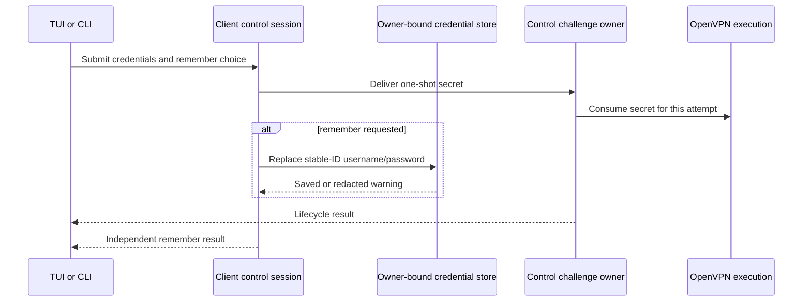
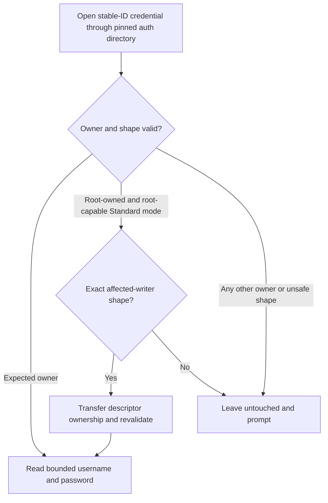

# Owner-Bound OpenVPN Credential Authority - Plan

## Goal Capsule

| Field | Contract |
|---|---|
| Objective | OpenVPN credential-dependent profiles connect repeatedly in Standard and Background modes without ownership failures, secret leakage, or loss of existing remembered credentials. |
| Means | Make the control session the sole authority for remembered credentials while keeping each connection attempt's credential handoff memory-only. (KTD1, KTD2) |
| Product authority | Preserve the existing auth prompt, Save credentials choice, stable profile identity, legacy credential compatibility, and optional Background mode defined by `docs/plans/2026-07-19-002-refactor-canonical-control-plane-plan.md`. |
| Open blockers | None. Background-mode activation remains outside this fix. |
| Execution profile | Test-first implementation on the current top stack branch, followed by full local CI parity and stack restacking before push. |
| Tail ownership | This session owns implementation, verification, commit, and stack synchronization. |

---

## Product Contract

### Summary

Vortix will use one owner-bound credential authority shared by TUI, CLI, Standard mode, and the dormant Background-mode path.
The UI supplies one-shot secrets to an admitted connection challenge and separately asks that authority to remember or clear the reusable username and password.

### Problem Frame

The current TUI writes remembered credentials directly from a root-assisted process, while the tunnel executor later requires the file to belong to the authenticated non-root configuration owner.
The first connection can consume the in-memory challenge response, but saving under `sudo` creates a root-owned file that makes the next attempt fail before OpenVPN starts.
The resulting `Internal` error hides both the recoverable ownership problem and whether the credentials were merely not saved or the connection itself failed.

### Key Decisions

- **Use an owner-bound file credential store on macOS and Linux.** (session-settled: user-approved — chosen over immediate Keychain and Secret Service integrations: it preserves behavior on both operating systems with lower release and migration risk.) Governs R1-R4, R7-R9.
- **Keep connection secrets and remembered credentials as separate outcomes.** (session-settled: user-approved — chosen over making connection success depend on persistence: a storage failure must not discard valid credentials already supplied for this attempt.) Governs R5-R6, R10.
- **Centralize persistence behind the control session.** (session-settled: user-approved — chosen over repairing direct TUI writes: one authority prevents UI, CLI, Standard, and Background ownership rules from drifting.) Governs R1-R2, R11-R12.

### Actors

- A1. A Standard-mode user runs Vortix with root assistance but owns the configuration and remembered credentials as their normal non-root account.
- A2. A Background-mode user runs an enrolled same-owner client without `sudo` once that mode becomes active.
- A3. The control session authenticates the configuration owner and owns remembered-credential operations.
- A4. The OpenVPN execution boundary receives only the one-shot secret required for the admitted connection attempt.

### Requirements

**Authority and secret flow**

- R1. The control session is the only production authority that may save, load, replace, migrate, or clear remembered OpenVPN credentials.
- R2. TUI and CLI surfaces express credential intent through the control contract and never mutate the credential store directly.
- R3. Every credential-store operation is bound to the authenticated configuration owner and stable profile ID.
- R4. Standard mode and the dormant Background adapter use the same credential contract; only a root-capable Standard authority may adopt a legacy root-owned artifact.
- R5. Username, password, and challenge answers for the current connection travel only through the bounded one-shot secret channel and never enter durable control state, logs, diagnostics, events, command arguments, or profile files.
- R6. Remembering credentials persists only reusable username and password; OTP, static-challenge answers, remote-challenge responses, and private-key passphrases are never retained.

**Compatibility and migration**

- R7. Existing valid owner-owned stable-ID credential files continue working without user action.
- R8. Existing unambiguous legacy name-keyed credential files retain their current migration and collision behavior.
- R9. A root-owned credential created by the affected sudo writer is adopted only when its directory, type, ownership, permissions, link count, size, profile association, and contents match the safe legacy shape; otherwise Vortix leaves it untouched and asks the user to enter credentials again.

**User-visible behavior**

- R10. Failure to remember credentials does not cancel an otherwise valid in-memory connection attempt; the user receives a clear warning that this connection can continue but the credentials were not saved.
- R11. A load, migration, or validation failure produces a credential-specific prompt or message rather than the generic `Internal` result.
- R12. Updating or clearing remembered credentials takes effect for the stable profile identity and cannot affect another profile with a colliding display name.

**Safety and portability**

- R13. Credential files remain owner-only and are created, replaced, adopted, and removed without following symlinks or operating on a path that changed after validation.
- R14. Partial writes, failed ownership transfer, crashes, or full disks retain either the prior valid credential or no credential; they never publish a truncated or wrongly owned replacement.
- R15. The solution supports current macOS and Linux Standard mode without adding an operating-system credential-service dependency.
- R16. Auth Manager set, edit, load, and clear actions use dedicated live-session operations because they are not associated with an admitted lifecycle challenge.
- R17. The current unsupported OpenVPN remote-challenge path remains truthfully fail-closed and never persists its response.

### Key Flows

- F1. First credential-dependent connection
  - **Trigger:** A user connects a profile without valid remembered credentials.
  - **Actors:** A1 or A2, A3, A4.
  - **Steps:** The control session publishes a challenge; the user submits credentials and a remember choice; the current attempt receives the one-shot secret; the store handles the remember choice independently.
  - **Outcome:** OpenVPN can start immediately, and any persistence failure is reported without changing this attempt's credentials.
  - **Covers R1-R6, R10-R11.**
- F2. Repeated connection
  - **Trigger:** A user reconnects a profile with valid remembered credentials.
  - **Actors:** A1 or A2, A3, A4.
  - **Steps:** The authority validates the owner-bound record, supplies one one-shot credential value to the admitted operation, and leaves the durable record outside lifecycle state.
  - **Outcome:** The profile reconnects without a prompt and without exposing the durable credential to unrelated components.
  - **Covers R3-R7, R12-R15.**
- F3. Upgrade from the affected sudo writer
  - **Trigger:** Vortix finds a root-owned remembered credential under an authenticated user's credential directory.
  - **Actors:** A1, A3.
  - **Steps:** The authority validates the exact legacy shape; a safe record is transferred to the authenticated owner, while an unsafe or ambiguous record is ignored and preserved for manual recovery.
  - **Outcome:** Safe existing users recover automatically; suspicious material is never silently trusted or destroyed.
  - **Covers R7-R9, R13-R14.**
- F4. Auth Manager credential maintenance
  - **Trigger:** A user opens Auth Manager without an active connection challenge.
  - **Actors:** A1 or A2, A3.
  - **Steps:** The UI asks the live control session to load, replace, or clear the stable profile's remembered credentials.
  - **Outcome:** The operation is owner-bound and cannot attach a secret to durable lifecycle state.
  - **Covers R1-R4, R12-R16.**

### Acceptance Examples

- AE1. **Covers R1-R7, R10.** Given Standard mode started with `sudo` and no saved credentials, when the user enters username and password with Save credentials enabled, then the current connection proceeds and the next connection can reuse an owner-valid record without prompting.
- AE2. **Covers R6.** Given a static-challenge or OTP profile, when the user saves credentials, then only username and password remain after the operation and the challenge answer is absent from all durable and diagnostic surfaces.
- AE3. **Covers R9.** Given a root-owned `0600` regular stable-ID credential created by the affected release inside the authenticated owner's safe directory, when the fixed release loads it, then ownership is safely normalized and the credential remains usable.
- AE4. **Covers R9, R13-R14.** Given a symlink, loosely permissioned file, unexpected owner, multiple links, oversized record, collision, or changed directory entry, when Vortix inspects it, then it neither consumes nor deletes it and prompts with recovery guidance.
- AE5. **Covers R10-R11.** Given valid credentials for this attempt but a persistence failure, when the user submits the prompt, then connection continues and the UI says the credentials were not remembered instead of reporting `Internal`.
- AE6. **Covers R7-R8, R12.** Given valid stable-ID and legacy credentials across profile rename and colliding display names, when profiles reconnect or credentials are cleared, then only the intended stable identity is affected and existing unambiguous migration behavior is preserved.
- AE7. **Covers R14-R15.** Given macOS and Linux owner boundaries plus injected write, ownership-transfer, sync, and replacement failures, when credentials are saved or migrated, then every failure before atomic publication preserves the exact prior-or-absent state, while a directory-sync failure after publication reports durability as uncertain without claiming the visible replacement was lost; no partial credential becomes visible.
- AE8. **Covers R16.** Given no lifecycle challenge exists, when a user edits or clears credentials in Auth Manager, then the live control session performs the exact stable-ID operation and reports its result without creating a durable lifecycle command.
- AE9. **Covers R17.** Given an OpenVPN remote challenge, when the current protocol adapter rejects it, then Vortix reports the unsupported authentication method and persists no response bytes.

### Scope Boundaries

- OS Keychain, Secret Service, encrypted-file fallback, and pre-login credential access are deferred; this fix must leave the credential authority replaceable without changing UI or control behavior.
- Background-mode production activation is not part of this work, but its dormant adapter must obey the same contract and remain compatible.
- OpenVPN server authentication policy, password rotation services, and provider-managed secrets remain outside Vortix.
- WireGuard private-key storage is unchanged; only shared credential-authority abstractions may be reused later after separate requirements review.

### Dependencies and Assumptions

- The configuration directory's authenticated owner remains the authority for Standard-mode user state.
- Standard mode continues to support root-assisted execution for this release, while Background mode remains unprivileged and production-disabled.
- Owner-only plaintext storage preserves the existing product security level; encryption is not claimed without an independent protected key source.

### Sources

- `docs/plans/2026-07-19-002-refactor-canonical-control-plane-plan.md` owns the canonical authority, Standard/Background mode, and memory-only challenge contracts.
- `docs/security/privileged-helper-threat-model.md` defines the enrolled non-root owner and privilege boundaries.
- `docs/MIGRATION.md` defines stable-ID and legacy `.auth` compatibility promises.
- `crates/vortix/src/vortix_core/control/command.rs` defines the non-durable secret value.
- `crates/vortix/src/vortix_core/openvpn_credentials.rs` defines the one-shot OpenVPN credential framing.
- Linux `openat(2)` and Apple `fchown(2)`, `rename(2)`, and `fsync(2)` define the descriptor-relative ownership and publication primitives used by the existing control-state store.

---

## Planning Contract

### Key Technical Decisions

- KTD1. **Use a session-owned credential authority with a narrow live API.** (session-settled: user-approved — chosen over repairing each TUI and executor file call independently: a single authority keeps owner, migration, and error rules consistent.) The authority exposes load, remember, and clear operations keyed by stable profile ID. It remains outside durable `UserCommand`, snapshots, and operation journals. Implements R1-R4, R11-R12, R16.
- KTD2. **Keep remembered storage separate from the one-shot connection answer.** (session-settled: user-approved — chosen over persisting before challenge delivery: storage failure must not cancel a valid current attempt.) The challenge answer is delivered first; remember completion is a separate redacted result. Implements R5-R6, R10, R17.
- KTD3. **Extend the existing owner-aware descriptor-safe file pattern.** The credential store pins and validates owner-controlled directories, opens entries without following links, applies mode and ownership to an exclusive temporary descriptor, syncs it, atomically renames it, and syncs the directory. Implements R3-R4, R9, R13-R15.
- KTD4. **Treat the known root-owned artifact as a constrained compatibility migration.** Only root-capable Standard mode may transfer a root-owned stable-ID record after exact validation. Background mode, non-root Standard mode, or any unsafe shape treats the record as unavailable and prompts without consuming or deleting it. Implements R4, R7-R9, R13-R15.
- KTD5. **Make credential warnings typed at the client boundary.** Load validation, remember failure, clear failure, and unsupported authentication map to redacted credential outcomes rather than lifecycle `Internal`. Implements R10-R11, R17.

### High-Level Technical Design

### Implementation Constraints

- The credential store may depend on configuration/filesystem code, but `vortix_core` remains free of platform, protocol, process, and credential-file imports.
- Secret-bearing live values remain non-cloneable or zeroizing and have no durable serde path.
- Per-profile remember and clear work is serialized so a delayed save cannot overwrite a later clear or edit.
- The UI never performs credential filesystem I/O directly.
- Remote-challenge support is not broadened by this fix.

### Sequencing

Build the owner-bound store first, then attach it to the Standard session and executor resolver. Move TUI/CLI management and challenge persistence only after the authority is available. Finish with compatibility, UX, boundary, and manual-runtime verification.

### Risks and Mitigations

- **Unsafe automatic adoption:** Restrict adoption to the exact stable-ID file shape and a root-capable Standard authority; all uncertainty re-prompts.
- **Save/clear races:** Serialize mutations per profile and bind challenge persistence to the challenge's stable profile ID rather than the selected row.
- **Credential loss during replacement:** Publish only a fully written, owner-correct, synced temporary file; retain the prior file on every pre-rename failure.
- **Cross-platform drift:** Keep the Unix syscall implementation shared, run the full macOS/Linux CI matrix, and add real sudo scenarios to the manual backlog.
- **Secret leakage through errors or IPC:** Use typed redacted outcomes and assert absence from snapshots, durable state, logs, diagnostics, and debug output.

---

## Implementation Units

### U1. Add the owner-bound credential store

- **Goal:** Provide one descriptor-safe authority for remembered OpenVPN username/password records and compatibility adoption.
- **Requirements:** R3-R4, R6-R9, R12-R15; AE2-AE4, AE6-AE7.
- **Dependencies:** None.
- **Files:** `crates/vortix/src/vortix_config/mod.rs`, a credential-store module under `crates/vortix/src/vortix_config/`, `crates/vortix/src/vortix_config/control_state.rs`, `crates/vortix/src/utils.rs`, and focused module tests.
- **Approach:**
  1. Extract or reuse the existing pinned owner-private directory and atomic owner-write primitives without changing control-state behavior.
  2. Add stable-ID load, replace, clear, legacy fallback, and constrained root-owner adoption under KTD3-KTD4.
  3. Return zeroizing credential values and typed redacted errors; remove delete-before-create rotation from the production path.
- **Execution note:** Start with failing ownership-policy, unsafe-artifact, and replacement-fault tests before changing production behavior.
- **Patterns to follow:** `FsControlStateStore::for_owner`, descriptor-relative control-state reads/writes, profile identity migration, and stable-ID auth paths in `FsProfileStore`.
- **Test scenarios:**
  - Covers AE3. A root-owned `0600`, single-link, bounded stable-ID record under owner-controlled parents is classified for adoption only by root-capable Standard mode.
  - Covers AE4. Symlink, hard link, loose mode, wrong owner, malformed body, oversized body, and changed-entry cases remain untouched and unavailable.
  - Covers AE6. Stable-ID lookup wins, unambiguous legacy fallback remains compatible, and colliding legacy identities fail closed.
  - Covers AE7. Injected create, write, ownership, and file-sync failures before rename preserve the prior valid record or absence; a post-rename directory-sync failure leaves the complete replacement visible and returns a typed durability-uncertain result.
  - Saved bytes contain exactly username and password; challenge or OTP bytes never enter the record.
- **Verification:** Store tests prove exact owner, content, migration, failure, and prior-or-absent invariants on Unix, with platform-specific branches compiled in CI.

### U2. Make the live control session own credential operations

- **Goal:** Route load, remember, and clear through the local/remote-neutral session facade without introducing a durable credential command.
- **Requirements:** R1-R5, R10-R12, R16; AE1, AE5, AE8.
- **Dependencies:** U1.
- **Files:** `crates/vortix/src/cli/control.rs`, `crates/vortix/src/tunnel.rs`, `crates/vortix/src/vortix_core/control/command.rs`, `crates/vortix/src/vortix_core/ipc/mod.rs` when needed for dormant adapter parity, and focused control/session tests.
- **Approach:**
  1. Construct the authority from the authenticated configuration owner and retain it for the session lifetime.
  2. Give tunnel execution a narrow remembered-credential resolver so it no longer opens credential files.
  3. Add bounded live-session management work and typed completion for load, remember, and clear; bind persistence to stable profile ID.
  4. Keep Background production disabled while making its unsupported credential-management response explicit and non-fallback.
- **Execution note:** Prove no `UserCommand`, `ControlSnapshot`, or persisted operation can contain credential bytes before integrating the UI.
- **Patterns to follow:** Existing bounded TUI work queues, memory-only `Secret`, `SensitiveBytes` live IPC framing, and client-session local/remote facade.
- **Test scenarios:**
  - Covers AE1. A Standard session created under root assistance writes and later resolves credentials for the authenticated non-root config owner.
  - Covers AE5. Challenge delivery succeeds even when the independent remember operation fails.
  - Covers AE8. Manage set/edit/clear works without a lifecycle challenge and creates no durable operation.
  - Concurrent remember then clear, and clear then delayed remember, resolve in user action order for one profile.
  - A challenge bound to one stable ID cannot save credentials for a row selected after a catalog reorder or rename.
- **Verification:** Session and executor tests prove one authority, bounded live work, stable-ID binding, and absence from durable control projections.

### U3. Cut TUI and CLI over to the credential authority

- **Goal:** Preserve existing Auth Manager and connection UX while removing all direct application-layer credential file access.
- **Requirements:** R1-R2, R5-R6, R10-R12, R16-R17; AE1-AE2, AE5, AE8-AE9.
- **Dependencies:** U2.
- **Files:** `crates/vortix/src/app/connection.rs`, `crates/vortix/src/app/update.rs`, `crates/vortix/src/app/tests.rs`, `crates/vortix/src/cli/commands.rs`, `crates/vortix/src/message.rs`, and relevant UI rendering tests.
- **Approach:**
  1. Load prompt defaults, edit, and clear through the session facade.
  2. Deliver the one-shot answer before requesting remember; show a warning only for remember failure and keep lifecycle progress visible.
  3. Replace generic `Internal` presentation with credential-specific, redacted guidance.
  4. Preserve current static/OTP behavior and the explicit unsupported remote-challenge result under KTD2 and KTD5.
- **Execution note:** Add App and CLI regression tests that fail on direct persistence or generic failure before modifying handlers.
- **Patterns to follow:** Existing auth overlay, toast/event-log conventions, pending TUI completion handling, and terminal-operation result mapping.
- **Test scenarios:**
  - Covers AE1. Remember-on first connect proceeds and a later connect reuses credentials without prompting.
  - Remember-off connects but leaves no record.
  - Covers AE2. A saved-base static/OTP prompt requests a fresh answer and never rewrites or persists the answer.
  - Covers AE5. The UI says the connection may continue but credentials were not remembered; it does not show `Internal`.
  - Covers AE8. Auth Manager load, edit, and clear target the stable profile through the live session.
  - Covers AE9. Remote challenge remains unsupported with actionable, non-secret output.
- **Verification:** App and CLI tests prove the user flows and structural searches show no production credential file mutation in UI modules.

### U4. Harden compatibility and architecture guards

- **Goal:** Prevent future reintroduction of split credential ownership and document the upgrade behavior.
- **Requirements:** R1-R4, R7-R15; AE3-AE7.
- **Dependencies:** U1-U3.
- **Files:** `crates/xtask/src/`, `docs/MIGRATION.md`, `docs/manual-testing/backlog.md`, and boundary/compatibility tests.
- **Approach:**
  1. Add a boundary check that rejects direct production credential file reads/writes from App and protocol execution layers.
  2. Document safe auto-adoption, re-prompt cases, and the distinction between current connection and remember failure.
  3. Add real macOS and Linux sudo-upgrade scenarios with owner, mode, reconnect, edit, and clear pass signals.
- **Patterns to follow:** Existing control-boundary token checks, migration documentation, and risk-ordered manual backlog rows.
- **Test scenarios:**
  - A forbidden direct credential helper call in an App fixture fails the boundary checker.
  - Legacy owner-owned and affected root-owned upgrade fixtures retain the same stable profile identity.
  - Redacted failures contain no username, password, challenge answer, or credential body.
- **Verification:** Boundary tests, migration tests, and manual scenarios make the single-authority rule enforceable and reviewable.

---

## Verification Contract

| Gate | Applies to | Done signal |
|---|---|---|
| Focused credential-store, control-session, tunnel, App, CLI, migration, and boundary tests | U1-U4 | New regressions pass after failing against the prior behavior. |
| `cargo fmt --all -- --check` | U1-U4 | No workspace formatting diff. |
| `cargo check --workspace --all-targets` | U1-U4 | All production and test targets compile. |
| `cargo clippy --workspace --all-targets -- -D warnings` | U1-U4 | No workspace lint warning, including test code. |
| `cargo test --workspace` | U1-U4 | Full workspace suite passes. |
| `RUSTDOCFLAGS='-D warnings' cargo doc --workspace --no-deps` | U1-U4 | Public and internal documentation builds without warnings. |
| All five `cargo xtask check-*` boundary commands from `docs/ci-parity.md` | U2-U4 | Subprocess, platform, protocol, shell, and control boundaries remain green. |
| Real sudo upgrade and reconnect on macOS and Linux | U4 | Safe root-owned record becomes owner-valid; unsafe record re-prompts; remember failure never blocks current connect. |

---

## Definition of Done

- Every active R-ID and AE-ID is implemented or explicitly retained as an existing fail-closed behavior.
- TUI, CLI, tunnel execution, and dormant remote adapter use the session-owned credential contract; production App code performs no credential filesystem mutation.
- Existing owner-owned stable-ID and unambiguous legacy credentials remain usable.
- The known root-owned artifact is adopted only under the exact safe Standard-mode conditions; all other unsafe records remain untouched and re-prompt.
- Remember failure is independently visible and cannot change the current connection result.
- OTP, static/remote challenge answers, and private-key passphrases remain absent from files and all durable or diagnostic surfaces.
- Focused tests, the full `docs/ci-parity.md` command set, and `git diff --check` pass before push.
- The manual-testing backlog contains macOS and Linux sudo-upgrade scenarios with explicit pass/fail signals.
- Dead-end experiments, duplicate helpers, obsolete direct persistence paths, and temporary test scaffolding are removed from the final diff.
